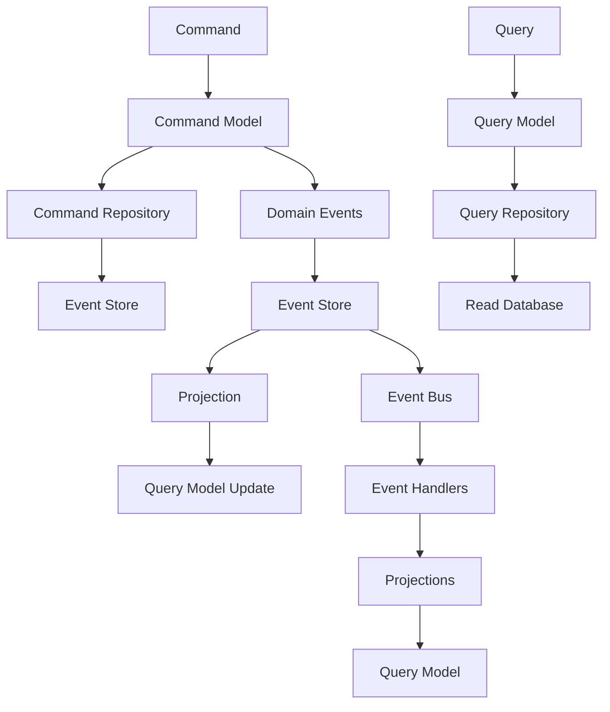

## Qu'est-ce que CQRS + Event Sourcing ?

CQRS + Event Sourcing est la combinaison de deux patterns architecturaux puissants qui offre le maximum de flexibilité, de performance et d'auditabilité. Cette approche combine la séparation des modèles de commande et de requête (CQRS) avec le stockage des événements comme source de vérité (Event Sourcing).

### Principe Fondamental

- **Modèles Distincts** : Commandes et requêtes complètement séparés
- **Event Sourcing** : Les événements sont la source de vérité
- **Projections** : Les modèles de requête sont reconstruits à partir des événements
- **Synchronisation** : Les modèles sont synchronisés via des projections

## Pourquoi CQRS + Event Sourcing ?

### Avantages Maximaux

1. **Audit Trail Complet** : Traçabilité complète de tous les changements
2. **Performance Maximale** : Chaque modèle optimisé pour son usage
3. **Scalabilité Maximale** : Lecture et écriture mises à l'échelle indépendamment
4. **Flexibilité Maximale** : Création de nouvelles vues sans modification des données
5. **Rejouabilité** : Possibilité de reconstruire l'état à n'importe quel moment
6. **Équipes Séparées** : Possibilité d'équipes spécialisées
7. **Évolutivité Maximale** : Évolution indépendante des modèles

### Inconvénients Maximaux

1. **Complexité Maximale** : Courbe d'apprentissage très importante
2. **Cohérence Éventuelle** : Les modèles peuvent être temporairement désynchronisés
3. **Équipe** : Nécessite une équipe très expérimentée (8+ développeurs)
4. **Maintenance** : Trois modèles à maintenir et synchroniser
5. **Coût** : Investissement très important
6. **Temps** : Temps de développement très long

## Architecture CQRS + Event Sourcing

### Structure des Modèles



### 1. Modèle de Commande avec Event Sourcing

```php
// Modèle de Commande avec Event Sourcing - Projet Gyroscops Cloud
final class PaymentCommand
{
    private PaymentId $id;
    private Amount $amount;
    private PaymentStatus $status;
    private ?string $authorizationCode = null;
    private \DateTimeInterface $createdAt;
    private ?\DateTimeInterface $processedAt = null;
    private array $events = [];
    private int $version = 0;

    private function __construct(
        PaymentId $id,
        Amount $amount,
        PaymentStatus $status = PaymentStatus::PENDING
    ) {
        $this->id = $id;
        $this->amount = $amount;
        $this->status = $status;
        $this->createdAt = new \DateTimeImmutable();
    }

    // ===== COMMANDES (Modification de l'état) =====
    
    public static function create(PaymentId $id, Amount $amount): self
    {
        $payment = new self($id, $amount);
        $payment->recordThat(new PaymentCreated($id, $amount, new \DateTimeImmutable()));
        return $payment;
    }

    public function authorize(string $authorizationCode): void
    {
        if ($this->status !== PaymentStatus::PENDING) {
            throw new InvalidOperationException('Only pending payments can be authorized');
        }

        $this->status = PaymentStatus::AUTHORIZED;
        $this->authorizationCode = $authorizationCode;
        
        $this->recordThat(new PaymentAuthorized($this->id, $authorizationCode, new \DateTimeImmutable()));
    }

    public function complete(): void
    {
        if ($this->status !== PaymentStatus::AUTHORIZED) {
            throw new InvalidOperationException('Only authorized payments can be completed');
        }

        $this->status = PaymentStatus::COMPLETED;
        $this->processedAt = new \DateTimeImmutable();
        
        $this->recordThat(new PaymentCompleted($this->id, new \DateTimeImmutable()));
    }

    public function cancel(): void
    {
        if ($this->status === PaymentStatus::COMPLETED) {
            throw new InvalidOperationException('Completed payments cannot be cancelled');
        }

        $this->status = PaymentStatus::CANCELLED;
        $this->recordThat(new PaymentCancelled($this->id, new \DateTimeImmutable()));
    }

    // ===== GESTION DES ÉVÉNEMENTS =====
    
    private function recordThat(object $event): void
    {
        $this->events[] = $event;
        $this->version++;
    }

    public function releaseEvents(): array
    {
        $events = $this->events;
        $this->events = [];
        return $events;
    }

    // ===== REQUÊTES MINIMALES (pour la cohérence) =====
    
    public function getId(): PaymentId
    {
        return $this->id;
    }

    public function getVersion(): int
    {
        return $this->version;
    }
}
```

### 2. Modèle de Requête Optimisé

```php
// Modèle de Requête Optimisé - Projet Gyroscops Cloud
final class PaymentQuery
{
    public function __construct(
        public readonly PaymentId $id,
        public readonly Amount $amount,
        public readonly PaymentStatus $status,
        public readonly ?string $authorizationCode,
        public readonly \DateTimeInterface $createdAt,
        public readonly ?\DateTimeInterface $processedAt,
        public readonly ?\DateTimeInterface $cancelledAt,
        public readonly int $version,
        public readonly array $metadata = []
    ) {
    }

    // ===== REQUÊTES OPTIMISÉES =====
    
    public function isActive(): bool
    {
        return $this->status === PaymentStatus::PENDING || $this->status === PaymentStatus::AUTHORIZED;
    }

    public function isCompleted(): bool
    {
        return $this->status === PaymentStatus::COMPLETED;
    }

    public function isCancelled(): bool
    {
        return $this->status === PaymentStatus::CANCELLED;
    }

    public function isExpired(): bool
    {
        if ($this->status === PaymentStatus::COMPLETED) {
            return false;
        }

        $expirationDate = $this->createdAt->add(new \DateInterval('P1D'));
        return new \DateTimeImmutable() > $expirationDate;
    }

    public function getDaysSinceCreation(): int
    {
        return $this->createdAt->diff(new \DateTimeImmutable())->days;
    }

    public function getProcessingTime(): ?\DateInterval
    {
        if ($this->processedAt === null) {
            return null;
        }

        return $this->createdAt->diff($this->processedAt);
    }

    public function getStatusHistory(): array
    {
        return $this->metadata['status_history'] ?? [];
    }

    public function getAuditTrail(): array
    {
        return $this->metadata['audit_trail'] ?? [];
    }

    // ===== REQUÊTES COMPLEXES =====
    
    public function getSummary(): array
    {
        return [
            'id' => $this->id->toString(),
            'amount' => $this->amount->getValue(),
            'currency' => $this->amount->getCurrency()->value,
            'status' => $this->status->value,
            'created_at' => $this->createdAt->format('Y-m-d H:i:s'),
            'is_active' => $this->isActive(),
            'is_expired' => $this->isExpired(),
            'processing_time' => $this->getProcessingTime()?->format('%H:%I:%S'),
        ];
    }

    public function getDetailedReport(): array
    {
        return [
            'payment' => $this->getSummary(),
            'status_history' => $this->getStatusHistory(),
            'audit_trail' => $this->getAuditTrail(),
            'metadata' => $this->metadata,
        ];
    }
}
```

## Projections et Synchronisation

### Projection de Base

```php
// Projection de Base - Projet Gyroscops Cloud
final class PaymentProjection
{
    public function __construct(
        private Connection $connection,
        private EventBusInterface $eventBus
    ) {
    }

    public function handle(PaymentCreated $event): void
    {
        $sql = <<<'SQL'
            INSERT INTO payments_query (
                uuid, amount, currency, status, created_at, version, metadata
            ) VALUES (
                :uuid, :amount, :currency, :status, :created_at, :version, :metadata
            )
            SQL;

        $statement = $this->connection->prepare($sql);
        $statement->bindValue(':uuid', $event->paymentId->toString(), ParameterType::STRING);
        $statement->bindValue(':amount', $event->amount->getValue(), ParameterType::STRING);
        $statement->bindValue(':currency', $event->amount->getCurrency()->value, ParameterType::STRING);
        $statement->bindValue(':status', PaymentStatus::PENDING->value, ParameterType::STRING);
        $statement->bindValue(':created_at', $event->occurredOn->format('Y-m-d H:i:s'), ParameterType::STRING);
        $statement->bindValue(':version', 1, ParameterType::INTEGER);
        $statement->bindValue(':metadata', json_encode([]), ParameterType::STRING);

        $statement->executeStatement();
    }

    public function handle(PaymentAuthorized $event): void
    {
        $sql = <<<'SQL'
            UPDATE payments_query 
            SET 
                status = :status,
                authorization_code = :authorization_code,
                version = version + 1,
                metadata = JSON_SET(metadata, '$.status_history', JSON_ARRAY_APPEND(COALESCE(JSON_EXTRACT(metadata, '$.status_history'), '[]'), '$', JSON_OBJECT('status', :status, 'timestamp', :timestamp)))
            WHERE uuid = :uuid
            SQL;

        $statement = $this->connection->prepare($sql);
        $statement->bindValue(':uuid', $event->paymentId->toString(), ParameterType::STRING);
        $statement->bindValue(':status', PaymentStatus::AUTHORIZED->value, ParameterType::STRING);
        $statement->bindValue(':authorization_code', $event->authorizationCode, ParameterType::STRING);
        $statement->bindValue(':timestamp', $event->occurredOn->format('Y-m-d H:i:s'), ParameterType::STRING);

        $statement->executeStatement();
    }

    public function handle(PaymentCompleted $event): void
    {
        $sql = <<<'SQL'
            UPDATE payments_query 
            SET 
                status = :status,
                processed_at = :processed_at,
                version = version + 1,
                metadata = JSON_SET(metadata, '$.status_history', JSON_ARRAY_APPEND(COALESCE(JSON_EXTRACT(metadata, '$.status_history'), '[]'), '$', JSON_OBJECT('status', :status, 'timestamp', :timestamp)))
            WHERE uuid = :uuid
            SQL;

        $statement = $this->connection->prepare($sql);
        $statement->bindValue(':uuid', $event->paymentId->toString(), ParameterType::STRING);
        $statement->bindValue(':status', PaymentStatus::COMPLETED->value, ParameterType::STRING);
        $statement->bindValue(':processed_at', $event->occurredOn->format('Y-m-d H:i:s'), ParameterType::STRING);
        $statement->bindValue(':timestamp', $event->occurredOn->format('Y-m-d H:i:s'), ParameterType::STRING);

        $statement->executeStatement();
    }

    public function handle(PaymentCancelled $event): void
    {
        $sql = <<<'SQL'
            UPDATE payments_query 
            SET 
                status = :status,
                cancelled_at = :cancelled_at,
                version = version + 1,
                metadata = JSON_SET(metadata, '$.status_history', JSON_ARRAY_APPEND(COALESCE(JSON_EXTRACT(metadata, '$.status_history'), '[]'), '$', JSON_OBJECT('status', :status, 'timestamp', :timestamp)))
            WHERE uuid = :uuid
            SQL;

        $statement = $this->connection->prepare($sql);
        $statement->bindValue(':uuid', $event->paymentId->toString(), ParameterType::STRING);
        $statement->bindValue(':status', PaymentStatus::CANCELLED->value, ParameterType::STRING);
        $statement->bindValue(':cancelled_at', $event->occurredOn->format('Y-m-d H:i:s'), ParameterType::STRING);
        $statement->bindValue(':timestamp', $event->occurredOn->format('Y-m-d H:i:s'), ParameterType::STRING);

        $statement->executeStatement();
    }
}
```

### Event Handler

```php
// Event Handler - Projet Gyroscops Cloud
final class PaymentEventHandler
{
    public function __construct(
        private PaymentProjection $projection
    ) {
    }

    public function handle(PaymentCreated $event): void
    {
        $this->projection->handle($event);
    }

    public function handle(PaymentAuthorized $event): void
    {
        $this->projection->handle($event);
    }

    public function handle(PaymentCompleted $event): void
    {
        $this->projection->handle($event);
    }

    public function handle(PaymentCancelled $event): void
    {
        $this->projection->handle($event);
    }
}
```

## Critères d'Adoption

### ✅ Adoptez CQRS + Event Sourcing si :

- **Audit Trail Critique** : Traçabilité complète obligatoire
- **Performance Critique** : Besoins de performance maximale
- **Scalabilité Maximale** : Besoins de scalabilité maximale
- **Modèles Très Différents** : Lecture et écriture très différentes
- **Équipe Très Expérimentée** : 8+ développeurs avec expérience
- **Budget et Temps** : Ressources très importantes
- **Conformité Réglementaire** : Exigences strictes d'audit
- **Équipes Spécialisées** : Possibilité d'équipes séparées

### ❌ Évitez CQRS + Event Sourcing si :

- **Application Simple** : Logique métier basique
- **Modèles Similaires** : Lecture et écriture similaires
- **Équipe Petite** : Moins de 8 développeurs
- **Budget Limité** : Ressources insuffisantes
- **Temps Limité** : Temps de développement insuffisant
- **Cohérence Immédiate** : Besoin de cohérence immédiate
- **Maintenance Simple** : Besoin de maintenance simple

## 📈 Matrice de Décision

| Critère | CQRS + Event Sourcing | CQRS | Event Sourcing | CQS | Classique |
|---------|----------------------|------|----------------|-----|-----------|
| **Complexité** | ❌ Maximale | ❌ Élevée | ❌ Élevée | ⚠️ Modérée | ✅ Faible |
| **Performance** | ✅ Maximale | ✅ Excellente | ⚠️ Variable | ✅ Bonne | ⚠️ Limitée |
| **Scalabilité** | ✅ Maximale | ✅ Élevée | ⚠️ Modérée | ⚠️ Modérée | ❌ Limitée |
| **Audit Trail** | ✅ Complet | ❌ Limité | ✅ Complet | ❌ Limité | ❌ Limité |
| **Équipe** | ❌ Très Expérimentée | ❌ Expérimentée | ❌ Expérimentée | ⚠️ Intermédiaire | ✅ Tous niveaux |
| **Budget** | ❌ Maximale | ❌ Élevé | ❌ Élevé | ⚠️ Modéré | ✅ Faible |
| **Temps** | ❌ 4-6 mois | ❌ 1-2 mois | ❌ 2-3 mois | ⚠️ 2-3 semaines | ✅ 1-2 semaines |
| **Maintenance** | ❌ Maximale | ❌ Complexe | ❌ Complexe | ⚠️ Modérée | ✅ Simple |

## 🚀 Implémentation Progressive

### Phase 1 : Préparation (1-2 mois)
1. **Formation de l'équipe** sur CQRS et Event Sourcing
2. **Choix d'un agrégat** pour commencer
3. **Mise en place** de l'infrastructure de base
4. **Création des événements** de domaine

### Phase 2 : Implémentation (2-3 mois)
1. **Création des modèles** de commande et de requête
2. **Implémentation des repositories** séparés
3. **Création des projections** pour la synchronisation
4. **Tests unitaires** complets

### Phase 3 : Intégration (1-2 mois)
1. **Synchronisation** des modèles via projections
2. **Monitoring** et observabilité
3. **Optimisation** des performances
4. **Documentation** complète

## 🔧 Outils et Bibliothèques

### PHP
- **API Platform** : Support natif des commandes et requêtes
- **Symfony Messenger** : Gestion des événements
- **Doctrine** : ORM avec optimisations
- **Prooph Event Store** : Event Store spécialisé

### Patterns Complémentaires
- **Sagas** : Orchestration de processus complexes
- **Projections** : Synchronisation des modèles
- **Event Handlers** : Gestion des événements

## 📚 Références aux ADR du Projet Gyroscops Cloud

Cette approche suit les patterns établis dans les Architecture Decision Records du Gyroscops Cloud :

- **[HIVE006](https://github.com/yourusername/hive/blob/main/architecture/HIVE006-query-models-for-api-platform.md)** : Query Models for API Platform - Modèles de requête
- **[HIVE007](https://github.com/yourusername/hive/blob/main/architecture/HIVE007-command-models-for-api-platform.md)** : Command Models for API Platform - Modèles de commande
- **[HIVE008](https://github.com/yourusername/hive/blob/main/architecture/HIVE008-event-collaboration.md)** : Event Collaboration - Architecture événementielle
- **[HIVE009](https://github.com/yourusername/hive/blob/main/architecture/HIVE009-message-buses.md)** : Message Buses - Event Bus, Command Bus, Query Bus
- **[HIVE010](https://github.com/yourusername/hive/blob/main/architecture/HIVE010-repositories.md)** : Repositories - Principes des repositories

---


  {{< chapter-option 
    letter="A" 
    color="green" 
    title="CQRS + Event Sourcing suffit pour mes besoins" 
    subtitle="Vous avez les besoins les plus exigeants et une équipe très expérimentée." 
    criteria="Audit trail critique,Performance critique,Scalabilité maximale,Équipe très expérimentée (8+ développeurs),Budget et temps très importants" 
    time="4-6 mois d'apprentissage" 
    chapter="6" 
    chapter-title="Repositories et Persistance" 
    chapter-url="/chapitres/fondamentaux/chapitre-06-repositories-persistance/" 
  >}}}
  
  {{< chapter-option 
    letter="B" 
    color="yellow" 
    title="Je veux d'abord explorer les options de stockage" 
    subtitle="Vous souhaitez comprendre comment CQRS + Event Sourcing impacte la persistance des données." 
    criteria="Vous êtes intéressé par les aspects techniques de l'implémentation,Vous voulez voir des exemples concrets avant de prendre une décision" 
    time="20-30 minutes" 
    chapter="6" 
    chapter-title="Repositories et Persistance" 
    chapter-url="/chapitres/fondamentaux/chapitre-06-repositories-persistance/" 
  >}}}
  
  {{< chapter-option 
    letter="C" 
    color="purple" 
    title="Je veux d'abord explorer CQRS seul" 
    subtitle="Vous voulez comprendre CQRS avant de combiner avec Event Sourcing." 
    criteria="Modèles de lecture/écriture très différents,Besoin de performance maximale,Équipe expérimentée (4+ développeurs),Possibilité d'évoluer vers Event Sourcing" 
    time="1-2 mois d'apprentissage" 
    chapter="9" 
    chapter-title="Architecture CQRS avec API Platform" 
    chapter-url="/chapitres/optionnels/chapitre-09-architecture-cqrs/" 
  >}}}
  
