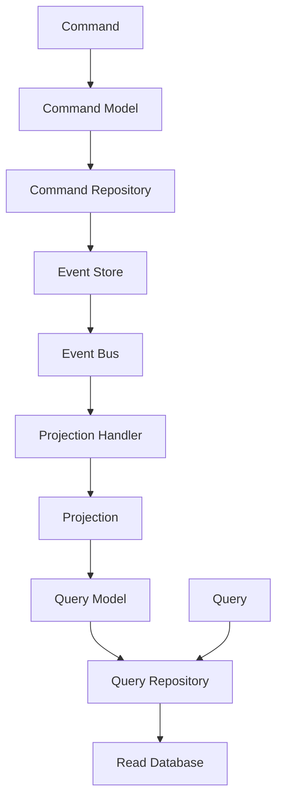

## Qu'est-ce que les Projections Event Sourcing ?

Les projections Event Sourcing sont des mécanismes qui transforment les événements stockés en modèles de requête optimisés pour la lecture. Elles permettent de créer des vues de données spécialisées sans modifier les données source, offrant une flexibilité maximale pour les besoins de lecture.

### Principe Fondamental

- **Transformation** : Les événements sont transformés en modèles de requête
- **Optimisation** : Chaque projection est optimisée pour un usage spécifique
- **Flexibilité** : Création de nouvelles vues sans modification des données
- **Performance** : Modèles de requête optimisés pour la lecture
- **Évolutivité** : Possibilité de créer de nouvelles projections

## Pourquoi les Projections ?

### Avantages Majeurs

1. **Flexibilité Maximale** : Création de vues spécialisées
2. **Performance Optimisée** : Chaque projection optimisée pour son usage
3. **Évolutivité** : Ajout de nouvelles vues sans modification des données
4. **Séparation des Responsabilités** : Chaque projection a un rôle spécifique
5. **Maintenance** : Modifications isolées par projection
6. **Tests** : Tests indépendants par projection

### Inconvénients à Considérer

1. **Complexité** : Gestion de plusieurs projections
2. **Synchronisation** : Gestion de la cohérence entre projections
3. **Performance** : Temps de reconstruction des projections
4. **Maintenance** : Plus de code à maintenir
5. **Tests** : Tests plus complexes

## Architecture des Projections

### Structure des Projections



### 1. Projection de Base

```php
// Projection de Base - Projet Hive
abstract class BaseProjection
{
    public function __construct(
        protected Connection $connection,
        protected EventBusInterface $eventBus
    ) {
    }

    abstract public function getProjectionName(): string;
    abstract public function getEventHandlers(): array;
    abstract public function getTableName(): string;

    public function handle(object $event): void
    {
        $handlers = $this->getEventHandlers();
        $eventClass = $event::class;

        if (isset($handlers[$eventClass])) {
            $this->{$handlers[$eventClass]}($event);
        }
    }

    protected function createTableIfNotExists(): void
    {
        $sql = $this->getCreateTableSql();
        $this->connection->executeStatement($sql);
    }

    abstract protected function getCreateTableSql(): string;
}
```

### 2. Projection de Paiement

```php
// Projection de Paiement - Projet Hive
final class PaymentProjection extends BaseProjection
{
    public function getProjectionName(): string
    {
        return 'payment_projection';
    }

    public function getEventHandlers(): array
    {
        return [
            PaymentCreated::class => 'handlePaymentCreated',
            PaymentAuthorized::class => 'handlePaymentAuthorized',
            PaymentCompleted::class => 'handlePaymentCompleted',
            PaymentCancelled::class => 'handlePaymentCancelled',
        ];
    }

    public function getTableName(): string
    {
        return 'payments_query';
    }

    protected function getCreateTableSql(): string
    {
        return <<<'SQL'
            CREATE TABLE IF NOT EXISTS payments_query (
                uuid VARCHAR(36) PRIMARY KEY,
                amount DECIMAL(10,2) NOT NULL,
                currency VARCHAR(3) NOT NULL,
                status VARCHAR(20) NOT NULL,
                authorization_code VARCHAR(255) NULL,
                created_at DATETIME NOT NULL,
                processed_at DATETIME NULL,
                cancelled_at DATETIME NULL,
                version INT NOT NULL DEFAULT 1,
                metadata JSON NULL,
                INDEX idx_status (status),
                INDEX idx_created_at (created_at),
                INDEX idx_organization_id (organization_id)
            )
            SQL;
    }

    public function handlePaymentCreated(PaymentCreated $event): void
    {
        $sql = <<<'SQL'
            INSERT INTO payments_query (
                uuid, amount, currency, status, created_at, version, metadata
            ) VALUES (
                :uuid, :amount, :currency, :status, :created_at, :version, :metadata
            )
            SQL;

        $statement = $this->connection->prepare($sql);
        $statement->bindValue(':uuid', $event->paymentId->toString(), ParameterType::STRING);
        $statement->bindValue(':amount', $event->amount->getValue(), ParameterType::STRING);
        $statement->bindValue(':currency', $event->amount->getCurrency()->value, ParameterType::STRING);
        $statement->bindValue(':status', PaymentStatus::PENDING->value, ParameterType::STRING);
        $statement->bindValue(':created_at', $event->occurredOn->format('Y-m-d H:i:s'), ParameterType::STRING);
        $statement->bindValue(':version', 1, ParameterType::INTEGER);
        $statement->bindValue(':metadata', json_encode([]), ParameterType::STRING);

        $statement->executeStatement();
    }

    public function handlePaymentAuthorized(PaymentAuthorized $event): void
    {
        $sql = <<<'SQL'
            UPDATE payments_query 
            SET 
                status = :status,
                authorization_code = :authorization_code,
                version = version + 1,
                metadata = JSON_SET(
                    metadata, 
                    '$.status_history', 
                    JSON_ARRAY_APPEND(
                        COALESCE(JSON_EXTRACT(metadata, '$.status_history'), '[]'), 
                        '$', 
                        JSON_OBJECT('status', :status, 'timestamp', :timestamp)
                    )
                )
            WHERE uuid = :uuid
            SQL;

        $statement = $this->connection->prepare($sql);
        $statement->bindValue(':uuid', $event->paymentId->toString(), ParameterType::STRING);
        $statement->bindValue(':status', PaymentStatus::AUTHORIZED->value, ParameterType::STRING);
        $statement->bindValue(':authorization_code', $event->authorizationCode, ParameterType::STRING);
        $statement->bindValue(':timestamp', $event->occurredOn->format('Y-m-d H:i:s'), ParameterType::STRING);

        $statement->executeStatement();
    }

    public function handlePaymentCompleted(PaymentCompleted $event): void
    {
        $sql = <<<'SQL'
            UPDATE payments_query 
            SET 
                status = :status,
                processed_at = :processed_at,
                version = version + 1,
                metadata = JSON_SET(
                    metadata, 
                    '$.status_history', 
                    JSON_ARRAY_APPEND(
                        COALESCE(JSON_EXTRACT(metadata, '$.status_history'), '[]'), 
                        '$', 
                        JSON_OBJECT('status', :status, 'timestamp', :timestamp)
                    )
                )
            WHERE uuid = :uuid
            SQL;

        $statement = $this->connection->prepare($sql);
        $statement->bindValue(':uuid', $event->paymentId->toString(), ParameterType::STRING);
        $statement->bindValue(':status', PaymentStatus::COMPLETED->value, ParameterType::STRING);
        $statement->bindValue(':processed_at', $event->occurredOn->format('Y-m-d H:i:s'), ParameterType::STRING);
        $statement->bindValue(':timestamp', $event->occurredOn->format('Y-m-d H:i:s'), ParameterType::STRING);

        $statement->executeStatement();
    }

    public function handlePaymentCancelled(PaymentCancelled $event): void
    {
        $sql = <<<'SQL'
            UPDATE payments_query 
            SET 
                status = :status,
                cancelled_at = :cancelled_at,
                version = version + 1,
                metadata = JSON_SET(
                    metadata, 
                    '$.status_history', 
                    JSON_ARRAY_APPEND(
                        COALESCE(JSON_EXTRACT(metadata, '$.status_history'), '[]'), 
                        '$', 
                        JSON_OBJECT('status', :status, 'timestamp', :timestamp)
                    )
                )
            WHERE uuid = :uuid
            SQL;

        $statement = $this->connection->prepare($sql);
        $statement->bindValue(':uuid', $event->paymentId->toString(), ParameterType::STRING);
        $statement->bindValue(':status', PaymentStatus::CANCELLED->value, ParameterType::STRING);
        $statement->bindValue(':cancelled_at', $event->occurredOn->format('Y-m-d H:i:s'), ParameterType::STRING);
        $statement->bindValue(':timestamp', $event->occurredOn->format('Y-m-d H:i:s'), ParameterType::STRING);

        $statement->executeStatement();
    }
}
```

### 3. Projection d'Abonnement

```php
// Projection d'Abonnement - Projet Hive
final class SubscriptionProjection extends BaseProjection
{
    public function getProjectionName(): string
    {
        return 'subscription_projection';
    }

    public function getEventHandlers(): array
    {
        return [
            SubscriptionCreated::class => 'handleSubscriptionCreated',
            SubscriptionActivated::class => 'handleSubscriptionActivated',
            SubscriptionCancelled::class => 'handleSubscriptionCancelled',
            SubscriptionRenewed::class => 'handleSubscriptionRenewed',
        ];
    }

    public function getTableName(): string
    {
        return 'subscriptions_query';
    }

    protected function getCreateTableSql(): string
    {
        return <<<'SQL'
            CREATE TABLE IF NOT EXISTS subscriptions_query (
                uuid VARCHAR(36) PRIMARY KEY,
                organization_id VARCHAR(36) NOT NULL,
                plan_id VARCHAR(36) NOT NULL,
                status VARCHAR(20) NOT NULL,
                start_date DATETIME NOT NULL,
                end_date DATETIME NULL,
                cancelled_at DATETIME NULL,
                recurrence VARCHAR(20) NOT NULL,
                price DECIMAL(10,2) NOT NULL,
                currency VARCHAR(3) NOT NULL,
                version INT NOT NULL DEFAULT 1,
                metadata JSON NULL,
                INDEX idx_organization_id (organization_id),
                INDEX idx_status (status),
                INDEX idx_start_date (start_date),
                INDEX idx_end_date (end_date)
            )
            SQL;
    }

    public function handleSubscriptionCreated(SubscriptionCreated $event): void
    {
        $sql = <<<'SQL'
            INSERT INTO subscriptions_query (
                uuid, organization_id, plan_id, status, start_date, recurrence, 
                price, currency, version, metadata
            ) VALUES (
                :uuid, :organization_id, :plan_id, :status, :start_date, :recurrence,
                :price, :currency, :version, :metadata
            )
            SQL;

        $statement = $this->connection->prepare($sql);
        $statement->bindValue(':uuid', $event->subscriptionId->toString(), ParameterType::STRING);
        $statement->bindValue(':organization_id', $event->organizationId->toString(), ParameterType::STRING);
        $statement->bindValue(':plan_id', $event->planId->toString(), ParameterType::STRING);
        $statement->bindValue(':status', SubscriptionStatus::PENDING->value, ParameterType::STRING);
        $statement->bindValue(':start_date', $event->occurredOn->format('Y-m-d H:i:s'), ParameterType::STRING);
        $statement->bindValue(':recurrence', $event->recurrence->value, ParameterType::STRING);
        $statement->bindValue(':price', $event->price->getValue(), ParameterType::STRING);
        $statement->bindValue(':currency', $event->price->getCurrency()->value, ParameterType::STRING);
        $statement->bindValue(':version', 1, ParameterType::INTEGER);
        $statement->bindValue(':metadata', json_encode([]), ParameterType::STRING);

        $statement->executeStatement();
    }

    public function handleSubscriptionActivated(SubscriptionActivated $event): void
    {
        $sql = <<<'SQL'
            UPDATE subscriptions_query 
            SET 
                status = :status,
                end_date = :end_date,
                version = version + 1,
                metadata = JSON_SET(
                    metadata, 
                    '$.status_history', 
                    JSON_ARRAY_APPEND(
                        COALESCE(JSON_EXTRACT(metadata, '$.status_history'), '[]'), 
                        '$', 
                        JSON_OBJECT('status', :status, 'timestamp', :timestamp)
                    )
                )
            WHERE uuid = :uuid
            SQL;

        $statement = $this->connection->prepare($sql);
        $statement->bindValue(':uuid', $event->subscriptionId->toString(), ParameterType::STRING);
        $statement->bindValue(':status', SubscriptionStatus::ACTIVE->value, ParameterType::STRING);
        $statement->bindValue(':end_date', $event->endDate->format('Y-m-d H:i:s'), ParameterType::STRING);
        $statement->bindValue(':timestamp', $event->occurredOn->format('Y-m-d H:i:s'), ParameterType::STRING);

        $statement->executeStatement();
    }

    public function handleSubscriptionCancelled(SubscriptionCancelled $event): void
    {
        $sql = <<<'SQL'
            UPDATE subscriptions_query 
            SET 
                status = :status,
                cancelled_at = :cancelled_at,
                version = version + 1,
                metadata = JSON_SET(
                    metadata, 
                    '$.status_history', 
                    JSON_ARRAY_APPEND(
                        COALESCE(JSON_EXTRACT(metadata, '$.status_history'), '[]'), 
                        '$', 
                        JSON_OBJECT('status', :status, 'timestamp', :timestamp)
                    )
                )
            WHERE uuid = :uuid
            SQL;

        $statement = $this->connection->prepare($sql);
        $statement->bindValue(':uuid', $event->subscriptionId->toString(), ParameterType::STRING);
        $statement->bindValue(':status', SubscriptionStatus::CANCELLED->value, ParameterType::STRING);
        $statement->bindValue(':cancelled_at', $event->occurredOn->format('Y-m-d H:i:s'), ParameterType::STRING);
        $statement->bindValue(':timestamp', $event->occurredOn->format('Y-m-d H:i:s'), ParameterType::STRING);

        $statement->executeStatement();
    }

    public function handleSubscriptionRenewed(SubscriptionRenewed $event): void
    {
        $sql = <<<'SQL'
            UPDATE subscriptions_query 
            SET 
                status = :status,
                end_date = :end_date,
                version = version + 1,
                metadata = JSON_SET(
                    metadata, 
                    '$.status_history', 
                    JSON_ARRAY_APPEND(
                        COALESCE(JSON_EXTRACT(metadata, '$.status_history'), '[]'), 
                        '$', 
                        JSON_OBJECT('status', :status, 'timestamp', :timestamp)
                    )
                )
            WHERE uuid = :uuid
            SQL;

        $statement = $this->connection->prepare($sql);
        $statement->bindValue(':uuid', $event->subscriptionId->toString(), ParameterType::STRING);
        $statement->bindValue(':status', SubscriptionStatus::ACTIVE->value, ParameterType::STRING);
        $statement->bindValue(':end_date', $event->endDate->format('Y-m-d H:i:s'), ParameterType::STRING);
        $statement->bindValue(':timestamp', $event->occurredOn->format('Y-m-d H:i:s'), ParameterType::STRING);

        $statement->executeStatement();
    }
}
```

## Gestion des Projections

### Projection Manager

```php
// Projection Manager - Projet Hive
final class ProjectionManager
{
    private array $projections = [];

    public function __construct(
        private Connection $connection,
        private EventBusInterface $eventBus
    ) {
    }

    public function registerProjection(BaseProjection $projection): void
    {
        $this->projections[$projection->getProjectionName()] = $projection;
    }

    public function handleEvent(object $event): void
    {
        foreach ($this->projections as $projection) {
            $projection->handle($event);
        }
    }

    public function rebuildProjection(string $projectionName): void
    {
        if (!isset($this->projections[$projectionName])) {
            throw new \InvalidArgumentException("Projection {$projectionName} not found");
        }

        $projection = $this->projections[$projectionName];
        $projection->createTableIfNotExists();

        // Rebuild from events
        $this->rebuildFromEvents($projection);
    }

    private function rebuildFromEvents(BaseProjection $projection): void
    {
        $sql = <<<'SQL'
            SELECT event_type, event_data, occurred_on
            FROM events
            ORDER BY occurred_on ASC
            SQL;

        $statement = $this->connection->prepare($sql);
        $result = $statement->executeQuery();

        while ($row = $result->fetchAssociative()) {
            $event = $this->deserializeEvent($row['event_type'], $row['event_data']);
            $projection->handle($event);
        }
    }

    private function deserializeEvent(string $eventType, string $eventData): object
    {
        $data = json_decode($eventData, true);
        $eventClass = $eventType;

        return new $eventClass(...$data);
    }
}
```

### Event Handler

```php
// Event Handler - Projet Hive
final class ProjectionEventHandler
{
    public function __construct(
        private ProjectionManager $projectionManager
    ) {
    }

    public function handle(PaymentCreated $event): void
    {
        $this->projectionManager->handleEvent($event);
    }

    public function handle(PaymentAuthorized $event): void
    {
        $this->projectionManager->handleEvent($event);
    }

    public function handle(PaymentCompleted $event): void
    {
        $this->projectionManager->handleEvent($event);
    }

    public function handle(PaymentCancelled $event): void
    {
        $this->projectionManager->handleEvent($event);
    }

    public function handle(SubscriptionCreated $event): void
    {
        $this->projectionManager->handleEvent($event);
    }

    public function handle(SubscriptionActivated $event): void
    {
        $this->projectionManager->handleEvent($event);
    }

    public function handle(SubscriptionCancelled $event): void
    {
        $this->projectionManager->handleEvent($event);
    }

    public function handle(SubscriptionRenewed $event): void
    {
        $this->projectionManager->handleEvent($event);
    }
}
```

## Critères d'Adoption

### ✅ Adoptez les Projections Event Sourcing si :

- **Event Sourcing en Place** : Event Sourcing déjà implémenté
- **Besoins de Lecture Optimisés** : Besoins de performance de lecture
- **Vues Spécialisées** : Besoins de vues de données spécialisées
- **Évolution des Vues** : Besoins d'évolution des vues métier
- **Analytics** : Besoins d'analytics et de reporting
- **Équipe Expérimentée** : Équipe expérimentée avec Event Sourcing
- **Performance Critique** : Performance de lecture critique

### ❌ Évitez les Projections Event Sourcing si :

- **Pas d'Event Sourcing** : Event Sourcing non implémenté
- **Vues Simples** : Vues de données simples
- **Performance Simple** : Pas de besoins de performance
- **Équipe Inexpérimentée** : Équipe peu expérimentée
- **Maintenance Simple** : Besoin de maintenance simple

## 📈 Matrice de Décision

| Critère | Projections | Event Sourcing | CQRS | CQS | Classique |
|---------|-------------|----------------|------|-----|-----------|
| **Complexité** | ❌ Élevée | ❌ Élevée | ❌ Élevée | ⚠️ Modérée | ✅ Faible |
| **Performance** | ✅ Excellente | ⚠️ Variable | ✅ Excellente | ✅ Bonne | ⚠️ Limitée |
| **Flexibilité** | ✅ Maximale | ✅ Maximale | ✅ Élevée | ⚠️ Modérée | ❌ Limitée |
| **Évolutivité** | ✅ Maximale | ✅ Maximale | ✅ Élevée | ⚠️ Modérée | ❌ Limitée |
| **Équipe** | ❌ Expérimentée | ❌ Expérimentée | ❌ Expérimentée | ⚠️ Intermédiaire | ✅ Tous niveaux |
| **Maintenance** | ❌ Complexe | ❌ Complexe | ❌ Complexe | ⚠️ Modérée | ✅ Simple |

## 🚀 Implémentation Progressive

### Phase 1 : Préparation (2-3 semaines)
1. **Formation de l'équipe** sur les projections
2. **Choix d'une projection** pour commencer
3. **Mise en place** de l'infrastructure de base

### Phase 2 : Implémentation (3-4 semaines)
1. **Création de la projection** de base
2. **Implémentation des handlers** d'événements
3. **Tests unitaires** complets

### Phase 3 : Intégration (2-3 semaines)
1. **Intégration** avec l'Event Store
2. **Monitoring** et observabilité
3. **Optimisation** des performances

## 🔧 Outils et Bibliothèques

### PHP
- **Symfony Messenger** : Gestion des événements
- **Doctrine DBAL** : Gestion de la base de données
- **Prooph Event Store** : Event Store spécialisé

### Patterns Complémentaires
- **Event Sourcing** : Source de vérité
- **CQRS** : Séparation des modèles
- **Sagas** : Orchestration de processus

## 📚 Références aux ADR du Projet Hive

Cette approche suit les patterns établis dans les Architecture Decision Records du projet Hive :

- **[HIVE008](https://github.com/yourusername/hive/blob/main/architecture/HIVE008-event-collaboration.md)** : Event Collaboration - Architecture événementielle
- **[HIVE009](https://github.com/yourusername/hive/blob/main/architecture/HIVE009-message-buses.md)** : Message Buses - Event Bus, Command Bus, Query Bus
- **[HIVE010](https://github.com/yourusername/hive/blob/main/architecture/HIVE010-repositories.md)** : Repositories - Principes des repositories
- **[HIVE012](https://github.com/yourusername/hive/blob/main/architecture/HIVE012-database-repositories.md)** : Database Repositories - Implémentations avec base de données

---


  {{< chapter-option 
    letter="A" 
    color="green" 
    title="Projections Event Sourcing suffisent pour mes besoins" 
    subtitle="Vous avez Event Sourcing en place et des besoins de lecture optimisés." 
    criteria="Event Sourcing déjà implémenté,Besoins de performance de lecture,Vues spécialisées nécessaires,Équipe expérimentée avec Event Sourcing" 
    time="1-2 mois d'apprentissage" 
    chapter="6" 
    chapter-title="Repositories et Persistance" 
    chapter-url="/chapitres/fondamentaux/chapitre-06-repositories-persistance/" 
  >}}}
  
  {{< chapter-option 
    letter="B" 
    color="purple" 
    title="Je veux d'abord voir les options de stockage" 
    subtitle="Vous souhaitez comprendre comment les projections impactent la persistance des données." 
    criteria="Vous êtes intéressé par les aspects techniques de l'implémentation,Vous voulez voir des exemples concrets avant de prendre une décision" 
    time="20-30 minutes" 
    chapter="6" 
    chapter-title="Repositories et Persistance" 
    chapter-url="/chapitres/fondamentaux/chapitre-06-repositories-persistance/" 
  >}}}
  
  {{< chapter-option 
    letter="C" 
    color="yellow" 
    title="Je veux d'abord explorer Event Sourcing" 
    subtitle="Vous voulez comprendre l'Event Sourcing avant d'implémenter les projections." 
    criteria="Besoins d'audit trail critique,Debugging complexe nécessaire,Équipe expérimentée (5+ développeurs),Possibilité d'évoluer vers les projections" 
    time="2-3 mois d'apprentissage" 
    chapter="7" 
    chapter-title="Event Sourcing - La Source de Vérité" 
    chapter-url="/chapitres/optionnels/chapitre-07-event-sourcing/" 
  >}}}
  
