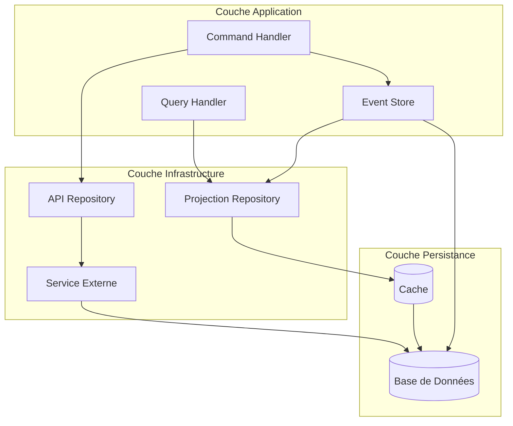

# Chapitre 27 : Stockage API - Event Sourcing + CQRS

## 🎯 Objectif du Chapitre

Ce chapitre explore la combinaison de l'Event Sourcing et du CQRS pour les APIs externes, offrant une séparation complète entre les opérations de lecture et d'écriture avec une traçabilité totale des événements.

## 📋 Prérequis

- **Chapitre 10** : Event Sourcing - Comprendre la persistance des événements
- **Chapitre 12** : Architecture CQRS - Séparation Command/Query
- **Chapitre 26** : Stockage API - Event Sourcing + CQS - Base pour l'approche API

## 🏗️ Architecture Event Sourcing + CQRS pour APIs

### Vue d'Ensemble

L'Event Sourcing + CQRS pour les APIs combine :
- **Event Sourcing** : Persistance des événements métier
- **CQRS** : Séparation complète Command/Query
- **API Repository** : Intégration avec des services externes
- **Projections** : Vues optimisées pour la lecture

### Diagramme d'Architecture



## 🔧 Implémentation Technique

### 1. Command Handler avec Event Sourcing

```php
<?php

namespace App\Accounting\Application\Command;

use App\Accounting\Domain\Event\PaymentProcessed;
use App\Accounting\Domain\ValueObject\PaymentId;
use App\Accounting\Domain\ValueObject\Amount;
use App\Accounting\Infrastructure\Repository\PaymentEventStore;
use App\Accounting\Infrastructure\Repository\PaymentApiRepository;

class ProcessPaymentCommandHandler
{
    public function __construct(
        private PaymentEventStore $eventStore,
        private PaymentApiRepository $apiRepository
    ) {}
    
    public function handle(ProcessPaymentCommand $command): void
    {
        // 1. Charger l'agrégat depuis les événements
        $payment = $this->eventStore->load($command->paymentId);
        
        // 2. Exécuter la commande métier
        $payment->process($command->amount, $command->currency);
        
        // 3. Persister les nouveaux événements
        $events = $payment->getUncommittedEvents();
        $this->eventStore->save($command->paymentId, $events);
        
        // 4. Synchroniser avec l'API externe
        $this->apiRepository->syncPayment($payment);
        
        // 5. Publier les événements
        foreach ($events as $event) {
            $this->eventBus->publish($event);
        }
    }
}
```

### 2. Query Handler avec Projections

```php
<?php

namespace App\Accounting\Application\Query;

use App\Accounting\Infrastructure\Repository\PaymentProjectionRepository;
use App\Accounting\Infrastructure\Repository\PaymentCacheRepository;

class GetPaymentQueryHandler
{
    public function __construct(
        private PaymentProjectionRepository $projectionRepository,
        private PaymentCacheRepository $cacheRepository
    ) {}
    
    public function handle(GetPaymentQuery $query): PaymentView
    {
        // 1. Vérifier le cache
        $cached = $this->cacheRepository->find($query->paymentId);
        if ($cached) {
            return $cached;
        }
        
        // 2. Charger depuis la projection
        $projection = $this->projectionRepository->find($query->paymentId);
        
        // 3. Mettre en cache
        $this->cacheRepository->save($projection);
        
        return $projection;
    }
}
```

### 3. API Repository avec Event Sourcing

```php
<?php

namespace App\Accounting\Infrastructure\Repository;

use App\Accounting\Domain\Aggregate\Payment;
use App\Accounting\Domain\Event\PaymentProcessed;
use App\Accounting\Domain\ValueObject\PaymentId;
use App\Accounting\Infrastructure\Api\StripeApiClient;

class PaymentApiRepository implements PaymentRepositoryInterface
{
    public function __construct(
        private StripeApiClient $stripeApi,
        private PaymentEventStore $eventStore
    ) {}
    
    public function save(Payment $payment): void
    {
        // 1. Persister les événements
        $events = $payment->getUncommittedEvents();
        $this->eventStore->save($payment->getId(), $events);
        
        // 2. Synchroniser avec l'API externe
        foreach ($events as $event) {
            if ($event instanceof PaymentProcessed) {
                $this->stripeApi->createPaymentIntent([
                    'amount' => $event->getAmount()->getValue(),
                    'currency' => $event->getCurrency()->getCode(),
                    'metadata' => [
                        'payment_id' => $event->getPaymentId()->getValue(),
                        'event_id' => $event->getEventId()
                    ]
                ]);
            }
        }
    }
    
    public function find(PaymentId $id): ?Payment
    {
        // 1. Charger depuis l'API externe
        $apiData = $this->stripeApi->getPaymentIntent($id->getValue());
        
        // 2. Reconstruire l'agrégat depuis les événements
        $events = $this->eventStore->load($id);
        
        if (empty($events)) {
            return null;
        }
        
        return Payment::fromEvents($events);
    }
}
```

### 4. Projection Handler

```php
<?php

namespace App\Accounting\Infrastructure\Projection;

use App\Accounting\Domain\Event\PaymentProcessed;
use App\Accounting\Domain\Event\PaymentFailed;
use App\Accounting\Infrastructure\Repository\PaymentProjectionRepository;

class PaymentProjectionHandler
{
    public function __construct(
        private PaymentProjectionRepository $projectionRepository
    ) {}
    
    public function handle(PaymentProcessed $event): void
    {
        $projection = new PaymentProjection(
            $event->getPaymentId(),
            $event->getAmount(),
            $event->getCurrency(),
            'processed',
            $event->getProcessedAt()
        );
        
        $this->projectionRepository->save($projection);
    }
    
    public function handle(PaymentFailed $event): void
    {
        $projection = new PaymentProjection(
            $event->getPaymentId(),
            $event->getAmount(),
            $event->getCurrency(),
            'failed',
            $event->getFailedAt()
        );
        
        $this->projectionRepository->save($projection);
    }
}
```

## 🎨 Patterns d'Implémentation

### 1. Event Store avec API

```php
<?php

namespace App\Accounting\Infrastructure\EventStore;

use App\Accounting\Domain\Event\DomainEvent;
use App\Accounting\Domain\ValueObject\PaymentId;
use App\Accounting\Infrastructure\Api\EventStoreApiClient;

class ApiEventStore implements EventStoreInterface
{
    public function __construct(
        private EventStoreApiClient $apiClient
    ) {}
    
    public function save(PaymentId $id, array $events): void
    {
        $streamName = "payment-{$id->getValue()}";
        
        foreach ($events as $event) {
            $this->apiClient->appendToStream($streamName, [
                'eventType' => get_class($event),
                'eventData' => $this->serializeEvent($event),
                'eventId' => $event->getEventId(),
                'occurredOn' => $event->getOccurredOn()
            ]);
        }
    }
    
    public function load(PaymentId $id): array
    {
        $streamName = "payment-{$id->getValue()}";
        $events = $this->apiClient->getStreamEvents($streamName);
        
        return array_map(
            fn($eventData) => $this->deserializeEvent($eventData),
            $events
        );
    }
}
```

### 2. Projection Repository avec Cache

```php
<?php

namespace App\Accounting\Infrastructure\Repository;

use App\Accounting\Domain\ValueObject\PaymentId;
use App\Accounting\Infrastructure\Api\ProjectionApiClient;
use App\Accounting\Infrastructure\Cache\RedisCache;

class PaymentProjectionRepository
{
    public function __construct(
        private ProjectionApiClient $apiClient,
        private RedisCache $cache
    ) {}
    
    public function find(PaymentId $id): ?PaymentProjection
    {
        $cacheKey = "payment_projection_{$id->getValue()}";
        
        // 1. Vérifier le cache
        $cached = $this->cache->get($cacheKey);
        if ($cached) {
            return PaymentProjection::fromArray($cached);
        }
        
        // 2. Charger depuis l'API
        $data = $this->apiClient->getProjection($id->getValue());
        
        if (!$data) {
            return null;
        }
        
        $projection = PaymentProjection::fromArray($data);
        
        // 3. Mettre en cache
        $this->cache->set($cacheKey, $projection->toArray(), 3600);
        
        return $projection;
    }
}
```

## 🔄 Synchronisation et Cohérence

### 1. Synchronisation Bidirectionnelle

```php
<?php

namespace App\Accounting\Infrastructure\Sync;

use App\Accounting\Domain\Event\PaymentProcessed;
use App\Accounting\Infrastructure\Api\StripeApiClient;
use App\Accounting\Infrastructure\Repository\PaymentEventStore;

class PaymentSynchronizer
{
    public function __construct(
        private StripeApiClient $stripeApi,
        private PaymentEventStore $eventStore
    ) {}
    
    public function syncFromApi(PaymentId $id): void
    {
        // 1. Récupérer les données de l'API
        $apiData = $this->stripeApi->getPaymentIntent($id->getValue());
        
        // 2. Vérifier les événements locaux
        $localEvents = $this->eventStore->load($id);
        
        // 3. Détecter les différences
        $differences = $this->detectDifferences($apiData, $localEvents);
        
        // 4. Appliquer les corrections
        foreach ($differences as $difference) {
            $this->applyCorrection($id, $difference);
        }
    }
    
    public function syncToApi(PaymentId $id): void
    {
        // 1. Charger les événements locaux
        $events = $this->eventStore->load($id);
        
        // 2. Synchroniser avec l'API
        foreach ($events as $event) {
            if ($event instanceof PaymentProcessed) {
                $this->stripeApi->updatePaymentIntent(
                    $id->getValue(),
                    $this->mapEventToApiData($event)
                );
            }
        }
    }
}
```

### 2. Gestion des Conflits

```php
<?php

namespace App\Accounting\Infrastructure\Conflict;

use App\Accounting\Domain\Event\DomainEvent;
use App\Accounting\Domain\ValueObject\PaymentId;

class ConflictResolver
{
    public function resolve(PaymentId $id, array $localEvents, array $apiEvents): array
    {
        $resolvedEvents = [];
        
        // 1. Fusionner les événements par timestamp
        $allEvents = array_merge($localEvents, $apiEvents);
        usort($allEvents, fn($a, $b) => $a->getOccurredOn() <=> $b->getOccurredOn());
        
        // 2. Détecter les conflits
        $conflicts = $this->detectConflicts($allEvents);
        
        // 3. Résoudre les conflits
        foreach ($conflicts as $conflict) {
            $resolved = $this->resolveConflict($conflict);
            $resolvedEvents[] = $resolved;
        }
        
        // 4. Ajouter les événements non conflictuels
        foreach ($allEvents as $event) {
            if (!$this->isInConflict($event, $conflicts)) {
                $resolvedEvents[] = $event;
            }
        }
        
        return $resolvedEvents;
    }
}
```

## 📊 Monitoring et Observabilité

### 1. Métriques de Performance

```php
<?php

namespace App\Accounting\Infrastructure\Monitoring;

use App\Accounting\Domain\Event\PaymentProcessed;
use App\Accounting\Infrastructure\Metrics\PrometheusMetrics;

class PaymentMetricsCollector
{
    public function __construct(
        private PrometheusMetrics $metrics
    ) {}
    
    public function recordPaymentProcessed(PaymentProcessed $event): void
    {
        $this->metrics->incrementCounter('payments_processed_total', [
            'currency' => $event->getCurrency()->getCode(),
            'amount_range' => $this->getAmountRange($event->getAmount())
        ]);
        
        $this->metrics->recordHistogram('payment_processing_duration', 
            $event->getProcessingDuration(),
            ['currency' => $event->getCurrency()->getCode()]
        );
    }
    
    public function recordApiCall(string $operation, float $duration, bool $success): void
    {
        $this->metrics->incrementCounter('api_calls_total', [
            'operation' => $operation,
            'status' => $success ? 'success' : 'error'
        ]);
        
        $this->metrics->recordHistogram('api_call_duration', $duration, [
            'operation' => $operation
        ]);
    }
}
```

### 2. Logging Structuré

```php
<?php

namespace App\Accounting\Infrastructure\Logging;

use App\Accounting\Domain\Event\PaymentProcessed;
use Psr\Log\LoggerInterface;

class PaymentEventLogger
{
    public function __construct(
        private LoggerInterface $logger
    ) {}
    
    public function logPaymentProcessed(PaymentProcessed $event): void
    {
        $this->logger->info('Payment processed', [
            'event_type' => 'PaymentProcessed',
            'payment_id' => $event->getPaymentId()->getValue(),
            'amount' => $event->getAmount()->getValue(),
            'currency' => $event->getCurrency()->getCode(),
            'processed_at' => $event->getProcessedAt()->format('Y-m-d H:i:s'),
            'event_id' => $event->getEventId(),
            'correlation_id' => $event->getCorrelationId()
        ]);
    }
}
```

## 🎯 Avantages de l'Approche

### 1. Séparation Complète des Responsabilités
- **Commands** : Gestion des opérations d'écriture
- **Queries** : Optimisation des opérations de lecture
- **Event Sourcing** : Traçabilité totale des événements
- **API Integration** : Synchronisation avec les services externes

### 2. Performance Optimisée
- **Projections** : Vues optimisées pour la lecture
- **Cache** : Mise en cache des projections
- **API Calls** : Appels optimisés aux services externes
- **Event Store** : Persistance efficace des événements

### 3. Évolutivité
- **Scaling** : Séparation des responsabilités
- **Maintenance** : Code modulaire et testable
- **Intégration** : Facile d'ajouter de nouveaux services
- **Monitoring** : Observabilité complète

## ⚠️ Inconvénients et Considérations

### 1. Complexité
- **Architecture** : Plus complexe que les approches simples
- **Debugging** : Plus difficile de tracer les problèmes
- **Learning Curve** : Courbe d'apprentissage importante

### 2. Consistance
- **Eventual Consistency** : Cohérence éventuelle
- **Synchronisation** : Gestion des conflits
- **API Dependencies** : Dépendance aux services externes

### 3. Performance
- **Latence** : Appels API synchrones
- **Résilience** : Gestion des pannes d'API
- **Coût** : Coût des appels API

## 🔧 Configuration et Déploiement

### 1. Configuration des Services

```yaml
# config/packages/accounting.yaml
accounting:
  event_sourcing:
    api:
      base_url: '%env(STRIPE_API_URL)%'
      api_key: '%env(STRIPE_API_KEY)%'
      timeout: 30
      retry_attempts: 3
  
  projections:
    cache:
      ttl: 3600
      prefix: 'payment_projection_'
    
    api:
      base_url: '%env(PROJECTION_API_URL)%'
      api_key: '%env(PROJECTION_API_KEY)%'
```

### 2. Déploiement avec Docker

```dockerfile
# Dockerfile
FROM php:8.2-fpm

# Install dependencies
RUN apt-get update && apt-get install -y \
    git \
    unzip \
    libzip-dev \
    libpq-dev

# Install PHP extensions
RUN docker-php-ext-install pdo_pgsql zip

# Copy application
COPY . /var/www/html
WORKDIR /var/www/html

# Install Composer dependencies
RUN composer install --no-dev --optimize-autoloader

# Configure PHP
RUN echo "memory_limit = 512M" >> /usr/local/etc/php/conf.d/memory.ini
RUN echo "max_execution_time = 300" >> /usr/local/etc/php/conf.d/execution.ini

# Expose port
EXPOSE 9000

# Start PHP-FPM
CMD ["php-fpm"]
```

## 📚 Exemples Concrets du projet Gyroscops Cloud

### 1. Intégration Stripe avec Event Sourcing

```php
<?php

namespace App\Accounting\Infrastructure\Api;

use App\Accounting\Domain\Event\PaymentProcessed;
use App\Accounting\Domain\ValueObject\PaymentId;
use App\Accounting\Domain\ValueObject\Amount;
use App\Accounting\Domain\ValueObject\Currency;

class StripePaymentApiRepository
{
    public function __construct(
        private StripeClient $stripeClient,
        private PaymentEventStore $eventStore
    ) {}
    
    public function processPayment(PaymentId $id, Amount $amount, Currency $currency): void
    {
        // 1. Créer le PaymentIntent sur Stripe
        $paymentIntent = $this->stripeClient->paymentIntents->create([
            'amount' => $amount->getValueInCents(),
            'currency' => $currency->getCode(),
            'metadata' => [
                'payment_id' => $id->getValue()
            ]
        ]);
        
        // 2. Enregistrer l'événement
        $event = new PaymentProcessed(
            $id,
            $amount,
            $currency,
            new \DateTimeImmutable(),
            $paymentIntent->id
        );
        
        $this->eventStore->save($id, [$event]);
    }
}
```

### 2. Projection pour le Dashboard

```php
<?php

namespace App\Accounting\Infrastructure\Projection;

use App\Accounting\Domain\Event\PaymentProcessed;
use App\Accounting\Domain\Event\PaymentFailed;

class PaymentDashboardProjection
{
    public function handle(PaymentProcessed $event): void
    {
        $this->updateDashboard([
            'total_payments' => $this->incrementCounter('total_payments'),
            'total_amount' => $this->addAmount('total_amount', $event->getAmount()),
            'success_rate' => $this->calculateSuccessRate(),
            'last_payment' => $event->getProcessedAt()
        ]);
    }
    
    public function handle(PaymentFailed $event): void
    {
        $this->updateDashboard([
            'failed_payments' => $this->incrementCounter('failed_payments'),
            'success_rate' => $this->calculateSuccessRate(),
            'last_failure' => $event->getFailedAt()
        ]);
    }
}
```

## 🎯 Critères d'Adoption

### ✅ Adoptez cette approche si :

- **Système complexe** avec de nombreuses intégrations API
- **Traçabilité importante** des opérations métier
- **Performance critique** pour les opérations de lecture
- **Équipe expérimentée** avec Event Sourcing et CQRS
- **Budget** pour la complexité architecturale
- **Temps** pour l'implémentation et la maintenance

### ❌ Évitez cette approche si :

- **Système simple** avec peu d'intégrations
- **Développement rapide** requis
- **Équipe junior** sans expérience Event Sourcing
- **Budget limité** pour la complexité
- **APIs instables** ou non fiables

## 📈 Métriques de Succès

### 1. Performance
- **Temps de réponse** des queries < 100ms
- **Throughput** des commands > 1000/min
- **Disponibilité** de l'API > 99.9%

### 2. Qualité
- **Couverture de tests** > 90%
- **Taux d'erreur** < 0.1%
- **Temps de récupération** < 5 minutes

### 3. Business
- **Satisfaction utilisateur** > 4.5/5
- **Temps de développement** des nouvelles fonctionnalités
- **Coût de maintenance** acceptable

---

## 🎯 Votre Prochaine Étape

Maintenant que vous comprenez l'Event Sourcing + CQRS pour les APIs, quel est votre contexte ?


  

  {{< chapter-option 
    letter="B" 
    color="yellow" 
    title="Je veux explorer le stockage ElasticSearch" 
    subtitle="Vous voulez comprendre comment utiliser ElasticSearch pour la recherche" 
    criteria="Besoin de recherche full-text,Analytics et reporting,Logs et monitoring,Performance de recherche" 
    time="35-45 minutes" 
    chapter="34" 
    chapter-title="Stockage ElasticSearch - Approche Classique" 
    chapter-url="/chapitres/stockage/elasticsearch/chapitre-34-stockage-elasticsearch-classique/" 
  >}}

  

  {{< chapter-option 
    letter="D" 
    color="blue" 
    title="Je veux explorer le Stockage Composite piloté par Temporal" 
    subtitle="Vous voulez comprendre comment gérer les workflows complexes" 
    criteria="Workflows complexes,Orchestration de services,Resilience et retry,État distribué" 
    time="40-50 minutes" 
    chapter="46" 
    chapter-title="Stockage Composite piloté par Temporal - Approche Classique" 
    chapter-url="/chapitres/stockage/temporal/chapitre-46-stockage-temporal-classique/" 
  >}}

  

