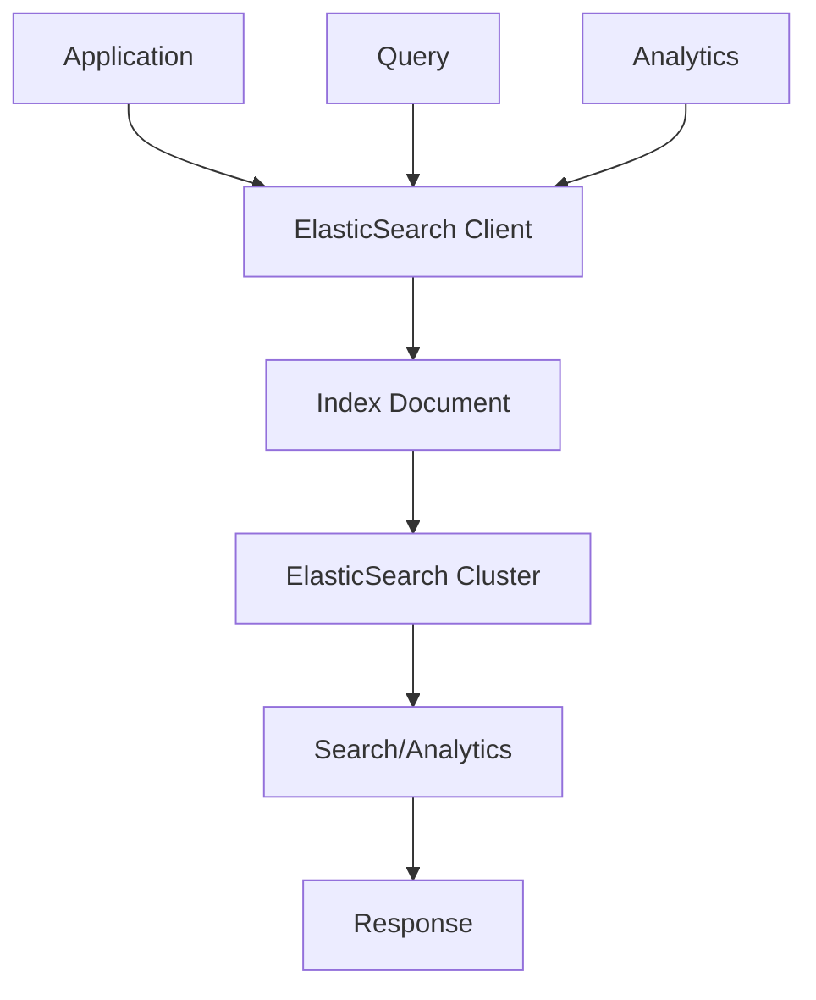

# 🔍 Stockage ElasticSearch - Approche Classique

## 🎯 **Contexte et Objectifs**

### **Pourquoi ElasticSearch pour le Stockage ?**

ElasticSearch n'est pas seulement un moteur de recherche, c'est aussi une **base de données NoSQL** puissante pour les cas d'usage spécifiques nécessitant :
- **Recherche full-text** : Recherche dans le contenu
- **Analytics** : Agrégations et métriques complexes
- **Logs** : Stockage et analyse de logs
- **Time-series** : Données temporelles avec requêtes rapides

#### **Avantages d'ElasticSearch**
- **Recherche puissante** : Full-text search avec scoring
- **Analytics avancées** : Agrégations complexes
- **Scalabilité** : Distribution horizontale native
- **Flexibilité** : Mapping dynamique des données
- **Performance** : Requêtes très rapides sur de gros volumes

### **Contexte Gyroscops**

Dans notre écosystème **User → Organization → Workflow → Cloud Resources → Billing**, ElasticSearch est idéal pour :
- **Logs d'application** : Traçabilité des actions utilisateurs
- **Métriques de performance** : Monitoring des ressources cloud
- **Recherche de factures** : Recherche full-text dans les données de facturation
- **Analytics business** : Rapports et tableaux de bord

## 🏗️ **Architecture ElasticSearch Classique**

### **Structure des Données**

#### **Index et Types**
```json
{
  "index": "Gyroscops Cloud-payments",
  "mapping": {
    "properties": {
      "paymentId": { "type": "keyword" },
      "organizationId": { "type": "keyword" },
      "userId": { "type": "keyword" },
      "amount": { "type": "double" },
      "currency": { "type": "keyword" },
      "status": { "type": "keyword" },
      "description": { "type": "text", "analyzer": "standard" },
      "processedAt": { "type": "date" },
      "metadata": {
        "type": "object",
        "properties": {
          "source": { "type": "keyword" },
          "tags": { "type": "keyword" }
        }
      }
    }
  }
}
```

#### **Document Example**
```json
{
  "paymentId": "payment-123",
  "organizationId": "org-456",
  "userId": "user-789",
  "amount": 100.00,
  "currency": "EUR",
  "status": "completed",
  "description": "Payment for cloud resources usage",
  "processedAt": "2024-12-19T10:00:00Z",
  "metadata": {
    "source": "api",
    "tags": ["cloud", "billing", "monthly"]
  }
}
```

### **Flux de Données**



## 💻 **Implémentation Pratique**

### **1. Configuration ElasticSearch**

#### **Client ElasticSearch**

```php
<?php

namespace App\Infrastructure\ElasticSearch;

use Elasticsearch\ClientBuilder;
use Elasticsearch\Client;

class ElasticSearchClientFactory
{
    public static function create(array $config): Client
    {
        $builder = ClientBuilder::create();
        
        // Configuration des hosts
        $builder->setHosts($config['hosts']);
        
        // Configuration de l'authentification
        if (isset($config['username']) && isset($config['password'])) {
            $builder->setBasicAuthentication($config['username'], $config['password']);
        }
        
        // Configuration SSL
        if (isset($config['ssl'])) {
            $builder->setSSLVerification($config['ssl']['verify']);
        }
        
        // Configuration du retry
        $builder->setRetries($config['retries'] ?? 3);
        
        return $builder->build();
    }
}
```

#### **Configuration Symfony**

```yaml
# config/packages/elasticsearch.yaml
elasticsearch:
    hosts:
        - 'localhost:9200'
    username: '%env(ELASTICSEARCH_USERNAME)%'
    password: '%env(ELASTICSEARCH_PASSWORD)%'
    ssl:
        verify: true
    retries: 3
    timeout: 30
```

### **2. Repository ElasticSearch**

#### **Repository de Base**

```php
<?php

namespace App\Infrastructure\ElasticSearch;

use Elasticsearch\Client;
use Psr\Log\LoggerInterface;

abstract class ElasticSearchRepository
{
    protected Client $client;
    protected string $index;
    protected LoggerInterface $logger;

    public function __construct(Client $client, string $index, LoggerInterface $logger)
    {
        $this->client = $client;
        $this->index = $index;
        $this->logger = $logger;
    }

    public function index(array $document, string $id = null): array
    {
        $params = [
            'index' => $this->index,
            'body' => $document
        ];
        
        if ($id) {
            $params['id'] = $id;
        }
        
        try {
            $response = $this->client->index($params);
            
            $this->logger->info('Document indexed', [
                'index' => $this->index,
                'id' => $response['_id'],
                'result' => $response['result']
            ]);
            
            return $response;
            
        } catch (\Exception $e) {
            $this->logger->error('Failed to index document', [
                'index' => $this->index,
                'error' => $e->getMessage(),
                'document' => $document
            ]);
            
            throw $e;
        }
    }

    public function get(string $id): ?array
    {
        try {
            $response = $this->client->get([
                'index' => $this->index,
                'id' => $id
            ]);
            
            return $response['_source'];
            
        } catch (\Elasticsearch\Common\Exceptions\Missing404Exception $e) {
            return null;
        } catch (\Exception $e) {
            $this->logger->error('Failed to get document', [
                'index' => $this->index,
                'id' => $id,
                'error' => $e->getMessage()
            ]);
            
            throw $e;
        }
    }

    public function search(array $query): array
    {
        try {
            $response = $this->client->search([
                'index' => $this->index,
                'body' => $query
            ]);
            
            return $response;
            
        } catch (\Exception $e) {
            $this->logger->error('Failed to search documents', [
                'index' => $this->index,
                'query' => $query,
                'error' => $e->getMessage()
            ]);
            
            throw $e;
        }
    }

    public function update(string $id, array $document): array
    {
        try {
            $response = $this->client->update([
                'index' => $this->index,
                'id' => $id,
                'body' => [
                    'doc' => $document
                ]
            ]);
            
            $this->logger->info('Document updated', [
                'index' => $this->index,
                'id' => $id,
                'result' => $response['result']
            ]);
            
            return $response;
            
        } catch (\Exception $e) {
            $this->logger->error('Failed to update document', [
                'index' => $this->index,
                'id' => $id,
                'error' => $e->getMessage()
            ]);
            
            throw $e;
        }
    }

    public function delete(string $id): array
    {
        try {
            $response = $this->client->delete([
                'index' => $this->index,
                'id' => $id
            ]);
            
            $this->logger->info('Document deleted', [
                'index' => $this->index,
                'id' => $id,
                'result' => $response['result']
            ]);
            
            return $response;
            
        } catch (\Exception $e) {
            $this->logger->error('Failed to delete document', [
                'index' => $this->index,
                'id' => $id,
                'error' => $e->getMessage()
            ]);
            
            throw $e;
        }
    }
}
```

#### **Repository Spécialisé pour les Paiements**

```php
<?php

namespace App\Infrastructure\ElasticSearch\Payment;

use App\Infrastructure\ElasticSearch\ElasticSearchRepository;
use App\Domain\Payment\Payment;
use App\Domain\Payment\PaymentRepositoryInterface;

class ElasticSearchPaymentRepository extends ElasticSearchRepository implements PaymentRepositoryInterface
{
    public function save(Payment $payment): void
    {
        $document = [
            'paymentId' => $payment->getId(),
            'organizationId' => $payment->getOrganizationId(),
            'userId' => $payment->getUserId(),
            'amount' => $payment->getAmount(),
            'currency' => $payment->getCurrency(),
            'status' => $payment->getStatus(),
            'description' => $payment->getDescription(),
            'processedAt' => $payment->getProcessedAt()->format('c'),
            'metadata' => $payment->getMetadata()
        ];
        
        $this->index($document, $payment->getId());
    }

    public function findById(string $id): ?Payment
    {
        $document = $this->get($id);
        
        if (!$document) {
            return null;
        }
        
        return $this->documentToPayment($document);
    }

    public function findByOrganization(string $organizationId, int $limit = 50, int $offset = 0): array
    {
        $query = [
            'query' => [
                'bool' => [
                    'must' => [
                        ['term' => ['organizationId' => $organizationId]]
                    ]
                ]
            ],
            'sort' => [
                ['processedAt' => ['order' => 'desc']]
            ],
            'from' => $offset,
            'size' => $limit
        ];
        
        $response = $this->search($query);
        
        $payments = [];
        foreach ($response['hits']['hits'] as $hit) {
            $payments[] = $this->documentToPayment($hit['_source']);
        }
        
        return $payments;
    }

    public function searchByDescription(string $description, string $organizationId = null): array
    {
        $query = [
            'query' => [
                'bool' => [
                    'must' => [
                        ['match' => ['description' => $description]]
                    ]
                ]
            ],
            'sort' => [
                ['_score' => ['order' => 'desc']],
                ['processedAt' => ['order' => 'desc']]
            ]
        ];
        
        if ($organizationId) {
            $query['query']['bool']['must'][] = ['term' => ['organizationId' => $organizationId]];
        }
        
        $response = $this->search($query);
        
        $payments = [];
        foreach ($response['hits']['hits'] as $hit) {
            $payments[] = $this->documentToPayment($hit['_source']);
        }
        
        return $payments;
    }

    public function getStatistics(string $organizationId, \DateTime $from, \DateTime $to): array
    {
        $query = [
            'query' => [
                'bool' => [
                    'must' => [
                        ['term' => ['organizationId' => $organizationId]],
                        ['range' => [
                            'processedAt' => [
                                'gte' => $from->format('c'),
                                'lte' => $to->format('c')
                            ]
                        ]]
                    ]
                ]
            ],
            'aggs' => [
                'status_stats' => [
                    'terms' => ['field' => 'status'],
                    'aggs' => [
                        'total_amount' => ['sum' => ['field' => 'amount']],
                        'avg_amount' => ['avg' => ['field' => 'amount']]
                    ]
                ],
                'currency_stats' => [
                    'terms' => ['field' => 'currency'],
                    'aggs' => [
                        'total_amount' => ['sum' => ['field' => 'amount']]
                    ]
                ],
                'daily_stats' => [
                    'date_histogram' => [
                        'field' => 'processedAt',
                        'calendar_interval' => 'day'
                    ],
                    'aggs' => [
                        'total_amount' => ['sum' => ['field' => 'amount']],
                        'count' => ['value_count' => ['field' => 'paymentId']]
                    ]
                ]
            ]
        ];
        
        $response = $this->search($query);
        
        return [
            'status_stats' => $response['aggregations']['status_stats']['buckets'],
            'currency_stats' => $response['aggregations']['currency_stats']['buckets'],
            'daily_stats' => $response['aggregations']['daily_stats']['buckets']
        ];
    }

    private function documentToPayment(array $document): Payment
    {
        return new Payment(
            $document['paymentId'],
            $document['organizationId'],
            $document['userId'],
            $document['amount'],
            $document['currency'],
            $document['status'],
            $document['description'],
            new \DateTime($document['processedAt']),
            $document['metadata'] ?? []
        );
    }
}
```

### **3. Service de Recherche**

#### **Service de Recherche Avancé**

```php
<?php

namespace App\Application\Service\Search;

use App\Infrastructure\ElasticSearch\ElasticSearchRepository;
use Psr\Log\LoggerInterface;

class PaymentSearchService
{
    private ElasticSearchRepository $repository;
    private LoggerInterface $logger;

    public function __construct(ElasticSearchRepository $repository, LoggerInterface $logger)
    {
        $this->repository = $repository;
        $this->logger = $logger;
    }

    public function searchPayments(PaymentSearchCriteria $criteria): PaymentSearchResult
    {
        $query = $this->buildSearchQuery($criteria);
        
        $response = $this->repository->search($query);
        
        return new PaymentSearchResult(
            $this->extractPayments($response),
            $response['hits']['total']['value'],
            $criteria->getPage(),
            $criteria->getSize()
        );
    }

    public function searchSuggestions(string $query, string $organizationId = null): array
    {
        $searchQuery = [
            'suggest' => [
                'payment_suggestions' => [
                    'prefix' => $query,
                    'completion' => [
                        'field' => 'description.suggest',
                        'size' => 10
                    ]
                ]
            ]
        ];
        
        if ($organizationId) {
            $searchQuery['query'] = [
                'term' => ['organizationId' => $organizationId]
            ];
        }
        
        $response = $this->repository->search($searchQuery);
        
        $suggestions = [];
        if (isset($response['suggest']['payment_suggestions'][0]['options'])) {
            foreach ($response['suggest']['payment_suggestions'][0]['options'] as $option) {
                $suggestions[] = [
                    'text' => $option['text'],
                    'score' => $option['score']
                ];
            }
        }
        
        return $suggestions;
    }

    public function getAnalytics(AnalyticsCriteria $criteria): array
    {
        $query = [
            'query' => [
                'bool' => [
                    'must' => [
                        ['term' => ['organizationId' => $criteria->getOrganizationId()]],
                        ['range' => [
                            'processedAt' => [
                                'gte' => $criteria->getFrom()->format('c'),
                                'lte' => $criteria->getTo()->format('c')
                            ]
                        ]]
                    ]
                ]
            ],
            'aggs' => [
                'trends' => [
                    'date_histogram' => [
                        'field' => 'processedAt',
                        'calendar_interval' => $criteria->getInterval()
                    ],
                    'aggs' => [
                        'total_amount' => ['sum' => ['field' => 'amount']],
                        'count' => ['value_count' => ['field' => 'paymentId']],
                        'status_breakdown' => [
                            'terms' => ['field' => 'status']
                        ]
                    ]
                ],
                'top_currencies' => [
                    'terms' => [
                        'field' => 'currency',
                        'size' => 10
                    ],
                    'aggs' => [
                        'total_amount' => ['sum' => ['field' => 'amount']]
                    ]
                ]
            ]
        ];
        
        $response = $this->repository->search($query);
        
        return [
            'trends' => $response['aggregations']['trends']['buckets'],
            'top_currencies' => $response['aggregations']['top_currencies']['buckets']
        ];
    }

    private function buildSearchQuery(PaymentSearchCriteria $criteria): array
    {
        $query = [
            'query' => [
                'bool' => [
                    'must' => []
                ]
            ],
            'sort' => [
                ['_score' => ['order' => 'desc']],
                ['processedAt' => ['order' => 'desc']]
            ],
            'from' => $criteria->getOffset(),
            'size' => $criteria->getSize()
        ];
        
        // Filtres obligatoires
        if ($criteria->getOrganizationId()) {
            $query['query']['bool']['must'][] = [
                'term' => ['organizationId' => $criteria->getOrganizationId()]
            ];
        }
        
        // Recherche textuelle
        if ($criteria->getSearchText()) {
            $query['query']['bool']['must'][] = [
                'multi_match' => [
                    'query' => $criteria->getSearchText(),
                    'fields' => ['description^2', 'paymentId', 'metadata.tags'],
                    'type' => 'best_fields',
                    'fuzziness' => 'AUTO'
                ]
            ];
        }
        
        // Filtres de statut
        if ($criteria->getStatuses()) {
            $query['query']['bool']['must'][] = [
                'terms' => ['status' => $criteria->getStatuses()]
            ];
        }
        
        // Filtres de devise
        if ($criteria->getCurrencies()) {
            $query['query']['bool']['must'][] = [
                'terms' => ['currency' => $criteria->getCurrencies()]
            ];
        }
        
        // Filtres de montant
        if ($criteria->getMinAmount() || $criteria->getMaxAmount()) {
            $range = [];
            if ($criteria->getMinAmount()) {
                $range['gte'] = $criteria->getMinAmount();
            }
            if ($criteria->getMaxAmount()) {
                $range['lte'] = $criteria->getMaxAmount();
            }
            
            $query['query']['bool']['must'][] = [
                'range' => ['amount' => $range]
            ];
        }
        
        // Filtres de date
        if ($criteria->getFrom() || $criteria->getTo()) {
            $range = [];
            if ($criteria->getFrom()) {
                $range['gte'] = $criteria->getFrom()->format('c');
            }
            if ($criteria->getTo()) {
                $range['lte'] = $criteria->getTo()->format('c');
            }
            
            $query['query']['bool']['must'][] = [
                'range' => ['processedAt' => $range]
            ];
        }
        
        return $query;
    }

    private function extractPayments(array $response): array
    {
        $payments = [];
        foreach ($response['hits']['hits'] as $hit) {
            $payments[] = $this->documentToPayment($hit['_source']);
        }
        
        return $payments;
    }
}
```

## 🧪 **Tests et Validation**

### **Tests Unitaires**

```php
<?php

namespace App\Tests\Infrastructure\ElasticSearch;

use PHPUnit\Framework\TestCase;
use App\Infrastructure\ElasticSearch\ElasticSearchRepository;
use Elasticsearch\Client;
use Psr\Log\LoggerInterface;

class ElasticSearchRepositoryTest extends TestCase
{
    private ElasticSearchRepository $repository;
    private Client $mockClient;
    private LoggerInterface $mockLogger;

    protected function setUp(): void
    {
        $this->mockClient = $this->createMock(Client::class);
        $this->mockLogger = $this->createMock(LoggerInterface::class);
        
        $this->repository = new ElasticSearchRepository(
            $this->mockClient,
            'test-index',
            $this->mockLogger
        );
    }

    public function testIndexDocument(): void
    {
        $document = ['test' => 'data'];
        $expectedResponse = ['_id' => 'test-id', 'result' => 'created'];
        
        $this->mockClient->expects($this->once())
            ->method('index')
            ->with([
                'index' => 'test-index',
                'body' => $document
            ])
            ->willReturn($expectedResponse);
        
        $result = $this->repository->index($document);
        
        $this->assertEquals($expectedResponse, $result);
    }

    public function testSearchDocuments(): void
    {
        $query = ['query' => ['match_all' => []]];
        $expectedResponse = ['hits' => ['hits' => []]];
        
        $this->mockClient->expects($this->once())
            ->method('search')
            ->with([
                'index' => 'test-index',
                'body' => $query
            ])
            ->willReturn($expectedResponse);
        
        $result = $this->repository->search($query);
        
        $this->assertEquals($expectedResponse, $result);
    }
}
```

### **Tests d'Intégration**

```php
<?php

namespace App\Tests\Integration\ElasticSearch;

use App\Infrastructure\ElasticSearch\Payment\ElasticSearchPaymentRepository;
use App\Domain\Payment\Payment;
use Elasticsearch\ClientBuilder;

class ElasticSearchPaymentRepositoryTest extends TestCase
{
    private ElasticSearchPaymentRepository $repository;
    private \Elasticsearch\Client $client;

    protected function setUp(): void
    {
        $this->client = ClientBuilder::create()
            ->setHosts(['localhost:9200'])
            ->build();
        
        $this->repository = new ElasticSearchPaymentRepository(
            $this->client,
            'test-payments',
            $this->createMock(LoggerInterface::class)
        );
        
        // Nettoyer l'index de test
        try {
            $this->client->indices()->delete(['index' => 'test-payments']);
        } catch (\Exception $e) {
            // Index n'existe pas, c'est normal
        }
    }

    public function testSaveAndFindPayment(): void
    {
        $payment = new Payment(
            'payment-123',
            'org-456',
            'user-789',
            100.00,
            'EUR',
            'completed',
            'Test payment',
            new \DateTime(),
            ['source' => 'test']
        );
        
        $this->repository->save($payment);
        
        $found = $this->repository->findById('payment-123');
        
        $this->assertNotNull($found);
        $this->assertEquals('payment-123', $found->getId());
        $this->assertEquals(100.00, $found->getAmount());
        $this->assertEquals('EUR', $found->getCurrency());
    }

    public function testSearchByOrganization(): void
    {
        // Créer plusieurs paiements
        $payments = [
            new Payment('payment-1', 'org-456', 'user-1', 100.00, 'EUR', 'completed', 'Payment 1', new \DateTime()),
            new Payment('payment-2', 'org-456', 'user-2', 200.00, 'USD', 'completed', 'Payment 2', new \DateTime()),
            new Payment('payment-3', 'org-789', 'user-3', 300.00, 'EUR', 'completed', 'Payment 3', new \DateTime())
        ];
        
        foreach ($payments as $payment) {
            $this->repository->save($payment);
        }
        
        $found = $this->repository->findByOrganization('org-456');
        
        $this->assertCount(2, $found);
        $this->assertEquals('payment-2', $found[0]->getId()); // Plus récent
        $this->assertEquals('payment-1', $found[1]->getId());
    }
}
```

## 📊 **Performance et Optimisation**

### **Stratégies d'Optimisation**

#### **1. Index et Mapping Optimisés**
```json
{
  "mappings": {
    "properties": {
      "paymentId": { "type": "keyword" },
      "organizationId": { "type": "keyword" },
      "description": { 
        "type": "text",
        "analyzer": "standard",
        "fields": {
          "suggest": {
            "type": "completion"
          }
        }
      },
      "processedAt": { 
        "type": "date",
        "format": "strict_date_optional_time||epoch_millis"
      },
      "amount": { "type": "double" },
      "metadata.tags": { "type": "keyword" }
    }
  },
  "settings": {
    "number_of_shards": 1,
    "number_of_replicas": 0,
    "refresh_interval": "30s"
  }
}
```

#### **2. Requêtes Optimisées**
```php
public function getOptimizedStatistics(string $organizationId, \DateTime $from, \DateTime $to): array
{
    $query = [
        'query' => [
            'bool' => [
                'must' => [
                    ['term' => ['organizationId' => $organizationId]],
                    ['range' => [
                        'processedAt' => [
                            'gte' => $from->format('c'),
                            'lte' => $to->format('c')
                        ]
                    ]]
                ]
            ]
        ],
        'aggs' => [
            'status_stats' => [
                'terms' => [
                    'field' => 'status',
                    'size' => 10
                ],
                'aggs' => [
                    'total_amount' => ['sum' => ['field' => 'amount']]
                ]
            ]
        ],
        'size' => 0 // Pas besoin des documents, seulement les agrégations
    ];
    
    return $this->search($query);
}
```

#### **3. Cache et Pagination**
```php
public function searchWithCache(PaymentSearchCriteria $criteria): PaymentSearchResult
{
    $cacheKey = 'payment_search_' . md5(serialize($criteria));
    
    if ($cached = $this->cache->get($cacheKey)) {
        return $cached;
    }
    
    $result = $this->searchPayments($criteria);
    $this->cache->set($cacheKey, $result, 300); // 5 minutes
    
    return $result;
}
```

## 🎯 **Critères d'Adoption**

### **Quand Utiliser ElasticSearch Classique**

#### **✅ Avantages**
- **Recherche puissante** : Full-text search avec scoring
- **Analytics avancées** : Agrégations complexes
- **Scalabilité** : Distribution horizontale native
- **Flexibilité** : Mapping dynamique des données
- **Performance** : Requêtes très rapides sur de gros volumes

#### **❌ Inconvénients**
- **Complexité** : Courbe d'apprentissage importante
- **Ressources** : Consommation mémoire importante
- **Consistance** : Eventual consistency
- **Coût** : Infrastructure plus coûteuse

#### **🎯 Critères d'Adoption**
- **Recherche full-text** : Besoin de recherche dans le contenu
- **Analytics** : Besoin d'agrégations complexes
- **Logs** : Stockage et analyse de logs
- **Time-series** : Données temporelles avec requêtes rapides
- **Équipe expérimentée** : Maîtrise d'ElasticSearch
- **Volume important** : Gros volumes de données

## 🚀 **Votre Prochaine Étape**


  
  
  
  
  
  
  


---

*ElasticSearch classique offre une approche puissante pour la recherche et l'analytics, parfaitement adaptée aux besoins de recherche et de reporting de Gyroscops.*

