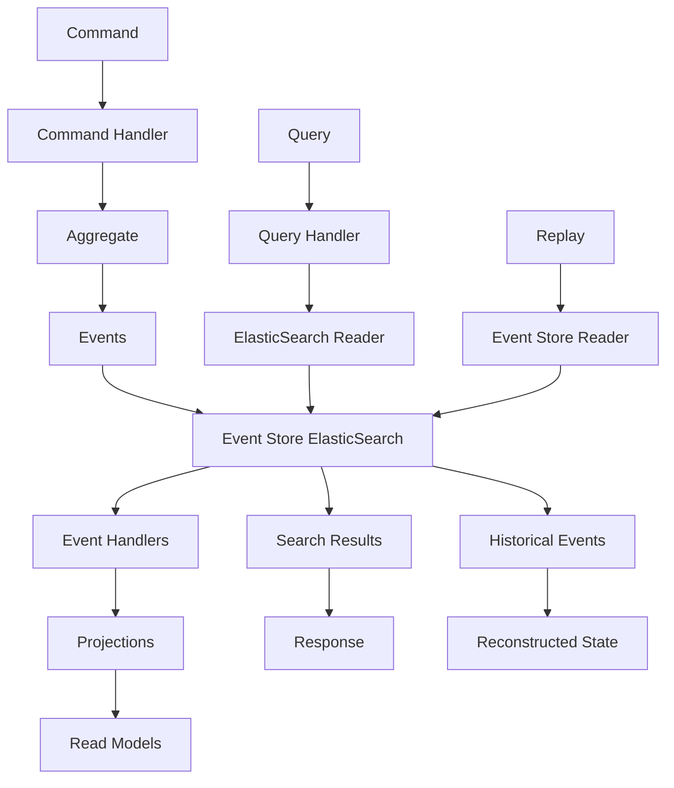

# 📚 Stockage ElasticSearch - Event Sourcing

## 🎯 **Contexte et Objectifs**

### **Pourquoi Event Sourcing avec ElasticSearch ?**

L'Event Sourcing avec ElasticSearch offre une approche unique qui combine l'audit trail complet de l'Event Sourcing avec la puissance de recherche et d'analytics d'ElasticSearch.

#### **Avantages de cette Combinaison**
- **Audit trail complet** : Historique de tous les événements
- **Recherche dans l'historique** : Full-text search sur les événements
- **Analytics temporelles** : Analyse des tendances dans le temps
- **Debugging avancé** : Possibilité de rejouer les événements
- **Flexibilité** : Projections multiples pour différents besoins

### **Contexte Gyroscops**

Dans notre écosystème **User → Organization → Workflow → Cloud Resources → Billing**, Event Sourcing avec ElasticSearch est particulièrement pertinent pour :
- **Logs d'application** : Audit trail complet des actions utilisateurs
- **Métriques de performance** : Historique des performances dans le temps
- **Facturation** : Traçabilité complète des changements de facturation
- **Workflows** : Historique des étapes et transitions

## 🏗️ **Architecture Event Sourcing avec ElasticSearch**

### **Structure des Données**

#### **Index des Événements**
```json
{
  "index": "hive-events",
  "mapping": {
    "properties": {
      "eventId": { "type": "keyword" },
      "aggregateId": { "type": "keyword" },
      "aggregateType": { "type": "keyword" },
      "eventType": { "type": "keyword" },
      "eventData": { "type": "object" },
      "version": { "type": "integer" },
      "timestamp": { "type": "date" },
      "correlationId": { "type": "keyword" },
      "causationId": { "type": "keyword" },
      "metadata": { "type": "object" }
    }
  }
}
```

#### **Document d'Événement**
```json
{
  "eventId": "evt-123",
  "aggregateId": "payment-456",
  "aggregateType": "Payment",
  "eventType": "PaymentProcessed",
  "eventData": {
    "amount": 100.00,
    "currency": "EUR",
    "status": "completed"
  },
  "version": 1,
  "timestamp": "2024-12-19T10:00:00Z",
  "correlationId": "corr-789",
  "causationId": "cmd-456",
  "metadata": {
    "userId": "user-123",
    "organizationId": "org-456",
    "source": "api"
  }
}
```

### **Flux de Données**



## 💻 **Implémentation Pratique**

### **1. Event Store ElasticSearch**

#### **Event Store Implementation**

```php
<?php

namespace App\Infrastructure\EventStore;

use Elasticsearch\Client;
use App\Domain\Event\DomainEvent;
use App\Domain\Event\EventStoreInterface;
use Psr\Log\LoggerInterface;

class ElasticSearchEventStore implements EventStoreInterface
{
    private Client $client;
    private string $index;
    private LoggerInterface $logger;

    public function __construct(Client $client, string $index, LoggerInterface $logger)
    {
        $this->client = $client;
        $this->index = $index;
        $this->logger = $logger;
    }

    public function appendEvents(string $aggregateId, array $events, int $expectedVersion): void
    {
        $session = $this->client->getClient()->startSession();
        
        try {
            $session->startTransaction();
            
            // Vérifier la version attendue
            $lastEvent = $this->getLastEvent($aggregateId);
            
            if ($lastEvent && $lastEvent['version'] !== $expectedVersion) {
                throw new ConcurrencyException('Version mismatch');
            }
            
            // Insérer les nouveaux événements
            $documents = [];
            $version = $expectedVersion + 1;
            
            foreach ($events as $event) {
                $documents[] = [
                    'eventId' => $event->getId(),
                    'aggregateId' => $aggregateId,
                    'aggregateType' => $event->getAggregateType(),
                    'eventType' => $event->getEventType(),
                    'eventData' => $event->toArray(),
                    'version' => $version++,
                    'timestamp' => new \MongoDB\BSON\UTCDateTime($event->getTimestamp()),
                    'correlationId' => $event->getCorrelationId(),
                    'causationId' => $event->getCausationId(),
                    'metadata' => $event->getMetadata()
                ];
            }
            
            $this->client->bulk([
                'body' => $this->prepareBulkIndex($documents),
                'refresh' => false
            ]);
            
            $session->commitTransaction();
            
        } catch (\Exception $e) {
            $session->abortTransaction();
            throw $e;
        }
    }

    public function getEvents(string $aggregateId, int $fromVersion = 0): array
    {
        $query = [
            'query' => [
                'bool' => [
                    'must' => [
                        ['term' => ['aggregateId' => $aggregateId]],
                        ['range' => ['version' => ['gte' => $fromVersion]]]
                    ]
                ]
            ],
            'sort' => [['version' => ['order' => 'asc']]]
        ];
        
        $response = $this->client->search([
            'index' => $this->index,
            'body' => $query
        ]);
        
        $events = [];
        foreach ($response['hits']['hits'] as $hit) {
            $events[] = $this->deserializeEvent($hit['_source']);
        }
        
        return $events;
    }

    public function getEventsByType(string $eventType, \DateTime $from = null, \DateTime $to = null): array
    {
        $query = [
            'query' => [
                'bool' => [
                    'must' => [
                        ['term' => ['eventType' => $eventType]]
                    ]
                ]
            ],
            'sort' => [['timestamp' => ['order' => 'desc']]]
        ];
        
        if ($from || $to) {
            $range = [];
            if ($from) {
                $range['gte'] = $from->format('c');
            }
            if ($to) {
                $range['lte'] = $to->format('c');
            }
            
            $query['query']['bool']['must'][] = [
                'range' => ['timestamp' => $range]
            ];
        }
        
        $response = $this->client->search([
            'index' => $this->index,
            'body' => $query
        ]);
        
        $events = [];
        foreach ($response['hits']['hits'] as $hit) {
            $events[] = $this->deserializeEvent($hit['_source']);
        }
        
        return $events;
    }

    public function getEventsByCorrelationId(string $correlationId): array
    {
        $query = [
            'query' => [
                'term' => ['correlationId' => $correlationId]
            ],
            'sort' => [['timestamp' => ['order' => 'asc']]]
        ];
        
        $response = $this->client->search([
            'index' => $this->index,
            'body' => $query
        ]);
        
        $events = [];
        foreach ($response['hits']['hits'] as $hit) {
            $events[] = $this->deserializeEvent($hit['_source']);
        }
        
        return $events;
    }

    public function searchEvents(array $criteria): array
    {
        $query = [
            'query' => [
                'bool' => [
                    'must' => []
                ]
            ],
            'sort' => [['timestamp' => ['order' => 'desc']]]
        ];
        
        if (isset($criteria['aggregateType'])) {
            $query['query']['bool']['must'][] = [
                'term' => ['aggregateType' => $criteria['aggregateType']]
            ];
        }
        
        if (isset($criteria['eventType'])) {
            $query['query']['bool']['must'][] = [
                'term' => ['eventType' => $criteria['eventType']]
            ];
        }
        
        if (isset($criteria['searchText'])) {
            $query['query']['bool']['must'][] = [
                'multi_match' => [
                    'query' => $criteria['searchText'],
                    'fields' => ['eventData.*', 'metadata.*']
                ]
            ];
        }
        
        if (isset($criteria['from']) || isset($criteria['to'])) {
            $range = [];
            if (isset($criteria['from'])) {
                $range['gte'] = $criteria['from']->format('c');
            }
            if (isset($criteria['to'])) {
                $range['lte'] = $criteria['to']->format('c');
            }
            
            $query['query']['bool']['must'][] = [
                'range' => ['timestamp' => $range]
            ];
        }
        
        $response = $this->client->search([
            'index' => $this->index,
            'body' => $query
        ]);
        
        $events = [];
        foreach ($response['hits']['hits'] as $hit) {
            $events[] = $this->deserializeEvent($hit['_source']);
        }
        
        return $events;
    }

    private function getLastEvent(string $aggregateId): ?array
    {
        $query = [
            'query' => [
                'term' => ['aggregateId' => $aggregateId]
            ],
            'sort' => [['version' => ['order' => 'desc']]],
            'size' => 1
        ];
        
        $response = $this->client->search([
            'index' => $this->index,
            'body' => $query
        ]);
        
        if (empty($response['hits']['hits'])) {
            return null;
        }
        
        return $response['hits']['hits'][0]['_source'];
    }

    private function prepareBulkIndex(array $documents): array
    {
        $bulk = [];
        foreach ($documents as $document) {
            $bulk[] = [
                'index' => [
                    '_index' => $this->index,
                    '_id' => $document['eventId']
                ]
            ];
            $bulk[] = $document;
        }
        
        return $bulk;
    }

    private function deserializeEvent(array $document): DomainEvent
    {
        $eventClass = $document['eventType'];
        return $eventClass::fromArray($document['eventData']);
    }
}
```

### **2. Command Handler avec Event Sourcing**

#### **Command Handler pour les Paiements**

```php
<?php

namespace App\Application\Command\Payment;

use App\Domain\Payment\PaymentAggregate;
use App\Domain\Event\EventStoreInterface;
use App\Domain\Event\EventBusInterface;
use Psr\Log\LoggerInterface;

class ProcessPaymentCommandHandler
{
    public function __construct(
        private EventStoreInterface $eventStore,
        private EventBusInterface $eventBus,
        private LoggerInterface $logger
    ) {}

    public function handle(ProcessPaymentCommand $command): void
    {
        try {
            // Charger l'agrégat depuis les événements
            $events = $this->eventStore->getEvents($command->getPaymentId());
            $payment = PaymentAggregate::fromEvents($events);
            
            // Exécuter la commande
            $payment->processPayment($command->getAmount(), $command->getCurrency());
            
            // Sauvegarder les événements
            $this->eventStore->appendEvents(
                $command->getPaymentId(),
                $payment->getUncommittedEvents(),
                $payment->getVersion()
            );
            
            // Publier les événements
            foreach ($payment->getUncommittedEvents() as $event) {
                $this->eventBus->publish($event);
            }
            
            // Nettoyer les événements non commités
            $payment->markEventsAsCommitted();
            
            $this->logger->info('Payment processed with event sourcing', [
                'paymentId' => $command->getPaymentId(),
                'amount' => $command->getAmount(),
                'currency' => $command->getCurrency(),
                'events' => count($payment->getUncommittedEvents())
            ]);
            
        } catch (\Exception $e) {
            $this->logger->error('Payment processing failed', [
                'paymentId' => $command->getPaymentId(),
                'error' => $e->getMessage()
            ]);
            
            throw $e;
        }
    }
}
```

### **3. Query Handler avec Recherche d'Événements**

#### **Query Handler pour l'Historique**

```php
<?php

namespace App\Application\Query\Payment;

use App\Infrastructure\EventStore\ElasticSearchEventStore;
use App\Domain\Payment\Payment;
use Psr\Log\LoggerInterface;

class PaymentHistoryQueryHandler
{
    private ElasticSearchEventStore $eventStore;
    private LoggerInterface $logger;

    public function __construct(ElasticSearchEventStore $eventStore, LoggerInterface $logger)
    {
        $this->eventStore = $eventStore;
        $this->logger = $logger;
    }

    public function handle(GetPaymentHistoryQuery $query): array
    {
        $events = $this->eventStore->getEvents($query->getPaymentId());
        
        $history = [];
        foreach ($events as $event) {
            $history[] = [
                'eventId' => $event->getId(),
                'eventType' => $event->getEventType(),
                'timestamp' => $event->getTimestamp(),
                'data' => $event->toArray(),
                'metadata' => $event->getMetadata()
            ];
        }
        
        return $history;
    }

    public function handle(SearchPaymentEventsQuery $query): array
    {
        $criteria = [
            'aggregateType' => 'Payment',
            'from' => $query->getFrom(),
            'to' => $query->getTo()
        ];
        
        if ($query->getEventType()) {
            $criteria['eventType'] = $query->getEventType();
        }
        
        if ($query->getSearchText()) {
            $criteria['searchText'] = $query->getSearchText();
        }
        
        $events = $this->eventStore->searchEvents($criteria);
        
        $results = [];
        foreach ($events as $event) {
            $results[] = [
                'eventId' => $event->getId(),
                'aggregateId' => $event->getAggregateId(),
                'eventType' => $event->getEventType(),
                'timestamp' => $event->getTimestamp(),
                'data' => $event->toArray(),
                'metadata' => $event->getMetadata()
            ];
        }
        
        return $results;
    }

    public function handle(GetPaymentTimelineQuery $query): array
    {
        $events = $this->eventStore->getEventsByCorrelationId($query->getCorrelationId());
        
        $timeline = [];
        foreach ($events as $event) {
            $timeline[] = [
                'eventId' => $event->getId(),
                'aggregateId' => $event->getAggregateId(),
                'eventType' => $event->getEventType(),
                'timestamp' => $event->getTimestamp(),
                'data' => $event->toArray(),
                'metadata' => $event->getMetadata()
            ];
        }
        
        return $timeline;
    }

    public function handle(ReplayPaymentEventsQuery $query): Payment
    {
        $events = $this->eventStore->getEvents($query->getPaymentId());
        
        // Reconstruire l'agrégat depuis les événements
        $payment = PaymentAggregate::fromEvents($events);
        
        return $payment->toPayment();
    }
}
```

### **4. Service d'Analytics Temporelles**

#### **Service d'Analytics des Événements**

```php
<?php

namespace App\Application\Service\ElasticSearch;

use App\Infrastructure\EventStore\ElasticSearchEventStore;
use Psr\Log\LoggerInterface;

class EventAnalyticsService
{
    private ElasticSearchEventStore $eventStore;
    private LoggerInterface $logger;

    public function __construct(ElasticSearchEventStore $eventStore, LoggerInterface $logger)
    {
        $this->eventStore = $eventStore;
        $this->logger = $logger;
    }

    public function getEventStatistics(string $eventType, \DateTime $from, \DateTime $to): array
    {
        $events = $this->eventStore->getEventsByType($eventType, $from, $to);
        
        $statistics = [
            'total' => count($events),
            'byHour' => [],
            'byDay' => [],
            'byOrganization' => [],
            'byUser' => []
        ];
        
        foreach ($events as $event) {
            $hour = $event->getTimestamp()->format('Y-m-d H:00:00');
            $day = $event->getTimestamp()->format('Y-m-d');
            $orgId = $event->getMetadata()['organizationId'] ?? 'unknown';
            $userId = $event->getMetadata()['userId'] ?? 'unknown';
            
            $statistics['byHour'][$hour] = ($statistics['byHour'][$hour] ?? 0) + 1;
            $statistics['byDay'][$day] = ($statistics['byDay'][$day] ?? 0) + 1;
            $statistics['byOrganization'][$orgId] = ($statistics['byOrganization'][$orgId] ?? 0) + 1;
            $statistics['byUser'][$userId] = ($statistics['byUser'][$userId] ?? 0) + 1;
        }
        
        return $statistics;
    }

    public function getEventTrends(string $eventType, \DateTime $from, \DateTime $to, string $interval = 'day'): array
    {
        $events = $this->eventStore->getEventsByType($eventType, $from, $to);
        
        $trends = [];
        foreach ($events as $event) {
            $key = $this->getIntervalKey($event->getTimestamp(), $interval);
            $trends[$key] = ($trends[$key] ?? 0) + 1;
        }
        
        ksort($trends);
        return $trends;
    }

    public function getEventCorrelations(string $correlationId): array
    {
        $events = $this->eventStore->getEventsByCorrelationId($correlationId);
        
        $correlations = [];
        foreach ($events as $event) {
            $correlations[] = [
                'eventType' => $event->getEventType(),
                'aggregateId' => $event->getAggregateId(),
                'timestamp' => $event->getTimestamp(),
                'data' => $event->toArray()
            ];
        }
        
        return $correlations;
    }

    public function searchEventData(string $searchText, array $filters = []): array
    {
        $criteria = [
            'searchText' => $searchText
        ];
        
        if (isset($filters['aggregateType'])) {
            $criteria['aggregateType'] = $filters['aggregateType'];
        }
        
        if (isset($filters['eventType'])) {
            $criteria['eventType'] = $filters['eventType'];
        }
        
        if (isset($filters['from'])) {
            $criteria['from'] = $filters['from'];
        }
        
        if (isset($filters['to'])) {
            $criteria['to'] = $filters['to'];
        }
        
        return $this->eventStore->searchEvents($criteria);
    }

    private function getIntervalKey(\DateTime $timestamp, string $interval): string
    {
        switch ($interval) {
            case 'hour':
                return $timestamp->format('Y-m-d H:00:00');
            case 'day':
                return $timestamp->format('Y-m-d');
            case 'week':
                return $timestamp->format('Y-W');
            case 'month':
                return $timestamp->format('Y-m');
            default:
                return $timestamp->format('Y-m-d');
        }
    }
}
```

## 🧪 **Tests et Validation**

### **Tests d'Intégration Event Sourcing**

```php
<?php

namespace App\Tests\Integration\ElasticSearch;

use App\Application\Command\Payment\ProcessPaymentCommand;
use App\Application\Command\Payment\ProcessPaymentCommandHandler;
use App\Application\Query\Payment\GetPaymentHistoryQuery;
use App\Application\Query\Payment\PaymentHistoryQueryHandler;
use App\Infrastructure\EventStore\ElasticSearchEventStore;
use Elasticsearch\ClientBuilder;

class ElasticSearchEventSourcingTest extends TestCase
{
    private ElasticSearchEventStore $eventStore;
    private ProcessPaymentCommandHandler $commandHandler;
    private PaymentHistoryQueryHandler $queryHandler;

    protected function setUp(): void
    {
        $client = ClientBuilder::create()->setHosts(['localhost:9200'])->build();
        
        $this->eventStore = new ElasticSearchEventStore($client, 'test-events', $this->createMock(LoggerInterface::class));
        
        $this->commandHandler = new ProcessPaymentCommandHandler(
            $this->eventStore,
            $this->createMock(EventBusInterface::class),
            $this->createMock(LoggerInterface::class)
        );
        
        $this->queryHandler = new PaymentHistoryQueryHandler($this->eventStore, $this->createMock(LoggerInterface::class));
    }

    public function testEventSourcingFlow(): void
    {
        // Exécuter une commande
        $command = new ProcessPaymentCommand(
            'payment-123',
            100.00,
            'EUR'
        );
        
        $this->commandHandler->handle($command);
        
        // Vérifier l'historique des événements
        $query = new GetPaymentHistoryQuery('payment-123');
        $history = $this->queryHandler->handle($query);
        
        $this->assertNotEmpty($history);
        $this->assertCount(1, $history);
        $this->assertEquals('PaymentProcessed', $history[0]['eventType']);
    }

    public function testEventSearch(): void
    {
        // Créer plusieurs événements
        $commands = [
            new ProcessPaymentCommand('payment-1', 100.00, 'EUR'),
            new ProcessPaymentCommand('payment-2', 200.00, 'USD'),
            new ProcessPaymentCommand('payment-3', 300.00, 'EUR')
        ];
        
        foreach ($commands as $command) {
            $this->commandHandler->handle($command);
        }
        
        // Rechercher les événements
        $searchQuery = new SearchPaymentEventsQuery(
            new \DateTime('2024-01-01'),
            new \DateTime('2024-12-31')
        );
        
        $results = $this->queryHandler->handle($searchQuery);
        
        $this->assertCount(3, $results);
        $this->assertEquals('PaymentProcessed', $results[0]['eventType']);
    }
}
```

## 📊 **Performance et Optimisation**

### **Stratégies d'Optimisation Event Sourcing**

#### **1. Index Optimisés pour les Événements**
```json
{
  "mappings": {
    "properties": {
      "eventId": { "type": "keyword" },
      "aggregateId": { "type": "keyword" },
      "aggregateType": { "type": "keyword" },
      "eventType": { "type": "keyword" },
      "eventData": { "type": "object" },
      "version": { "type": "integer" },
      "timestamp": { "type": "date" },
      "correlationId": { "type": "keyword" },
      "causationId": { "type": "keyword" },
      "metadata": { "type": "object" }
    }
  },
  "settings": {
    "number_of_shards": 3,
    "number_of_replicas": 1,
    "refresh_interval": "30s"
  }
}
```

#### **2. Requêtes Optimisées**
```php
public function getEventsOptimized(string $aggregateId, int $fromVersion = 0): array
{
    $query = [
        'query' => [
            'bool' => [
                'must' => [
                    ['term' => ['aggregateId' => $aggregateId]],
                    ['range' => ['version' => ['gte' => $fromVersion]]]
                ]
            ]
        ],
        'sort' => [['version' => ['order' => 'asc']]],
        'size' => 1000 // Limiter la taille pour éviter les timeouts
    ];
    
    return $this->searchEvents($query);
}
```

#### **3. Cache des Agrégats**
```php
public function getAggregateWithCache(string $aggregateId): PaymentAggregate
{
    $cacheKey = "aggregate_{$aggregateId}";
    
    if ($cached = $this->cache->get($cacheKey)) {
        return $cached;
    }
    
    $events = $this->getEvents($aggregateId);
    $aggregate = PaymentAggregate::fromEvents($events);
    
    $this->cache->set($cacheKey, $aggregate, 300);
    
    return $aggregate;
}
```

## 🎯 **Critères d'Adoption**

### **Quand Utiliser Event Sourcing avec ElasticSearch**

#### **✅ Avantages**
- **Audit trail complet** : Historique de tous les événements
- **Recherche dans l'historique** : Full-text search sur les événements
- **Analytics temporelles** : Analyse des tendances dans le temps
- **Debugging avancé** : Possibilité de rejouer les événements
- **Flexibilité** : Projections multiples pour différents besoins

#### **❌ Inconvénients**
- **Complexité** : Architecture plus complexe
- **Stockage** : Beaucoup d'espace disque nécessaire
- **Performance** : Requêtes plus lentes sur de gros volumes
- **Expertise** : Équipe expérimentée requise

#### **🎯 Critères d'Adoption**
- **Audit trail critique** : Besoin de traçabilité complète
- **Recherche dans l'historique** : Besoin de rechercher dans les événements
- **Analytics temporelles** : Besoin d'analyser les tendances
- **Debugging complexe** : Besoin de rejouer les événements
- **Équipe expérimentée** : Maîtrise d'Event Sourcing et ElasticSearch
- **Volume modéré** : Pas de volumes trop importants

## 🚀 **Votre Prochaine Étape**


  {{< chapter-option 
    letter="A" 
    color="green" 
    title="Je veux voir l'approche Event Sourcing + CQS avec ElasticSearch" 
    subtitle="Vous voulez comprendre la combinaison Event Sourcing et CQS"
    criteria="Performance critique,Équipe très expérimentée,Architecture complexe,Audit trail complet"
    time="45-60 minutes"
    chapter="38"
    chapter-title="Stockage ElasticSearch - Event Sourcing + CQS"
    chapter-url="/chapitres/stockage/elasticsearch/chapitre-38-stockage-elasticsearch-event-sourcing-cqs/"
  >}}
  
  
  
  
  
  


---

*Event Sourcing avec ElasticSearch offre une approche unique pour l'audit trail et la recherche dans l'historique, parfaitement adaptée aux besoins de traçabilité de Gyroscops.*
