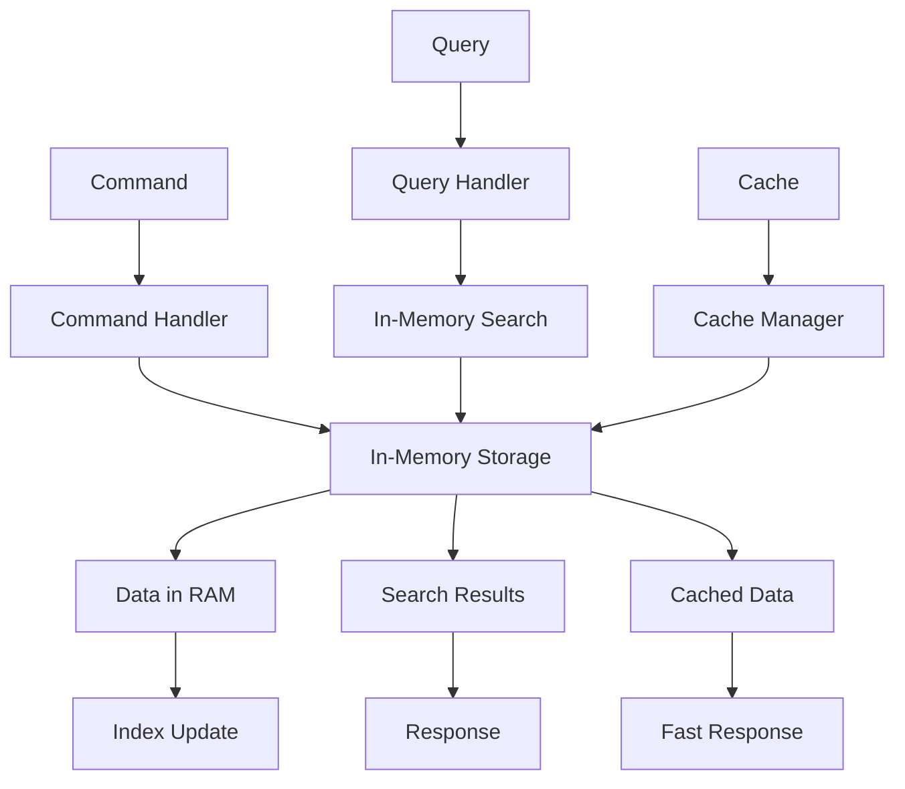

# ⚡ Stockage In-Memory - Approche Classique

## 🎯 **Contexte et Objectifs**

### **Pourquoi In-Memory pour le Stockage ?**

Le stockage In-Memory offre des performances exceptionnelles en gardant toutes les données en RAM, éliminant les latences de disque et les coûts de sérialisation.

#### **Avantages du Stockage In-Memory**
- **Performance maximale** : Accès ultra-rapide aux données
- **Simplicité** : Pas de configuration de base de données
- **Latence minimale** : Pas de I/O disque
- **Développement rapide** : Idéal pour les prototypes et tests

### **Contexte Gyroscops**

Dans notre écosystème **User → Organization → Workflow → Cloud Resources → Billing**, le stockage In-Memory est particulièrement pertinent pour :
- **Cache haute performance** : Mise en cache des données fréquemment accédées
- **Sessions utilisateur** : Stockage temporaire des sessions
- **Métriques en temps réel** : Collecte et agrégation des métriques
- **Tests et développement** : Environnements de test rapides

## 🏗️ **Architecture In-Memory Classique**

### **Structure des Données**

#### **Collections en Mémoire**
```php
<?php

namespace App\Infrastructure\InMemory;

class InMemoryStorage
{
    private array $data = [];
    private array $indexes = [];
    private array $locks = [];

    public function store(string $key, mixed $value): void
    {
        $this->data[$key] = $value;
    }

    public function get(string $key): mixed
    {
        return $this->data[$key] ?? null;
    }

    public function delete(string $key): void
    {
        unset($this->data[$key]);
    }

    public function exists(string $key): bool
    {
        return array_key_exists($key, $this->data);
    }

    public function getAll(): array
    {
        return $this->data;
    }

    public function clear(): void
    {
        $this->data = [];
        $this->indexes = [];
    }
}
```

#### **Indexation pour la Recherche**
```php
<?php

namespace App\Infrastructure\InMemory;

class InMemoryIndexer
{
    private array $indexes = [];

    public function addToIndex(string $indexName, string $key, mixed $value, array $searchFields): void
    {
        if (!isset($this->indexes[$indexName])) {
            $this->indexes[$indexName] = [];
        }

        foreach ($searchFields as $field) {
            $fieldValue = $this->getFieldValue($value, $field);
            if ($fieldValue !== null) {
                $this->indexes[$indexName][$field][$fieldValue][] = $key;
            }
        }
    }

    public function search(string $indexName, string $field, mixed $value): array
    {
        return $this->indexes[$indexName][$field][$value] ?? [];
    }

    public function removeFromIndex(string $indexName, string $key): void
    {
        if (!isset($this->indexes[$indexName])) {
            return;
        }

        foreach ($this->indexes[$indexName] as $field => $values) {
            foreach ($values as $fieldValue => $keys) {
                $this->indexes[$indexName][$field][$fieldValue] = array_filter(
                    $keys,
                    fn($k) => $k !== $key
                );
            }
        }
    }

    private function getFieldValue(mixed $value, string $field): mixed
    {
        if (is_array($value)) {
            return $value[$field] ?? null;
        }

        if (is_object($value)) {
            return $value->$field ?? null;
        }

        return null;
    }
}
```

### **Flux de Données**



## 💻 **Implémentation Pratique**

### **1. Repository In-Memory**

#### **Repository de Base**

```php
<?php

namespace App\Infrastructure\InMemory\Repository;

use App\Domain\Payment\Payment;
use App\Domain\Payment\PaymentRepositoryInterface;
use App\Infrastructure\InMemory\InMemoryStorage;
use App\Infrastructure\InMemory\InMemoryIndexer;

class InMemoryPaymentRepository implements PaymentRepositoryInterface
{
    private InMemoryStorage $storage;
    private InMemoryIndexer $indexer;
    private string $entityType;

    public function __construct(InMemoryStorage $storage, InMemoryIndexer $indexer)
    {
        $this->storage = $storage;
        $this->indexer = $indexer;
        $this->entityType = 'Payment';
    }

    public function save(Payment $payment): void
    {
        $key = $this->generateKey($payment->getId());
        
        // Sauvegarder l'entité
        $this->storage->store($key, $payment);
        
        // Mettre à jour les index
        $this->indexer->addToIndex(
            $this->entityType,
            $key,
            $payment,
            ['organizationId', 'userId', 'status', 'currency']
        );
    }

    public function findById(string $id): ?Payment
    {
        $key = $this->generateKey($id);
        $data = $this->storage->get($key);
        
        return $data instanceof Payment ? $data : null;
    }

    public function findByOrganization(string $organizationId): array
    {
        $keys = $this->indexer->search($this->entityType, 'organizationId', $organizationId);
        
        $payments = [];
        foreach ($keys as $key) {
            $payment = $this->storage->get($key);
            if ($payment instanceof Payment) {
                $payments[] = $payment;
            }
        }
        
        return $payments;
    }

    public function findByUser(string $userId): array
    {
        $keys = $this->indexer->search($this->entityType, 'userId', $userId);
        
        $payments = [];
        foreach ($keys as $key) {
            $payment = $this->storage->get($key);
            if ($payment instanceof Payment) {
                $payments[] = $payment;
            }
        }
        
        return $payments;
    }

    public function findByStatus(string $status): array
    {
        $keys = $this->indexer->search($this->entityType, 'status', $status);
        
        $payments = [];
        foreach ($keys as $key) {
            $payment = $this->storage->get($key);
            if ($payment instanceof Payment) {
                $payments[] = $payment;
            }
        }
        
        return $payments;
    }

    public function findByCurrency(string $currency): array
    {
        $keys = $this->indexer->search($this->entityType, 'currency', $currency);
        
        $payments = [];
        foreach ($keys as $key) {
            $payment = $this->storage->get($key);
            if ($payment instanceof Payment) {
                $payments[] = $payment;
            }
        }
        
        return $payments;
    }

    public function findAll(): array
    {
        $allData = $this->storage->getAll();
        
        $payments = [];
        foreach ($allData as $key => $value) {
            if (str_starts_with($key, 'Payment:') && $value instanceof Payment) {
                $payments[] = $value;
            }
        }
        
        return $payments;
    }

    public function delete(string $id): void
    {
        $key = $this->generateKey($id);
        
        // Supprimer des index
        $this->indexer->removeFromIndex($this->entityType, $key);
        
        // Supprimer de la storage
        $this->storage->delete($key);
    }

    public function count(): int
    {
        $allData = $this->storage->getAll();
        $count = 0;
        
        foreach ($allData as $key => $value) {
            if (str_starts_with($key, 'Payment:') && $value instanceof Payment) {
                $count++;
            }
        }
        
        return $count;
    }

    private function generateKey(string $id): string
    {
        return "Payment:{$id}";
    }
}
```

### **2. Service de Cache**

#### **Cache Manager**

```php
<?php

namespace App\Infrastructure\InMemory\Cache;

use App\Infrastructure\InMemory\InMemoryStorage;
use Psr\Log\LoggerInterface;

class CacheManager
{
    private InMemoryStorage $storage;
    private LoggerInterface $logger;
    private array $ttl = [];
    private array $accessCount = [];
    private int $maxSize;

    public function __construct(InMemoryStorage $storage, LoggerInterface $logger, int $maxSize = 10000)
    {
        $this->storage = $storage;
        $this->logger = $logger;
        $this->maxSize = $maxSize;
    }

    public function get(string $key): mixed
    {
        if (!$this->storage->exists($key)) {
            return null;
        }

        // Vérifier le TTL
        if (isset($this->ttl[$key]) && $this->ttl[$key] < time()) {
            $this->delete($key);
            return null;
        }

        // Incrémenter le compteur d'accès
        $this->accessCount[$key] = ($this->accessCount[$key] ?? 0) + 1;

        $this->logger->debug('Cache hit', ['key' => $key]);
        return $this->storage->get($key);
    }

    public function set(string $key, mixed $value, int $ttl = 3600): void
    {
        // Vérifier la taille maximale
        if ($this->storage->count() >= $this->maxSize) {
            $this->evictLeastUsed();
        }

        $this->storage->store($key, $value);
        $this->ttl[$key] = time() + $ttl;
        $this->accessCount[$key] = 0;

        $this->logger->debug('Cache set', ['key' => $key, 'ttl' => $ttl]);
    }

    public function delete(string $key): void
    {
        $this->storage->delete($key);
        unset($this->ttl[$key]);
        unset($this->accessCount[$key]);

        $this->logger->debug('Cache delete', ['key' => $key]);
    }

    public function clear(): void
    {
        $this->storage->clear();
        $this->ttl = [];
        $this->accessCount = [];

        $this->logger->info('Cache cleared');
    }

    public function exists(string $key): bool
    {
        if (!$this->storage->exists($key)) {
            return false;
        }

        // Vérifier le TTL
        if (isset($this->ttl[$key]) && $this->ttl[$key] < time()) {
            $this->delete($key);
            return false;
        }

        return true;
    }

    public function getStats(): array
    {
        return [
            'size' => $this->storage->count(),
            'maxSize' => $this->maxSize,
            'hitRate' => $this->calculateHitRate(),
            'memoryUsage' => memory_get_usage(true),
            'peakMemoryUsage' => memory_get_peak_usage(true)
        ];
    }

    private function evictLeastUsed(): void
    {
        if (empty($this->accessCount)) {
            return;
        }

        // Trouver la clé la moins utilisée
        $leastUsedKey = array_search(min($this->accessCount), $this->accessCount);
        
        if ($leastUsedKey !== false) {
            $this->delete($leastUsedKey);
            $this->logger->debug('Cache evicted', ['key' => $leastUsedKey]);
        }
    }

    private function calculateHitRate(): float
    {
        $totalAccess = array_sum($this->accessCount);
        $totalKeys = count($this->accessCount);
        
        if ($totalKeys === 0) {
            return 0.0;
        }

        return $totalAccess / $totalKeys;
    }
}
```

### **3. Service de Recherche**

#### **Search Service**

```php
<?php

namespace App\Infrastructure\InMemory\Search;

use App\Infrastructure\InMemory\InMemoryStorage;
use App\Infrastructure\InMemory\InMemoryIndexer;

class SearchService
{
    private InMemoryStorage $storage;
    private InMemoryIndexer $indexer;

    public function __construct(InMemoryStorage $storage, InMemoryIndexer $indexer)
    {
        $this->storage = $storage;
        $this->indexer = $indexer;
    }

    public function search(string $entityType, array $criteria): array
    {
        $results = [];
        $allData = $this->storage->getAll();

        foreach ($allData as $key => $value) {
            if (!$this->isEntityType($key, $entityType)) {
                continue;
            }

            if ($this->matchesCriteria($value, $criteria)) {
                $results[] = $value;
            }
        }

        return $results;
    }

    public function searchByField(string $entityType, string $field, mixed $value): array
    {
        $keys = $this->indexer->search($entityType, $field, $value);
        
        $results = [];
        foreach ($keys as $key) {
            $data = $this->storage->get($key);
            if ($data !== null) {
                $results[] = $data;
            }
        }
        
        return $results;
    }

    public function searchByMultipleFields(string $entityType, array $criteria): array
    {
        $results = [];
        $allData = $this->storage->getAll();

        foreach ($allData as $key => $value) {
            if (!$this->isEntityType($key, $entityType)) {
                continue;
            }

            $matches = true;
            foreach ($criteria as $field => $expectedValue) {
                if (!$this->fieldMatches($value, $field, $expectedValue)) {
                    $matches = false;
                    break;
                }
            }

            if ($matches) {
                $results[] = $value;
            }
        }

        return $results;
    }

    public function searchByRange(string $entityType, string $field, mixed $min, mixed $max): array
    {
        $results = [];
        $allData = $this->storage->getAll();

        foreach ($allData as $key => $value) {
            if (!$this->isEntityType($key, $entityType)) {
                continue;
            }

            $fieldValue = $this->getFieldValue($value, $field);
            if ($fieldValue !== null && $fieldValue >= $min && $fieldValue <= $max) {
                $results[] = $value;
            }
        }

        return $results;
    }

    public function searchByText(string $entityType, string $field, string $text): array
    {
        $results = [];
        $allData = $this->storage->getAll();

        foreach ($allData as $key => $value) {
            if (!$this->isEntityType($key, $entityType)) {
                continue;
            }

            $fieldValue = $this->getFieldValue($value, $field);
            if ($fieldValue !== null && stripos($fieldValue, $text) !== false) {
                $results[] = $value;
            }
        }

        return $results;
    }

    private function isEntityType(string $key, string $entityType): bool
    {
        return str_starts_with($key, "{$entityType}:");
    }

    private function matchesCriteria(mixed $value, array $criteria): bool
    {
        foreach ($criteria as $field => $expectedValue) {
            if (!$this->fieldMatches($value, $field, $expectedValue)) {
                return false;
            }
        }

        return true;
    }

    private function fieldMatches(mixed $value, string $field, mixed $expectedValue): bool
    {
        $fieldValue = $this->getFieldValue($value, $field);
        
        if (is_array($expectedValue)) {
            return in_array($fieldValue, $expectedValue);
        }

        return $fieldValue === $expectedValue;
    }

    private function getFieldValue(mixed $value, string $field): mixed
    {
        if (is_array($value)) {
            return $value[$field] ?? null;
        }

        if (is_object($value)) {
            return $value->$field ?? null;
        }

        return null;
    }
}
```

## 🧪 **Tests et Validation**

### **Tests d'Intégration In-Memory**

```php
<?php

namespace App\Tests\Integration\InMemory;

use App\Domain\Payment\Payment;
use App\Infrastructure\InMemory\Repository\InMemoryPaymentRepository;
use App\Infrastructure\InMemory\InMemoryStorage;
use App\Infrastructure\InMemory\InMemoryIndexer;

class InMemoryPaymentRepositoryTest extends TestCase
{
    private InMemoryPaymentRepository $repository;
    private InMemoryStorage $storage;
    private InMemoryIndexer $indexer;

    protected function setUp(): void
    {
        $this->storage = new InMemoryStorage();
        $this->indexer = new InMemoryIndexer();
        $this->repository = new InMemoryPaymentRepository($this->storage, $this->indexer);
    }

    public function testSaveAndFindPayment(): void
    {
        $payment = new Payment(
            'payment-123',
            'org-456',
            'user-789',
            100.00,
            'EUR',
            'completed',
            'Test payment',
            new \DateTime()
        );

        $this->repository->save($payment);
        $found = $this->repository->findById('payment-123');

        $this->assertNotNull($found);
        $this->assertEquals($payment->getId(), $found->getId());
        $this->assertEquals($payment->getAmount(), $found->getAmount());
    }

    public function testFindByOrganization(): void
    {
        $payments = [
            new Payment('payment-1', 'org-456', 'user-1', 100.00, 'EUR', 'completed', 'Payment 1', new \DateTime()),
            new Payment('payment-2', 'org-456', 'user-2', 200.00, 'USD', 'completed', 'Payment 2', new \DateTime()),
            new Payment('payment-3', 'org-789', 'user-3', 300.00, 'EUR', 'completed', 'Payment 3', new \DateTime())
        ];

        foreach ($payments as $payment) {
            $this->repository->save($payment);
        }

        $orgPayments = $this->repository->findByOrganization('org-456');
        $this->assertCount(2, $orgPayments);
    }

    public function testFindByStatus(): void
    {
        $payments = [
            new Payment('payment-1', 'org-456', 'user-1', 100.00, 'EUR', 'completed', 'Payment 1', new \DateTime()),
            new Payment('payment-2', 'org-456', 'user-2', 200.00, 'USD', 'pending', 'Payment 2', new \DateTime()),
            new Payment('payment-3', 'org-789', 'user-3', 300.00, 'EUR', 'completed', 'Payment 3', new \DateTime())
        ];

        foreach ($payments as $payment) {
            $this->repository->save($payment);
        }

        $completedPayments = $this->repository->findByStatus('completed');
        $this->assertCount(2, $completedPayments);
    }

    public function testDeletePayment(): void
    {
        $payment = new Payment(
            'payment-123',
            'org-456',
            'user-789',
            100.00,
            'EUR',
            'completed',
            'Test payment',
            new \DateTime()
        );

        $this->repository->save($payment);
        $this->assertNotNull($this->repository->findById('payment-123'));

        $this->repository->delete('payment-123');
        $this->assertNull($this->repository->findById('payment-123'));
    }
}
```

## 📊 **Performance et Optimisation**

### **Stratégies d'Optimisation In-Memory**

#### **1. Gestion de la Mémoire**
```php
public function optimizeMemory(): void
{
    // Nettoyer les données expirées
    $this->cleanExpiredData();
    
    // Compacter les index
    $this->compactIndexes();
    
    // Forcer le garbage collection
    gc_collect_cycles();
}
```

#### **2. Cache LRU (Least Recently Used)**
```php
public function evictLeastRecentlyUsed(): void
{
    $sortedByAccess = $this->accessCount;
    asort($sortedByAccess);
    
    $keysToEvict = array_slice(array_keys($sortedByAccess), 0, $this->evictionCount);
    
    foreach ($keysToEvict as $key) {
        $this->delete($key);
    }
}
```

#### **3. Compression des Données**
```php
public function compressData(mixed $data): string
{
    return gzcompress(serialize($data), 9);
}

public function decompressData(string $compressedData): mixed
{
    return unserialize(gzuncompress($compressedData));
}
```

## 🎯 **Critères d'Adoption**

### **Quand Utiliser In-Memory Classique**

#### **✅ Avantages**
- **Performance maximale** : Accès ultra-rapide aux données
- **Simplicité** : Pas de configuration de base de données
- **Latence minimale** : Pas de I/O disque
- **Développement rapide** : Idéal pour les prototypes et tests

#### **❌ Inconvénients**
- **Volatilité** : Données perdues au redémarrage
- **Limitation mémoire** : Contraint par la RAM disponible
- **Pas de persistance** : Données temporaires uniquement
- **Pas de partage** : Données limitées à un processus

#### **🎯 Critères d'Adoption**
- **Performance critique** : Besoins de performance maximale
- **Données temporaires** : Cache, sessions, métriques
- **Tests et développement** : Environnements de test rapides
- **Prototypes** : Développement rapide et itératif
- **Données volatiles** : Pas de besoin de persistance
- **Mémoire suffisante** : RAM disponible pour toutes les données

## 🚀 **Votre Prochaine Étape**


  
  
  
  
  
  
  


---

*In-Memory classique offre des performances exceptionnelles pour les données temporaires et les caches, parfaitement adapté aux besoins de performance de Gyroscops.*
