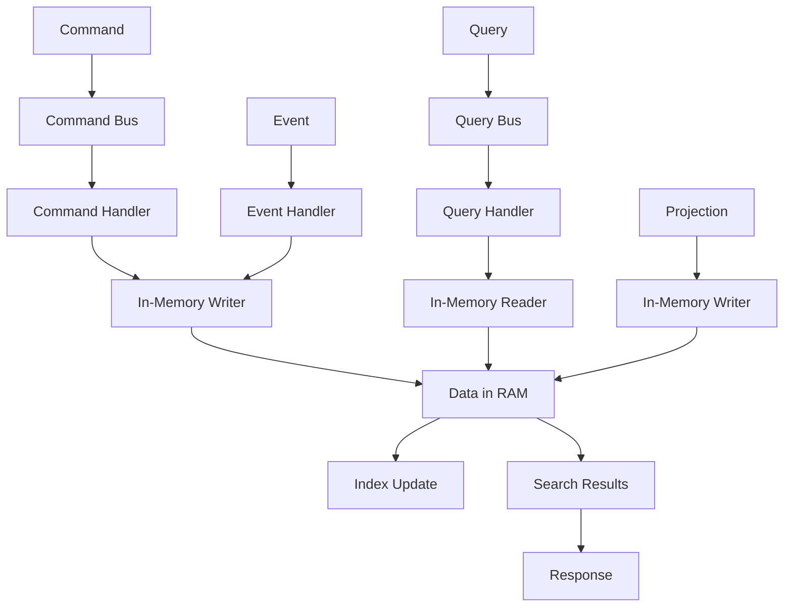

# 🚀 Stockage In-Memory - CQRS

## 🎯 **Contexte et Objectifs**

### **L'Approche CQRS Complète avec In-Memory**

Nous arrivons maintenant à l'approche la plus sophistiquée pour In-Memory : **CQRS complet**. Cette combinaison offre une architecture hautement scalable et flexible, parfaite pour les systèmes nécessitant performance maximale et séparation claire des responsabilités.

#### **Pourquoi CQRS avec In-Memory ?**
- **Séparation totale** : Commandes et requêtes complètement découplées
- **Scalabilité maximale** : Possibilité de scaler indépendamment chaque côté
- **Performance optimale** : Chaque côté optimisé pour son usage
- **Flexibilité** : Projections multiples pour différents besoins
- **Cache efficace** : Mise en cache des requêtes

### **Contexte Gyroscops**

Dans notre écosystème **User → Organization → Workflow → Cloud Resources → Billing**, CQRS avec In-Memory est idéal pour :
- **Cache haute performance** : Séparation des écritures et lectures de cache
- **Sessions utilisateur** : Gestion optimisée des sessions avec projections
- **Métriques en temps réel** : Collecte et lecture des métriques avec analytics
- **Tests et développement** : Environnements de test rapides et organisés

## 🏗️ **Architecture CQRS avec In-Memory**

### **Séparation Complète des Responsabilités**

#### **Command Side (Write)**
- **Command Handlers** : Traitement des commandes métier
- **In-Memory Writer** : Écriture optimisée en mémoire
- **Event Handlers** : Gestion des événements de domaine
- **Command Bus** : Orchestration des commandes
- **Bulk Operations** : Optimisation des écritures

#### **Query Side (Read)**
- **Query Handlers** : Traitement des requêtes
- **In-Memory Reader** : Requêtes optimisées
- **Search Services** : Services de recherche spécialisés
- **Query Bus** : Orchestration des requêtes
- **Caches** : Optimisation des performances

### **Flux de Données Complet**



## 💻 **Implémentation Complète**

### **1. Command Side Implementation**

#### **Command Bus avec Middleware**

```php
<?php

namespace App\Application\CommandBus;

use App\Domain\Command\CommandInterface;
use App\Domain\Command\CommandHandlerInterface;
use Psr\Log\LoggerInterface;

class CommandBus
{
    private array $handlers = [];
    private array $middleware = [];
    private LoggerInterface $logger;

    public function __construct(LoggerInterface $logger)
    {
        $this->logger = $logger;
    }

    public function registerHandler(string $commandClass, CommandHandlerInterface $handler): void
    {
        $this->handlers[$commandClass] = $handler;
    }

    public function addMiddleware(callable $middleware): void
    {
        $this->middleware[] = $middleware;
    }

    public function handle(CommandInterface $command): void
    {
        $commandClass = get_class($command);
        
        if (!isset($this->handlers[$commandClass])) {
            throw new \InvalidArgumentException("No handler registered for command: $commandClass");
        }

        $handler = $this->handlers[$commandClass];
        
        // Exécuter les middleware
        $this->executeMiddleware($command, function() use ($handler, $command) {
            $this->logger->info('Executing command', [
                'command' => get_class($command),
                'data' => $command->toArray()
            ]);
            
            $handler->handle($command);
        });
    }

    private function executeMiddleware(CommandInterface $command, callable $next): void
    {
        $middleware = array_reverse($this->middleware);
        
        foreach ($middleware as $mw) {
            $next = function() use ($mw, $command, $next) {
                return $mw($command, $next);
            };
        }
        
        $next();
    }
}
```

#### **In-Memory Writer Avancé**

```php
<?php

namespace App\Infrastructure\InMemory\Command;

use App\Infrastructure\InMemory\InMemoryStorage;
use App\Infrastructure\InMemory\InMemoryIndexer;
use Psr\Log\LoggerInterface;

class InMemoryWriter
{
    private InMemoryStorage $storage;
    private InMemoryIndexer $indexer;
    private LoggerInterface $logger;
    private array $bulkBuffer = [];
    private int $bulkSize;
    private string $routingField;

    public function __construct(
        InMemoryStorage $storage,
        InMemoryIndexer $indexer,
        LoggerInterface $logger,
        int $bulkSize = 100,
        string $routingField = 'organizationId'
    ) {
        $this->storage = $storage;
        $this->indexer = $indexer;
        $this->logger = $logger;
        $this->bulkSize = $bulkSize;
        $this->routingField = $routingField;
    }

    public function store(string $key, mixed $value, array $indexFields = [], string $routing = null): void
    {
        $this->bulkBuffer[] = [
            'operation' => 'store',
            'key' => $key,
            'value' => $value,
            'indexFields' => $indexFields,
            'routing' => $routing
        ];

        if (count($this->bulkBuffer) >= $this->bulkSize) {
            $this->flushBulk();
        }
    }

    public function update(string $key, mixed $value, array $indexFields = [], string $routing = null): void
    {
        $this->bulkBuffer[] = [
            'operation' => 'update',
            'key' => $key,
            'value' => $value,
            'indexFields' => $indexFields,
            'routing' => $routing
        ];

        if (count($this->bulkBuffer) >= $this->bulkSize) {
            $this->flushBulk();
        }
    }

    public function delete(string $key, string $routing = null): void
    {
        $this->bulkBuffer[] = [
            'operation' => 'delete',
            'key' => $key,
            'routing' => $routing
        ];

        if (count($this->bulkBuffer) >= $this->bulkSize) {
            $this->flushBulk();
        }
    }

    public function flushBulk(): void
    {
        if (empty($this->bulkBuffer)) {
            return;
        }

        try {
            foreach ($this->bulkBuffer as $operation) {
                switch ($operation['operation']) {
                    case 'store':
                        $this->storage->store($operation['key'], $operation['value']);
                        if (!empty($operation['indexFields'])) {
                            $this->indexer->addToIndex(
                                $this->getEntityType($operation['key']),
                                $operation['key'],
                                $operation['value'],
                                $operation['indexFields']
                            );
                        }
                        break;

                    case 'update':
                        $this->storage->store($operation['key'], $operation['value']);
                        if (!empty($operation['indexFields'])) {
                            $this->indexer->removeFromIndex(
                                $this->getEntityType($operation['key']),
                                $operation['key']
                            );
                            $this->indexer->addToIndex(
                                $this->getEntityType($operation['key']),
                                $operation['key'],
                                $operation['value'],
                                $operation['indexFields']
                            );
                        }
                        break;

                    case 'delete':
                        $this->indexer->removeFromIndex(
                            $this->getEntityType($operation['key']),
                            $operation['key']
                        );
                        $this->storage->delete($operation['key']);
                        break;
                }
            }

            $this->logger->info('Bulk operations completed', [
                'operations' => count($this->bulkBuffer)
            ]);

            $this->bulkBuffer = [];

        } catch (\Exception $e) {
            $this->logger->error('Bulk operations failed', [
                'error' => $e->getMessage(),
                'operations' => count($this->bulkBuffer)
            ]);

            throw $e;
        }
    }

    private function getEntityType(string $key): string
    {
        $parts = explode(':', $key);
        return $parts[0] ?? 'Unknown';
    }
}
```

#### **Command Handler pour les Paiements**

```php
<?php

namespace App\Application\Command\Payment;

use App\Domain\Payment\Payment;
use App\Domain\Payment\PaymentRepositoryInterface;
use App\Infrastructure\InMemory\Command\InMemoryWriter;
use App\Domain\Event\EventBusInterface;
use Psr\Log\LoggerInterface;

class ProcessPaymentCommandHandler implements CommandHandlerInterface
{
    public function __construct(
        private PaymentRepositoryInterface $paymentRepository,
        private InMemoryWriter $writer,
        private EventBusInterface $eventBus,
        private LoggerInterface $logger
    ) {}

    public function handle(ProcessPaymentCommand $command): void
    {
        try {
            // Charger le paiement
            $payment = $this->paymentRepository->findById($command->getPaymentId());
            
            if (!$payment) {
                throw new \InvalidArgumentException("Payment not found: {$command->getPaymentId()}");
            }

            // Traiter le paiement
            $payment->processPayment($command->getAmount(), $command->getCurrency());
            
            // Sauvegarder dans le repository principal
            $this->paymentRepository->save($payment);

            // Indexer dans In-Memory pour la recherche
            $this->indexPaymentForSearch($payment);

            // Publier l'événement
            $event = new PaymentProcessedEvent(
                $payment->getId(),
                $payment->getAmount(),
                $payment->getCurrency(),
                $payment->getOrganizationId()
            );
            
            $this->eventBus->publish($event);

            $this->logger->info('Payment processed and indexed', [
                'paymentId' => $payment->getId(),
                'organizationId' => $payment->getOrganizationId(),
                'amount' => $payment->getAmount()
            ]);

        } catch (\Exception $e) {
            $this->logger->error('Payment processing failed', [
                'paymentId' => $command->getPaymentId(),
                'error' => $e->getMessage()
            ]);

            throw $e;
        }
    }

    private function indexPaymentForSearch(Payment $payment): void
    {
        $key = "Payment:{$payment->getId()}";
        $document = [
            'paymentId' => $payment->getId(),
            'organizationId' => $payment->getOrganizationId(),
            'userId' => $payment->getUserId(),
            'amount' => $payment->getAmount(),
            'currency' => $payment->getCurrency(),
            'status' => $payment->getStatus(),
            'description' => $payment->getDescription(),
            'processedAt' => $payment->getProcessedAt()->format('c'),
            'metadata' => $payment->getMetadata(),
            'indexedAt' => (new \DateTime())->format('c')
        ];

        $this->writer->store(
            $key,
            $document,
            ['organizationId', 'userId', 'status', 'currency'],
            $payment->getOrganizationId()
        );
    }
}
```

### **2. Query Side Implementation**

#### **Query Bus avec Cache**

```php
<?php

namespace App\Application\QueryBus;

use App\Domain\Query\QueryInterface;
use App\Domain\Query\QueryHandlerInterface;
use Psr\Cache\CacheItemPoolInterface;
use Psr\Log\LoggerInterface;

class QueryBus
{
    private array $handlers = [];
    private CacheItemPoolInterface $cache;
    private LoggerInterface $logger;

    public function __construct(CacheItemPoolInterface $cache, LoggerInterface $logger)
    {
        $this->cache = $cache;
        $this->logger = $logger;
    }

    public function registerHandler(string $queryClass, QueryHandlerInterface $handler): void
    {
        $this->handlers[$queryClass] = $handler;
    }

    public function handle(QueryInterface $query): mixed
    {
        $queryClass = get_class($query);
        
        if (!isset($this->handlers[$queryClass])) {
            throw new \InvalidArgumentException("No handler registered for query: $queryClass");
        }

        // Vérifier le cache
        $cacheKey = $this->generateCacheKey($query);
        $cachedItem = $this->cache->getItem($cacheKey);
        
        if ($cachedItem->isHit()) {
            $this->logger->debug('Query result served from cache', [
                'query' => $queryClass,
                'cacheKey' => $cacheKey
            ]);
            
            return $cachedItem->get();
        }

        // Exécuter la requête
        $handler = $this->handlers[$queryClass];
        $result = $handler->handle($query);
        
        // Mettre en cache
        $cachedItem->set($result);
        $cachedItem->expiresAfter(300); // 5 minutes
        $this->cache->save($cachedItem);
        
        $this->logger->info('Query executed and cached', [
            'query' => $queryClass,
            'cacheKey' => $cacheKey
        ]);
        
        return $result;
    }

    private function generateCacheKey(QueryInterface $query): string
    {
        return 'query_' . md5(serialize($query));
    }
}
```

#### **In-Memory Reader Avancé**

```php
<?php

namespace App\Infrastructure\InMemory\Query;

use App\Infrastructure\InMemory\InMemoryStorage;
use App\Infrastructure\InMemory\InMemoryIndexer;
use Psr\Log\LoggerInterface;
use Psr\Cache\CacheItemPoolInterface;

class InMemoryReader
{
    private InMemoryStorage $storage;
    private InMemoryIndexer $indexer;
    private LoggerInterface $logger;
    private CacheItemPoolInterface $cache;

    public function __construct(
        InMemoryStorage $storage,
        InMemoryIndexer $indexer,
        LoggerInterface $logger,
        CacheItemPoolInterface $cache
    ) {
        $this->storage = $storage;
        $this->indexer = $indexer;
        $this->logger = $logger;
        $this->cache = $cache;
    }

    public function get(string $key, string $cacheKey = null): mixed
    {
        // Vérifier le cache
        if ($cacheKey) {
            $cachedItem = $this->cache->getItem($cacheKey);
            if ($cachedItem->isHit()) {
                $this->logger->debug('Data served from cache', [
                    'key' => $key,
                    'cacheKey' => $cacheKey
                ]);
                return $cachedItem->get();
            }
        }

        $data = $this->storage->get($key);

        // Mettre en cache
        if ($cacheKey && $data !== null) {
            $cachedItem->set($data);
            $cachedItem->expiresAfter(300); // 5 minutes
            $this->cache->save($cachedItem);
        }

        return $data;
    }

    public function search(array $query, string $cacheKey = null): array
    {
        // Vérifier le cache
        if ($cacheKey) {
            $cachedItem = $this->cache->getItem($cacheKey);
            if ($cachedItem->isHit()) {
                $this->logger->debug('Search result served from cache', [
                    'query' => $query,
                    'cacheKey' => $cacheKey
                ]);
                return $cachedItem->get();
            }
        }

        $results = $this->performSearch($query);

        // Mettre en cache
        if ($cacheKey) {
            $cachedItem->set($results);
            $cachedItem->expiresAfter(300); // 5 minutes
            $this->cache->save($cachedItem);
        }

        $this->logger->info('Search executed', [
            'query' => $query,
            'results' => count($results)
        ]);

        return $results;
    }

    public function getDocument(string $id, string $routing = null): ?array
    {
        $key = $this->generateKey($id);
        $data = $this->storage->get($key);
        
        return $data ?: null;
    }

    public function getSuggestions(string $query, string $field = 'description', int $size = 10): array
    {
        $results = $this->search([
            'field' => $field,
            'text' => $query,
            'size' => $size
        ]);

        $suggestions = [];
        foreach ($results as $result) {
            $suggestions[] = [
                'text' => $result[$field] ?? '',
                'score' => 1.0
            ];
        }

        return $suggestions;
    }

    public function getAnalytics(array $query): array
    {
        $results = $this->performSearch($query);
        
        $analytics = [
            'total' => count($results),
            'byStatus' => [],
            'byCurrency' => [],
            'totalAmount' => 0
        ];
        
        foreach ($results as $result) {
            $status = $result['status'] ?? 'unknown';
            $currency = $result['currency'] ?? 'unknown';
            $amount = $result['amount'] ?? 0;
            
            $analytics['byStatus'][$status] = ($analytics['byStatus'][$status] ?? 0) + 1;
            $analytics['byCurrency'][$currency] = ($analytics['byCurrency'][$currency] ?? 0) + 1;
            $analytics['totalAmount'] += $amount;
        }
        
        return $analytics;
    }

    private function performSearch(array $query): array
    {
        $results = [];
        $allData = $this->storage->getAll();

        foreach ($allData as $key => $value) {
            if ($this->matchesQuery($value, $query)) {
                $results[] = $value;
            }
        }

        return $results;
    }

    private function matchesQuery(mixed $value, array $query): bool
    {
        foreach ($query as $field => $expectedValue) {
            if (!$this->fieldMatches($value, $field, $expectedValue)) {
                return false;
            }
        }

        return true;
    }

    private function fieldMatches(mixed $value, string $field, mixed $expectedValue): bool
    {
        $fieldValue = $this->getFieldValue($value, $field);
        
        if (is_array($expectedValue)) {
            return in_array($fieldValue, $expectedValue);
        }

        return $fieldValue === $expectedValue;
    }

    private function getFieldValue(mixed $value, string $field): mixed
    {
        if (is_array($value)) {
            return $value[$field] ?? null;
        }

        if (is_object($value)) {
            return $value->$field ?? null;
        }

        return null;
    }

    private function generateKey(string $id): string
    {
        return "Payment:{$id}";
    }
}
```

#### **Query Handler pour les Paiements**

```php
<?php

namespace App\Application\Query\Payment;

use App\Infrastructure\InMemory\Query\InMemoryReader;
use App\Domain\Payment\Payment;
use Psr\Log\LoggerInterface;

class PaymentQueryHandler implements QueryHandlerInterface
{
    private InMemoryReader $reader;
    private LoggerInterface $logger;

    public function __construct(InMemoryReader $reader, LoggerInterface $logger)
    {
        $this->reader = $reader;
        $this->logger = $logger;
    }

    public function handle(GetPaymentByIdQuery $query): ?Payment
    {
        $data = $this->reader->getDocument($query->getPaymentId());
        
        if (!$data) {
            return null;
        }
        
        return $this->dataToPayment($data);
    }

    public function handle(SearchPaymentsQuery $query): PaymentSearchResult
    {
        $searchQuery = $this->buildSearchQuery($query);
        $cacheKey = $this->generateCacheKey($query);
        
        $results = $this->reader->search($searchQuery, $cacheKey);
        
        $payments = [];
        foreach ($results as $data) {
            $payments[] = $this->dataToPayment($data);
        }
        
        return new PaymentSearchResult(
            $payments,
            count($payments),
            $query->getPage(),
            $query->getSize()
        );
    }

    public function handle(GetPaymentStatisticsQuery $query): array
    {
        $searchQuery = [
            'organizationId' => $query->getOrganizationId()
        ];
        
        if ($query->getFrom() && $query->getTo()) {
            $searchQuery['processedAt'] = [
                'gte' => $query->getFrom()->format('c'),
                'lte' => $query->getTo()->format('c')
            ];
        }
        
        return $this->reader->getAnalytics($searchQuery);
    }

    public function handle(GetPaymentSuggestionsQuery $query): array
    {
        return $this->reader->getSuggestions(
            $query->getQuery(),
            'description',
            $query->getSize()
        );
    }

    private function buildSearchQuery(SearchPaymentsQuery $query): array
    {
        $searchQuery = [];
        
        if ($query->getOrganizationId()) {
            $searchQuery['organizationId'] = $query->getOrganizationId();
        }
        
        if ($query->getStatuses()) {
            $searchQuery['status'] = $query->getStatuses();
        }
        
        if ($query->getCurrencies()) {
            $searchQuery['currency'] = $query->getCurrencies();
        }
        
        if ($query->getMinAmount() || $query->getMaxAmount()) {
            $searchQuery['amount'] = [];
            if ($query->getMinAmount()) {
                $searchQuery['amount']['gte'] = $query->getMinAmount();
            }
            if ($query->getMaxAmount()) {
                $searchQuery['amount']['lte'] = $query->getMaxAmount();
            }
        }
        
        return $searchQuery;
    }

    private function generateCacheKey(SearchPaymentsQuery $query): string
    {
        return 'payment_search_' . md5(serialize($query));
    }

    private function dataToPayment(array $data): Payment
    {
        return new Payment(
            $data['paymentId'],
            $data['organizationId'],
            $data['userId'],
            $data['amount'],
            $data['currency'],
            $data['status'],
            $data['description'],
            new \DateTime($data['processedAt']),
            $data['metadata'] ?? []
        );
    }
}
```

### **3. Service de Projection**

#### **Service de Projection pour les Analytics**

```php
<?php

namespace App\Application\Service\InMemory;

use App\Domain\Event\DomainEvent;
use App\Infrastructure\InMemory\Command\InMemoryWriter;
use Psr\Log\LoggerInterface;

class PaymentProjectionService
{
    private InMemoryWriter $writer;
    private LoggerInterface $logger;

    public function __construct(InMemoryWriter $writer, LoggerInterface $logger)
    {
        $this->writer = $writer;
        $this->logger = $logger;
    }

    public function handleEvent(DomainEvent $event): void
    {
        switch ($event->getEventType()) {
            case 'PaymentProcessed':
                $this->handlePaymentProcessed($event);
                break;
            case 'PaymentFailed':
                $this->handlePaymentFailed($event);
                break;
            case 'PaymentRefunded':
                $this->handlePaymentRefunded($event);
                break;
        }
    }

    private function handlePaymentProcessed(DomainEvent $event): void
    {
        $key = "Payment:{$event->getAggregateId()}";
        $update = [
            'status' => 'completed',
            'processedAt' => $event->getTimestamp()->format('c'),
            'updatedAt' => (new \DateTime())->format('c')
        ];

        $this->writer->update($key, $update, ['status']);

        $this->logger->info('Payment processed projection updated', [
            'paymentId' => $event->getAggregateId(),
            'status' => 'completed'
        ]);
    }

    private function handlePaymentFailed(DomainEvent $event): void
    {
        $key = "Payment:{$event->getAggregateId()}";
        $update = [
            'status' => 'failed',
            'error' => $event->getData()['error'],
            'failedAt' => $event->getTimestamp()->format('c'),
            'updatedAt' => (new \DateTime())->format('c')
        ];

        $this->writer->update($key, $update, ['status']);

        $this->logger->info('Payment failed projection updated', [
            'paymentId' => $event->getAggregateId(),
            'status' => 'failed'
        ]);
    }

    private function handlePaymentRefunded(DomainEvent $event): void
    {
        $key = "Payment:{$event->getAggregateId()}";
        $update = [
            'status' => 'refunded',
            'refundAmount' => $event->getData()['refundAmount'],
            'refundedAt' => $event->getTimestamp()->format('c'),
            'updatedAt' => (new \DateTime())->format('c')
        ];

        $this->writer->update($key, $update, ['status']);

        $this->logger->info('Payment refunded projection updated', [
            'paymentId' => $event->getAggregateId(),
            'status' => 'refunded'
        ]);
    }
}
```

## 🧪 **Tests et Validation**

### **Tests d'Intégration CQRS**

```php
<?php

namespace App\Tests\Integration\InMemory;

use App\Application\Command\Payment\ProcessPaymentCommand;
use App\Application\Command\Payment\ProcessPaymentCommandHandler;
use App\Application\Query\Payment\GetPaymentByIdQuery;
use App\Application\Query\Payment\SearchPaymentsQuery;
use App\Application\Query\Payment\PaymentQueryHandler;
use App\Infrastructure\InMemory\Command\InMemoryWriter;
use App\Infrastructure\InMemory\Query\InMemoryReader;
use App\Infrastructure\InMemory\InMemoryStorage;
use App\Infrastructure\InMemory\InMemoryIndexer;

class InMemoryCqrsTest extends TestCase
{
    private InMemoryWriter $writer;
    private InMemoryReader $reader;
    private ProcessPaymentCommandHandler $commandHandler;
    private PaymentQueryHandler $queryHandler;

    protected function setUp(): void
    {
        $storage = new InMemoryStorage();
        $indexer = new InMemoryIndexer();
        
        $this->writer = new InMemoryWriter($storage, $indexer, $this->createMock(LoggerInterface::class));
        $this->reader = new InMemoryReader($storage, $indexer, $this->createMock(LoggerInterface::class), $this->createMock(CacheItemPoolInterface::class));
        
        $this->commandHandler = new ProcessPaymentCommandHandler(
            $this->createMock(PaymentRepositoryInterface::class),
            $this->writer,
            $this->createMock(EventBusInterface::class),
            $this->createMock(LoggerInterface::class)
        );
        
        $this->queryHandler = new PaymentQueryHandler($this->reader, $this->createMock(LoggerInterface::class));
    }

    public function testCqrsSeparation(): void
    {
        // Exécuter une commande
        $command = new ProcessPaymentCommand(
            'payment-123',
            100.00,
            'EUR',
            'org-456'
        );
        
        $this->commandHandler->handle($command);
        
        // Vérifier avec une requête
        $query = new GetPaymentByIdQuery('payment-123');
        $payment = $this->queryHandler->handle($query);
        
        $this->assertNotNull($payment);
        $this->assertEquals('payment-123', $payment->getId());
        $this->assertEquals(100.00, $payment->getAmount());
    }

    public function testSearchWithAnalytics(): void
    {
        // Créer plusieurs paiements
        $payments = [
            new ProcessPaymentCommand('payment-1', 100.00, 'EUR', 'org-456'),
            new ProcessPaymentCommand('payment-2', 200.00, 'USD', 'org-456'),
            new ProcessPaymentCommand('payment-3', 300.00, 'EUR', 'org-789')
        ];
        
        foreach ($payments as $command) {
            $this->commandHandler->handle($command);
        }
        
        // Rechercher avec analytics
        $searchQuery = new SearchPaymentsQuery('org-456', 0, 10);
        $result = $this->queryHandler->handle($searchQuery);
        
        $this->assertCount(2, $result->getPayments());
        $this->assertEquals(2, $result->getTotal());
    }
}
```

## 📊 **Performance et Optimisation**

### **Stratégies d'Optimisation CQRS**

#### **1. Cache Multi-Niveaux**
```php
public function searchWithMultiLevelCache(SearchPaymentsQuery $query): PaymentSearchResult
{
    // Cache L1: Mémoire
    if (isset($this->memoryCache[$query->getCacheKey()])) {
        return $this->memoryCache[$query->getCacheKey()];
    }
    
    // Cache L2: Redis
    $cached = $this->redis->get("payment_search:{$query->getCacheKey()}");
    if ($cached) {
        $result = PaymentSearchResult::fromArray(json_decode($cached, true));
        $this->memoryCache[$query->getCacheKey()] = $result;
        return $result;
    }
    
    // In-Memory
    $result = $this->searchPayments($query);
    
    // Mettre en cache
    $this->memoryCache[$query->getCacheKey()] = $result;
    $this->redis->setex("payment_search:{$query->getCacheKey()}", 300, json_encode($result->toArray()));
    
    return $result;
}
```

#### **2. Projections Asynchrones**
```php
public function handleEventAsync(DomainEvent $event): void
{
    // Mettre en queue pour traitement asynchrone
    $this->messageBus->dispatch(new ProcessProjectionCommand($event));
}
```

#### **3. Index Optimisés**
```php
public function optimizeIndexes(): void
{
    // Nettoyer les index orphelins
    $this->cleanOrphanedIndexes();
    
    // Compacter les index
    $this->compactIndexes();
    
    // Forcer le garbage collection
    gc_collect_cycles();
}
```

## 🎯 **Critères d'Adoption**

### **Quand Utiliser CQRS avec In-Memory**

#### **✅ Avantages**
- **Scalabilité maximale** : Possibilité de scaler indépendamment
- **Performance optimale** : Chaque côté optimisé pour son usage
- **Flexibilité** : Projections multiples pour différents besoins
- **Cache efficace** : Mise en cache des requêtes
- **Maintenabilité** : Code plus clair et organisé

#### **❌ Inconvénients**
- **Complexité maximale** : Architecture très complexe
- **Volatilité** : Données perdues au redémarrage
- **Limitation mémoire** : Contraint par la RAM disponible
- **Expertise** : Équipe très expérimentée requise

#### **🎯 Critères d'Adoption**
- **Système très complexe** : Besoins de scalabilité maximale
- **Performance critique** : Besoins de performance maximale
- **Données temporaires** : Cache, sessions, métriques
- **Équipe très expérimentée** : Maîtrise d'In-Memory et CQRS
- **Tests et développement** : Environnements de test rapides
- **Mémoire suffisante** : RAM disponible pour toutes les données

## 🚀 **Votre Prochaine Étape**


  
  
  
  
  
  
  


---

*CQRS avec In-Memory représente l'état de l'art en matière d'architecture scalable pour la performance, parfaitement adapté aux besoins les plus exigeants de Gyroscops.*

