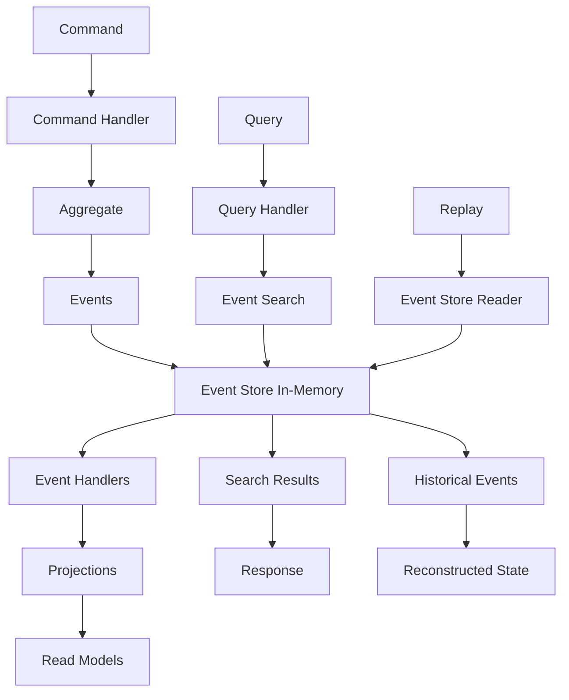

# 📚 Stockage In-Memory - Event Sourcing

## 🎯 **Contexte et Objectifs**

### **Pourquoi Event Sourcing avec In-Memory ?**

L'Event Sourcing avec In-Memory offre une approche unique qui combine l'audit trail complet de l'Event Sourcing avec les performances exceptionnelles du stockage en mémoire.

#### **Avantages de cette Combinaison**
- **Audit trail complet** : Historique de tous les événements
- **Performance maximale** : Accès ultra-rapide aux événements
- **Debugging avancé** : Possibilité de rejouer les événements
- **Flexibilité** : Projections multiples pour différents besoins
- **Simplicité** : Pas de configuration de base de données

### **Contexte Gyroscops**

Dans notre écosystème **User → Organization → Workflow → Cloud Resources → Billing**, Event Sourcing avec In-Memory est particulièrement pertinent pour :
- **Cache d'événements** : Stockage temporaire des événements pour replay
- **Sessions utilisateur** : Historique des actions utilisateur
- **Métriques en temps réel** : Traçabilité des métriques
- **Tests et développement** : Environnements de test avec audit trail

## 🏗️ **Architecture Event Sourcing avec In-Memory**

### **Structure des Données**

#### **Event Store In-Memory**
```php
<?php

namespace App\Infrastructure\EventStore;

use App\Domain\Event\DomainEvent;
use App\Domain\Event\EventStoreInterface;
use Psr\Log\LoggerInterface;

class InMemoryEventStore implements EventStoreInterface
{
    private array $events = [];
    private array $indexes = [];
    private LoggerInterface $logger;

    public function __construct(LoggerInterface $logger)
    {
        $this->logger = $logger;
    }

    public function appendEvents(string $aggregateId, array $events, int $expectedVersion): void
    {
        try {
            // Vérifier la version attendue
            $lastEvent = $this->getLastEvent($aggregateId);
            
            if ($lastEvent && $lastEvent['version'] !== $expectedVersion) {
                throw new ConcurrencyException('Version mismatch');
            }
            
            // Insérer les nouveaux événements
            $version = $expectedVersion + 1;
            
            foreach ($events as $event) {
                $eventData = [
                    'eventId' => $event->getId(),
                    'aggregateId' => $aggregateId,
                    'aggregateType' => $event->getAggregateType(),
                    'eventType' => $event->getEventType(),
                    'eventData' => $event->toArray(),
                    'version' => $version++,
                    'timestamp' => $event->getTimestamp(),
                    'correlationId' => $event->getCorrelationId(),
                    'causationId' => $event->getCausationId(),
                    'metadata' => $event->getMetadata()
                ];
                
                $this->events[$event->getId()] = $eventData;
                
                // Mettre à jour les index
                $this->updateIndexes($eventData);
            }
            
            $this->logger->info('Events appended', [
                'aggregateId' => $aggregateId,
                'events' => count($events)
            ]);
            
        } catch (\Exception $e) {
            $this->logger->error('Failed to append events', [
                'aggregateId' => $aggregateId,
                'events' => count($events),
                'error' => $e->getMessage()
            ]);
            
            throw $e;
        }
    }

    public function getEvents(string $aggregateId, int $fromVersion = 0): array
    {
        $events = [];
        
        foreach ($this->events as $event) {
            if ($event['aggregateId'] === $aggregateId && $event['version'] >= $fromVersion) {
                $events[] = $this->deserializeEvent($event);
            }
        }
        
        // Trier par version
        usort($events, fn($a, $b) => $a->getVersion() <=> $b->getVersion());
        
        return $events;
    }

    public function getEventsByType(string $eventType, \DateTime $from = null, \DateTime $to = null): array
    {
        $events = [];
        
        foreach ($this->events as $event) {
            if ($event['eventType'] === $eventType) {
                if ($from && $event['timestamp'] < $from) {
                    continue;
                }
                if ($to && $event['timestamp'] > $to) {
                    continue;
                }
                
                $events[] = $this->deserializeEvent($event);
            }
        }
        
        // Trier par timestamp
        usort($events, fn($a, $b) => $a->getTimestamp() <=> $b->getTimestamp());
        
        return $events;
    }

    public function getEventsByCorrelationId(string $correlationId): array
    {
        $events = [];
        
        foreach ($this->events as $event) {
            if ($event['correlationId'] === $correlationId) {
                $events[] = $this->deserializeEvent($event);
            }
        }
        
        // Trier par timestamp
        usort($events, fn($a, $b) => $a->getTimestamp() <=> $b->getTimestamp());
        
        return $events;
    }

    public function searchEvents(array $criteria): array
    {
        $events = [];
        
        foreach ($this->events as $event) {
            if ($this->matchesCriteria($event, $criteria)) {
                $events[] = $this->deserializeEvent($event);
            }
        }
        
        // Trier par timestamp
        usort($events, fn($a, $b) => $a->getTimestamp() <=> $b->getTimestamp());
        
        return $events;
    }

    private function getLastEvent(string $aggregateId): ?array
    {
        $lastEvent = null;
        $lastVersion = -1;
        
        foreach ($this->events as $event) {
            if ($event['aggregateId'] === $aggregateId && $event['version'] > $lastVersion) {
                $lastEvent = $event;
                $lastVersion = $event['version'];
            }
        }
        
        return $lastEvent;
    }

    private function updateIndexes(array $eventData): void
    {
        // Index par type d'événement
        $this->indexes['eventType'][$eventData['eventType']][] = $eventData['eventId'];
        
        // Index par agrégat
        $this->indexes['aggregateId'][$eventData['aggregateId']][] = $eventData['eventId'];
        
        // Index par corrélation
        if ($eventData['correlationId']) {
            $this->indexes['correlationId'][$eventData['correlationId']][] = $eventData['eventId'];
        }
        
        // Index par timestamp
        $date = $eventData['timestamp']->format('Y-m-d');
        $this->indexes['date'][$date][] = $eventData['eventId'];
    }

    private function matchesCriteria(array $event, array $criteria): bool
    {
        foreach ($criteria as $field => $expectedValue) {
            if (!$this->fieldMatches($event, $field, $expectedValue)) {
                return false;
            }
        }
        
        return true;
    }

    private function fieldMatches(array $event, string $field, mixed $expectedValue): bool
    {
        $fieldValue = $event[$field] ?? null;
        
        if (is_array($expectedValue)) {
            return in_array($fieldValue, $expectedValue);
        }
        
        return $fieldValue === $expectedValue;
    }

    private function deserializeEvent(array $eventData): DomainEvent
    {
        $eventClass = $eventData['eventType'];
        return $eventClass::fromArray($eventData['eventData']);
    }
}
```

### **Flux de Données**



## 💻 **Implémentation Pratique**

### **1. Command Handler avec Event Sourcing**

#### **Command Handler pour les Paiements**

```php
<?php

namespace App\Application\Command\Payment;

use App\Domain\Payment\PaymentAggregate;
use App\Domain\Event\EventStoreInterface;
use App\Domain\Event\EventBusInterface;
use Psr\Log\LoggerInterface;

class ProcessPaymentCommandHandler
{
    public function __construct(
        private EventStoreInterface $eventStore,
        private EventBusInterface $eventBus,
        private LoggerInterface $logger
    ) {}

    public function handle(ProcessPaymentCommand $command): void
    {
        try {
            // Charger l'agrégat depuis les événements
            $events = $this->eventStore->getEvents($command->getPaymentId());
            $payment = PaymentAggregate::fromEvents($events);
            
            // Exécuter la commande
            $payment->processPayment($command->getAmount(), $command->getCurrency());
            
            // Sauvegarder les événements
            $this->eventStore->appendEvents(
                $command->getPaymentId(),
                $payment->getUncommittedEvents(),
                $payment->getVersion()
            );
            
            // Publier les événements
            foreach ($payment->getUncommittedEvents() as $event) {
                $this->eventBus->publish($event);
            }
            
            // Nettoyer les événements non commités
            $payment->markEventsAsCommitted();
            
            $this->logger->info('Payment processed with event sourcing', [
                'paymentId' => $command->getPaymentId(),
                'amount' => $command->getAmount(),
                'currency' => $command->getCurrency(),
                'events' => count($payment->getUncommittedEvents())
            ]);
            
        } catch (\Exception $e) {
            $this->logger->error('Payment processing failed', [
                'paymentId' => $command->getPaymentId(),
                'error' => $e->getMessage()
            ]);
            
            throw $e;
        }
    }
}
```

### **2. Query Handler avec Recherche d'Événements**

#### **Query Handler pour l'Historique**

```php
<?php

namespace App\Application\Query\Payment;

use App\Infrastructure\EventStore\InMemoryEventStore;
use App\Domain\Payment\Payment;
use Psr\Log\LoggerInterface;

class PaymentHistoryQueryHandler
{
    private InMemoryEventStore $eventStore;
    private LoggerInterface $logger;

    public function __construct(InMemoryEventStore $eventStore, LoggerInterface $logger)
    {
        $this->eventStore = $eventStore;
        $this->logger = $logger;
    }

    public function handle(GetPaymentHistoryQuery $query): array
    {
        $events = $this->eventStore->getEvents($query->getPaymentId());
        
        $history = [];
        foreach ($events as $event) {
            $history[] = [
                'eventId' => $event->getId(),
                'eventType' => $event->getEventType(),
                'timestamp' => $event->getTimestamp(),
                'data' => $event->toArray(),
                'metadata' => $event->getMetadata()
            ];
        }
        
        return $history;
    }

    public function handle(SearchPaymentEventsQuery $query): array
    {
        $criteria = [
            'aggregateType' => 'Payment'
        ];
        
        if ($query->getEventType()) {
            $criteria['eventType'] = $query->getEventType();
        }
        
        if ($query->getFrom() || $query->getTo()) {
            $criteria['timestamp'] = [];
            if ($query->getFrom()) {
                $criteria['timestamp']['gte'] = $query->getFrom();
            }
            if ($query->getTo()) {
                $criteria['timestamp']['lte'] = $query->getTo();
            }
        }
        
        $events = $this->eventStore->searchEvents($criteria);
        
        $results = [];
        foreach ($events as $event) {
            $results[] = [
                'eventId' => $event->getId(),
                'aggregateId' => $event->getAggregateId(),
                'eventType' => $event->getEventType(),
                'timestamp' => $event->getTimestamp(),
                'data' => $event->toArray(),
                'metadata' => $event->getMetadata()
            ];
        }
        
        return $results;
    }

    public function handle(GetPaymentTimelineQuery $query): array
    {
        $events = $this->eventStore->getEventsByCorrelationId($query->getCorrelationId());
        
        $timeline = [];
        foreach ($events as $event) {
            $timeline[] = [
                'eventId' => $event->getId(),
                'aggregateId' => $event->getAggregateId(),
                'eventType' => $event->getEventType(),
                'timestamp' => $event->getTimestamp(),
                'data' => $event->toArray(),
                'metadata' => $event->getMetadata()
            ];
        }
        
        return $timeline;
    }

    public function handle(ReplayPaymentEventsQuery $query): Payment
    {
        $events = $this->eventStore->getEvents($query->getPaymentId());
        
        // Reconstruire l'agrégat depuis les événements
        $payment = PaymentAggregate::fromEvents($events);
        
        return $payment->toPayment();
    }
}
```

### **3. Service d'Analytics Temporelles**

#### **Service d'Analytics des Événements**

```php
<?php

namespace App\Application\Service\InMemory;

use App\Infrastructure\EventStore\InMemoryEventStore;
use Psr\Log\LoggerInterface;

class EventAnalyticsService
{
    private InMemoryEventStore $eventStore;
    private LoggerInterface $logger;

    public function __construct(InMemoryEventStore $eventStore, LoggerInterface $logger)
    {
        $this->eventStore = $eventStore;
        $this->logger = $logger;
    }

    public function getEventStatistics(string $eventType, \DateTime $from, \DateTime $to): array
    {
        $events = $this->eventStore->getEventsByType($eventType, $from, $to);
        
        $statistics = [
            'total' => count($events),
            'byHour' => [],
            'byDay' => [],
            'byOrganization' => [],
            'byUser' => []
        ];
        
        foreach ($events as $event) {
            $hour = $event->getTimestamp()->format('Y-m-d H:00:00');
            $day = $event->getTimestamp()->format('Y-m-d');
            $orgId = $event->getMetadata()['organizationId'] ?? 'unknown';
            $userId = $event->getMetadata()['userId'] ?? 'unknown';
            
            $statistics['byHour'][$hour] = ($statistics['byHour'][$hour] ?? 0) + 1;
            $statistics['byDay'][$day] = ($statistics['byDay'][$day] ?? 0) + 1;
            $statistics['byOrganization'][$orgId] = ($statistics['byOrganization'][$orgId] ?? 0) + 1;
            $statistics['byUser'][$userId] = ($statistics['byUser'][$userId] ?? 0) + 1;
        }
        
        return $statistics;
    }

    public function getEventTrends(string $eventType, \DateTime $from, \DateTime $to, string $interval = 'day'): array
    {
        $events = $this->eventStore->getEventsByType($eventType, $from, $to);
        
        $trends = [];
        foreach ($events as $event) {
            $key = $this->getIntervalKey($event->getTimestamp(), $interval);
            $trends[$key] = ($trends[$key] ?? 0) + 1;
        }
        
        ksort($trends);
        return $trends;
    }

    public function getEventCorrelations(string $correlationId): array
    {
        $events = $this->eventStore->getEventsByCorrelationId($correlationId);
        
        $correlations = [];
        foreach ($events as $event) {
            $correlations[] = [
                'eventType' => $event->getEventType(),
                'aggregateId' => $event->getAggregateId(),
                'timestamp' => $event->getTimestamp(),
                'data' => $event->toArray()
            ];
        }
        
        return $correlations;
    }

    public function searchEventData(string $searchText, array $filters = []): array
    {
        $criteria = [];
        
        if (isset($filters['aggregateType'])) {
            $criteria['aggregateType'] = $filters['aggregateType'];
        }
        
        if (isset($filters['eventType'])) {
            $criteria['eventType'] = $filters['eventType'];
        }
        
        if (isset($filters['from'])) {
            $criteria['timestamp']['gte'] = $filters['from'];
        }
        
        if (isset($filters['to'])) {
            $criteria['timestamp']['lte'] = $filters['to'];
        }
        
        $events = $this->eventStore->searchEvents($criteria);
        
        // Filtrer par texte de recherche
        if ($searchText) {
            $events = array_filter($events, function($event) use ($searchText) {
                $data = $event->toArray();
                return stripos(json_encode($data), $searchText) !== false;
            });
        }
        
        return $events;
    }

    private function getIntervalKey(\DateTime $timestamp, string $interval): string
    {
        switch ($interval) {
            case 'hour':
                return $timestamp->format('Y-m-d H:00:00');
            case 'day':
                return $timestamp->format('Y-m-d');
            case 'week':
                return $timestamp->format('Y-W');
            case 'month':
                return $timestamp->format('Y-m');
            default:
                return $timestamp->format('Y-m-d');
        }
    }
}
```

### **4. Service de Replay**

#### **Service de Replay des Événements**

```php
<?php

namespace App\Application\Service\InMemory;

use App\Infrastructure\EventStore\InMemoryEventStore;
use App\Domain\Event\DomainEvent;
use Psr\Log\LoggerInterface;

class EventReplayService
{
    private InMemoryEventStore $eventStore;
    private LoggerInterface $logger;

    public function __construct(InMemoryEventStore $eventStore, LoggerInterface $logger)
    {
        $this->eventStore = $eventStore;
        $this->logger = $logger;
    }

    public function replayEvents(string $aggregateId, int $fromVersion = 0): array
    {
        $events = $this->eventStore->getEvents($aggregateId, $fromVersion);
        
        $replay = [];
        foreach ($events as $event) {
            $replay[] = [
                'eventId' => $event->getId(),
                'eventType' => $event->getEventType(),
                'timestamp' => $event->getTimestamp(),
                'data' => $event->toArray(),
                'metadata' => $event->getMetadata()
            ];
        }
        
        $this->logger->info('Events replayed', [
            'aggregateId' => $aggregateId,
            'fromVersion' => $fromVersion,
            'events' => count($events)
        ]);
        
        return $replay;
    }

    public function replayEventsByType(string $eventType, \DateTime $from = null, \DateTime $to = null): array
    {
        $events = $this->eventStore->getEventsByType($eventType, $from, $to);
        
        $replay = [];
        foreach ($events as $event) {
            $replay[] = [
                'eventId' => $event->getId(),
                'aggregateId' => $event->getAggregateId(),
                'eventType' => $event->getEventType(),
                'timestamp' => $event->getTimestamp(),
                'data' => $event->toArray(),
                'metadata' => $event->getMetadata()
            ];
        }
        
        $this->logger->info('Events replayed by type', [
            'eventType' => $eventType,
            'from' => $from?->format('c'),
            'to' => $to?->format('c'),
            'events' => count($events)
        ]);
        
        return $replay;
    }

    public function replayEventsByCorrelation(string $correlationId): array
    {
        $events = $this->eventStore->getEventsByCorrelationId($correlationId);
        
        $replay = [];
        foreach ($events as $event) {
            $replay[] = [
                'eventId' => $event->getId(),
                'aggregateId' => $event->getAggregateId(),
                'eventType' => $event->getEventType(),
                'timestamp' => $event->getTimestamp(),
                'data' => $event->toArray(),
                'metadata' => $event->getMetadata()
            ];
        }
        
        $this->logger->info('Events replayed by correlation', [
            'correlationId' => $correlationId,
            'events' => count($events)
        ]);
        
        return $replay;
    }

    public function getEventCount(): int
    {
        return count($this->eventStore->getAllEvents());
    }

    public function getEventCountByType(string $eventType): int
    {
        $events = $this->eventStore->getEventsByType($eventType);
        return count($events);
    }

    public function getEventCountByAggregate(string $aggregateId): int
    {
        $events = $this->eventStore->getEvents($aggregateId);
        return count($events);
    }
}
```

## 🧪 **Tests et Validation**

### **Tests d'Intégration Event Sourcing**

```php
<?php

namespace App\Tests\Integration\InMemory;

use App\Application\Command\Payment\ProcessPaymentCommand;
use App\Application\Command\Payment\ProcessPaymentCommandHandler;
use App\Application\Query\Payment\GetPaymentHistoryQuery;
use App\Application\Query\Payment\PaymentHistoryQueryHandler;
use App\Infrastructure\EventStore\InMemoryEventStore;

class InMemoryEventSourcingTest extends TestCase
{
    private InMemoryEventStore $eventStore;
    private ProcessPaymentCommandHandler $commandHandler;
    private PaymentHistoryQueryHandler $queryHandler;

    protected function setUp(): void
    {
        $this->eventStore = new InMemoryEventStore($this->createMock(LoggerInterface::class));
        
        $this->commandHandler = new ProcessPaymentCommandHandler(
            $this->eventStore,
            $this->createMock(EventBusInterface::class),
            $this->createMock(LoggerInterface::class)
        );
        
        $this->queryHandler = new PaymentHistoryQueryHandler($this->eventStore, $this->createMock(LoggerInterface::class));
    }

    public function testEventSourcingFlow(): void
    {
        // Exécuter une commande
        $command = new ProcessPaymentCommand(
            'payment-123',
            100.00,
            'EUR'
        );
        
        $this->commandHandler->handle($command);
        
        // Vérifier l'historique des événements
        $query = new GetPaymentHistoryQuery('payment-123');
        $history = $this->queryHandler->handle($query);
        
        $this->assertNotEmpty($history);
        $this->assertCount(1, $history);
        $this->assertEquals('PaymentProcessed', $history[0]['eventType']);
    }

    public function testEventSearch(): void
    {
        // Créer plusieurs événements
        $commands = [
            new ProcessPaymentCommand('payment-1', 100.00, 'EUR'),
            new ProcessPaymentCommand('payment-2', 200.00, 'USD'),
            new ProcessPaymentCommand('payment-3', 300.00, 'EUR')
        ];
        
        foreach ($commands as $command) {
            $this->commandHandler->handle($command);
        }
        
        // Rechercher les événements
        $searchQuery = new SearchPaymentEventsQuery(
            new \DateTime('2024-01-01'),
            new \DateTime('2024-12-31')
        );
        
        $results = $this->queryHandler->handle($searchQuery);
        
        $this->assertCount(3, $results);
        $this->assertEquals('PaymentProcessed', $results[0]['eventType']);
    }
}
```

## 📊 **Performance et Optimisation**

### **Stratégies d'Optimisation Event Sourcing**

#### **1. Index Optimisés**
```php
public function optimizeIndexes(): void
{
    // Nettoyer les index orphelins
    $this->cleanOrphanedIndexes();
    
    // Compacter les index
    $this->compactIndexes();
    
    // Forcer le garbage collection
    gc_collect_cycles();
}
```

#### **2. Cache des Événements**
```php
public function getEventsWithCache(string $aggregateId, int $fromVersion = 0): array
{
    $cacheKey = "events_{$aggregateId}_{$fromVersion}";
    
    if ($cached = $this->cache->get($cacheKey)) {
        return $cached;
    }
    
    $events = $this->getEvents($aggregateId, $fromVersion);
    $this->cache->set($cacheKey, $events, 300);
    
    return $events;
}
```

#### **3. Compression des Événements**
```php
public function compressEvents(): void
{
    foreach ($this->events as $eventId => $event) {
        $this->events[$eventId]['eventData'] = gzcompress(
            serialize($event['eventData']),
            9
        );
    }
}
```

## 🎯 **Critères d'Adoption**

### **Quand Utiliser Event Sourcing avec In-Memory**

#### **✅ Avantages**
- **Audit trail complet** : Historique de tous les événements
- **Performance maximale** : Accès ultra-rapide aux événements
- **Debugging avancé** : Possibilité de rejouer les événements
- **Flexibilité** : Projections multiples pour différents besoins
- **Simplicité** : Pas de configuration de base de données

#### **❌ Inconvénients**
- **Volatilité** : Données perdues au redémarrage
- **Limitation mémoire** : Contraint par la RAM disponible
- **Pas de persistance** : Données temporaires uniquement
- **Expertise** : Équipe expérimentée requise

#### **🎯 Critères d'Adoption**
- **Audit trail critique** : Besoin de traçabilité complète
- **Debugging complexe** : Besoin de rejouer les événements
- **Données temporaires** : Cache, sessions, métriques
- **Tests et développement** : Environnements de test avec audit trail
- **Équipe expérimentée** : Maîtrise d'Event Sourcing et In-Memory
- **Mémoire suffisante** : RAM disponible pour tous les événements

## 🚀 **Votre Prochaine Étape**


  
  
  
  
  
  
  


---

*Event Sourcing avec In-Memory offre une approche unique pour l'audit trail et la performance, parfaitement adaptée aux besoins de traçabilité de Gyroscops.*
