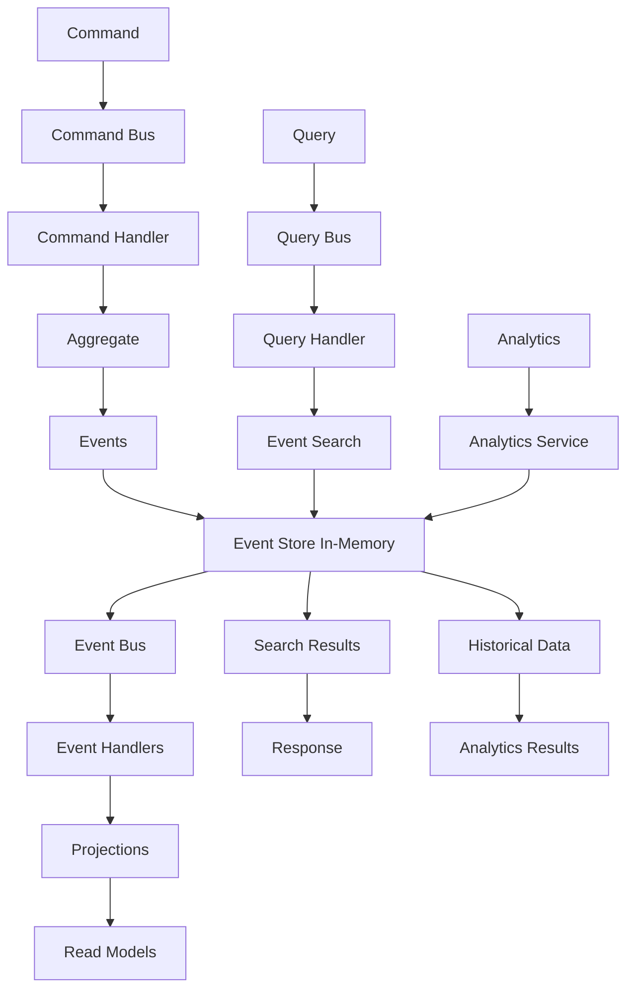

# 🚀 Stockage In-Memory - Event Sourcing + CQRS

## 🎯 **Contexte et Objectifs**

### **L'Architecture Maximale : Event Sourcing + CQRS avec In-Memory**

Nous arrivons maintenant à l'approche la plus sophistiquée et puissante pour In-Memory : **Event Sourcing + CQRS**. Cette combinaison représente l'état de l'art en matière d'architecture scalable pour la performance et l'audit trail.

#### **Pourquoi cette Combinaison ?**
- **Audit trail complet** : Historique immuable de tous les événements
- **Scalabilité maximale** : Possibilité de scaler indépendamment chaque côté
- **Performance optimale** : Chaque côté optimisé pour son usage
- **Flexibilité maximale** : Projections multiples pour différents besoins
- **Cache efficace** : Mise en cache des requêtes

### **Contexte Gyroscops**

Dans notre écosystème **User → Organization → Workflow → Cloud Resources → Billing**, Event Sourcing + CQRS avec In-Memory est la solution ultime pour :
- **Cache haute performance** : Audit trail complet avec analytics avancées
- **Sessions utilisateur** : Gestion optimisée des sessions avec projections
- **Métriques en temps réel** : Traçabilité des métriques avec analytics temporelles
- **Tests et développement** : Environnements de test rapides et organisés

## 🏗️ **Architecture Event Sourcing + CQRS**

### **Séparation Complète des Responsabilités**

#### **Command Side (Write)**
- **Command Handlers** : Traitement des commandes métier
- **Event Store** : Persistance des événements dans In-Memory
- **Event Handlers** : Gestion des événements de domaine
- **Command Bus** : Orchestration des commandes
- **Bulk Operations** : Optimisation des écritures

#### **Query Side (Read)**
- **Query Handlers** : Traitement des requêtes
- **Event Search** : Recherche dans les événements
- **Analytics Services** : Services d'analytics temporelles
- **Query Bus** : Orchestration des requêtes
- **Caches** : Optimisation des performances

### **Flux de Données Complet**



## 💻 **Implémentation Complète**

### **1. Command Side Implementation**

#### **Event Store In-Memory Avancé**

```php
<?php

namespace App\Infrastructure\EventStore;

use App\Domain\Event\DomainEvent;
use App\Domain\Event\EventStoreInterface;
use Psr\Log\LoggerInterface;

class InMemoryEventStore implements EventStoreInterface
{
    private array $events = [];
    private array $indexes = [];
    private LoggerInterface $logger;
    private array $bulkBuffer = [];
    private int $bulkSize;

    public function __construct(LoggerInterface $logger, int $bulkSize = 100)
    {
        $this->logger = $logger;
        $this->bulkSize = $bulkSize;
    }

    public function appendEvents(string $aggregateId, array $events, int $expectedVersion): void
    {
        try {
            // Vérifier la version attendue
            $lastEvent = $this->getLastEvent($aggregateId);
            
            if ($lastEvent && $lastEvent['version'] !== $expectedVersion) {
                throw new ConcurrencyException('Version mismatch');
            }
            
            // Préparer les événements pour l'insertion
            $version = $expectedVersion + 1;
            
            foreach ($events as $event) {
                $this->bulkBuffer[] = [
                    'eventId' => $event->getId(),
                    'aggregateId' => $aggregateId,
                    'aggregateType' => $event->getAggregateType(),
                    'eventType' => $event->getEventType(),
                    'eventData' => $event->toArray(),
                    'version' => $version++,
                    'timestamp' => $event->getTimestamp(),
                    'correlationId' => $event->getCorrelationId(),
                    'causationId' => $event->getCausationId(),
                    'metadata' => $event->getMetadata()
                ];
                
                if (count($this->bulkBuffer) >= $this->bulkSize) {
                    $this->flushBulk();
                }
            }
            
            $this->flushBulk();
            
        } catch (\Exception $e) {
            $this->logger->error('Failed to append events', [
                'aggregateId' => $aggregateId,
                'events' => count($events),
                'error' => $e->getMessage()
            ]);
            
            throw $e;
        }
    }

    public function getEvents(string $aggregateId, int $fromVersion = 0): array
    {
        $events = [];
        
        foreach ($this->events as $event) {
            if ($event['aggregateId'] === $aggregateId && $event['version'] >= $fromVersion) {
                $events[] = $this->deserializeEvent($event);
            }
        }
        
        // Trier par version
        usort($events, fn($a, $b) => $a->getVersion() <=> $b->getVersion());
        
        return $events;
    }

    public function searchEvents(array $criteria): array
    {
        $events = [];
        
        foreach ($this->events as $event) {
            if ($this->matchesCriteria($event, $criteria)) {
                $events[] = $this->deserializeEvent($event);
            }
        }
        
        // Trier par timestamp
        usort($events, fn($a, $b) => $a->getTimestamp() <=> $b->getTimestamp());
        
        return $events;
    }

    private function getLastEvent(string $aggregateId): ?array
    {
        $lastEvent = null;
        $lastVersion = -1;
        
        foreach ($this->events as $event) {
            if ($event['aggregateId'] === $aggregateId && $event['version'] > $lastVersion) {
                $lastEvent = $event;
                $lastVersion = $event['version'];
            }
        }
        
        return $lastEvent;
    }

    private function flushBulk(): void
    {
        if (empty($this->bulkBuffer)) {
            return;
        }

        try {
            foreach ($this->bulkBuffer as $eventData) {
                $this->events[$eventData['eventId']] = $eventData;
                $this->updateIndexes($eventData);
            }

            $this->logger->info('Bulk events inserted', [
                'events' => count($this->bulkBuffer)
            ]);

            $this->bulkBuffer = [];

        } catch (\Exception $e) {
            $this->logger->error('Bulk events insertion failed', [
                'error' => $e->getMessage(),
                'events' => count($this->bulkBuffer)
            ]);

            throw $e;
        }
    }

    private function updateIndexes(array $eventData): void
    {
        // Index par type d'événement
        $this->indexes['eventType'][$eventData['eventType']][] = $eventData['eventId'];
        
        // Index par agrégat
        $this->indexes['aggregateId'][$eventData['aggregateId']][] = $eventData['eventId'];
        
        // Index par corrélation
        if ($eventData['correlationId']) {
            $this->indexes['correlationId'][$eventData['correlationId']][] = $eventData['eventId'];
        }
        
        // Index par timestamp
        $date = $eventData['timestamp']->format('Y-m-d');
        $this->indexes['date'][$date][] = $eventData['eventId'];
    }

    private function matchesCriteria(array $event, array $criteria): bool
    {
        foreach ($criteria as $field => $expectedValue) {
            if (!$this->fieldMatches($event, $field, $expectedValue)) {
                return false;
            }
        }
        
        return true;
    }

    private function fieldMatches(array $event, string $field, mixed $expectedValue): bool
    {
        $fieldValue = $event[$field] ?? null;
        
        if (is_array($expectedValue)) {
            return in_array($fieldValue, $expectedValue);
        }
        
        return $fieldValue === $expectedValue;
    }

    private function deserializeEvent(array $eventData): DomainEvent
    {
        $eventClass = $eventData['eventType'];
        return $eventClass::fromArray($eventData['eventData']);
    }
}
```

#### **Command Bus avec Middleware**

```php
<?php

namespace App\Application\CommandBus;

use App\Domain\Command\CommandInterface;
use App\Domain\Command\CommandHandlerInterface;
use Psr\Log\LoggerInterface;

class CommandBus
{
    private array $handlers = [];
    private array $middleware = [];
    private LoggerInterface $logger;

    public function __construct(LoggerInterface $logger)
    {
        $this->logger = $logger;
    }

    public function registerHandler(string $commandClass, CommandHandlerInterface $handler): void
    {
        $this->handlers[$commandClass] = $handler;
    }

    public function addMiddleware(callable $middleware): void
    {
        $this->middleware[] = $middleware;
    }

    public function handle(CommandInterface $command): void
    {
        $commandClass = get_class($command);
        
        if (!isset($this->handlers[$commandClass])) {
            throw new \InvalidArgumentException("No handler registered for command: $commandClass");
        }

        $handler = $this->handlers[$commandClass];
        
        // Exécuter les middleware
        $this->executeMiddleware($command, function() use ($handler, $command) {
            $this->logger->info('Executing command', [
                'command' => get_class($command),
                'data' => $command->toArray()
            ]);
            
            $handler->handle($command);
        });
    }

    private function executeMiddleware(CommandInterface $command, callable $next): void
    {
        $middleware = array_reverse($this->middleware);
        
        foreach ($middleware as $mw) {
            $next = function() use ($mw, $command, $next) {
                return $mw($command, $next);
            };
        }
        
        $next();
    }
}
```

### **2. Query Side Implementation**

#### **Query Bus avec Cache**

```php
<?php

namespace App\Application\QueryBus;

use App\Domain\Query\QueryInterface;
use App\Domain\Query\QueryHandlerInterface;
use Psr\Cache\CacheItemPoolInterface;
use Psr\Log\LoggerInterface;

class QueryBus
{
    private array $handlers = [];
    private CacheItemPoolInterface $cache;
    private LoggerInterface $logger;

    public function __construct(CacheItemPoolInterface $cache, LoggerInterface $logger)
    {
        $this->cache = $cache;
        $this->logger = $logger;
    }

    public function registerHandler(string $queryClass, QueryHandlerInterface $handler): void
    {
        $this->handlers[$queryClass] = $handler;
    }

    public function handle(QueryInterface $query): mixed
    {
        $queryClass = get_class($query);
        
        if (!isset($this->handlers[$queryClass])) {
            throw new \InvalidArgumentException("No handler registered for query: $queryClass");
        }

        // Vérifier le cache
        $cacheKey = $this->generateCacheKey($query);
        $cachedItem = $this->cache->getItem($cacheKey);
        
        if ($cachedItem->isHit()) {
            $this->logger->debug('Query result served from cache', [
                'query' => $queryClass,
                'cacheKey' => $cacheKey
            ]);
            
            return $cachedItem->get();
        }

        // Exécuter la requête
        $handler = $this->handlers[$queryClass];
        $result = $handler->handle($query);
        
        // Mettre en cache
        $cachedItem->set($result);
        $cachedItem->expiresAfter(300); // 5 minutes
        $this->cache->save($cachedItem);
        
        $this->logger->info('Query executed and cached', [
            'query' => $queryClass,
            'cacheKey' => $cacheKey
        ]);
        
        return $result;
    }

    private function generateCacheKey(QueryInterface $query): string
    {
        return 'query_' . md5(serialize($query));
    }
}
```

#### **Event Search Service Avancé**

```php
<?php

namespace App\Infrastructure\InMemory\Query;

use App\Infrastructure\EventStore\InMemoryEventStore;
use Psr\Log\LoggerInterface;
use Psr\Cache\CacheItemPoolInterface;

class EventSearchService
{
    private InMemoryEventStore $eventStore;
    private LoggerInterface $logger;
    private CacheItemPoolInterface $cache;

    public function __construct(
        InMemoryEventStore $eventStore,
        LoggerInterface $logger,
        CacheItemPoolInterface $cache
    ) {
        $this->eventStore = $eventStore;
        $this->logger = $logger;
        $this->cache = $cache;
    }

    public function searchEvents(array $query, string $cacheKey = null): array
    {
        // Vérifier le cache
        if ($cacheKey) {
            $cachedItem = $this->cache->getItem($cacheKey);
            if ($cachedItem->isHit()) {
                $this->logger->debug('Event search result served from cache', [
                    'query' => $query,
                    'cacheKey' => $cacheKey
                ]);
                return $cachedItem->get();
            }
        }

        $results = $this->eventStore->searchEvents($query);

        // Mettre en cache
        if ($cacheKey) {
            $cachedItem->set($results);
            $cachedItem->expiresAfter(300); // 5 minutes
            $this->cache->save($cachedItem);
        }

        $this->logger->info('Event search executed', [
            'query' => $query,
            'results' => count($results)
        ]);

        return $results;
    }

    public function getEventStatistics(string $eventType, \DateTime $from, \DateTime $to): array
    {
        $events = $this->eventStore->getEventsByType($eventType, $from, $to);
        
        $statistics = [
            'total' => count($events),
            'byHour' => [],
            'byDay' => [],
            'byOrganization' => [],
            'byUser' => []
        ];
        
        foreach ($events as $event) {
            $hour = $event->getTimestamp()->format('Y-m-d H:00:00');
            $day = $event->getTimestamp()->format('Y-m-d');
            $orgId = $event->getMetadata()['organizationId'] ?? 'unknown';
            $userId = $event->getMetadata()['userId'] ?? 'unknown';
            
            $statistics['byHour'][$hour] = ($statistics['byHour'][$hour] ?? 0) + 1;
            $statistics['byDay'][$day] = ($statistics['byDay'][$day] ?? 0) + 1;
            $statistics['byOrganization'][$orgId] = ($statistics['byOrganization'][$orgId] ?? 0) + 1;
            $statistics['byUser'][$userId] = ($statistics['byUser'][$userId] ?? 0) + 1;
        }
        
        return $statistics;
    }

    public function getEventTrends(string $eventType, \DateTime $from, \DateTime $to, string $interval = 'day'): array
    {
        $events = $this->eventStore->getEventsByType($eventType, $from, $to);
        
        $trends = [];
        foreach ($events as $event) {
            $key = $this->getIntervalKey($event->getTimestamp(), $interval);
            $trends[$key] = ($trends[$key] ?? 0) + 1;
        }
        
        ksort($trends);
        return $trends;
    }
}
```

### **3. Service de Projection Avancé**

#### **Service de Projection pour les Analytics**

```php
<?php

namespace App\Application\Service\InMemory;

use App\Domain\Event\DomainEvent;
use App\Infrastructure\InMemory\Command\InMemoryWriter;
use Psr\Log\LoggerInterface;

class PaymentProjectionService
{
    private InMemoryWriter $writer;
    private LoggerInterface $logger;

    public function __construct(InMemoryWriter $writer, LoggerInterface $logger)
    {
        $this->writer = $writer;
        $this->logger = $logger;
    }

    public function handleEvent(DomainEvent $event): void
    {
        switch ($event->getEventType()) {
            case 'PaymentProcessed':
                $this->handlePaymentProcessed($event);
                break;
            case 'PaymentFailed':
                $this->handlePaymentFailed($event);
                break;
            case 'PaymentRefunded':
                $this->handlePaymentRefunded($event);
                break;
        }
    }

    private function handlePaymentProcessed(DomainEvent $event): void
    {
        $key = "Payment:{$event->getAggregateId()}";
        $update = [
            'status' => 'completed',
            'processedAt' => $event->getTimestamp()->format('c'),
            'updatedAt' => (new \DateTime())->format('c')
        ];

        $this->writer->update($key, $update, ['status']);

        $this->logger->info('Payment processed projection updated', [
            'paymentId' => $event->getAggregateId(),
            'status' => 'completed'
        ]);
    }

    private function handlePaymentFailed(DomainEvent $event): void
    {
        $key = "Payment:{$event->getAggregateId()}";
        $update = [
            'status' => 'failed',
            'error' => $event->getData()['error'],
            'failedAt' => $event->getTimestamp()->format('c'),
            'updatedAt' => (new \DateTime())->format('c')
        ];

        $this->writer->update($key, $update, ['status']);

        $this->logger->info('Payment failed projection updated', [
            'paymentId' => $event->getAggregateId(),
            'status' => 'failed'
        ]);
    }

    private function handlePaymentRefunded(DomainEvent $event): void
    {
        $key = "Payment:{$event->getAggregateId()}";
        $update = [
            'status' => 'refunded',
            'refundAmount' => $event->getData()['refundAmount'],
            'refundedAt' => $event->getTimestamp()->format('c'),
            'updatedAt' => (new \DateTime())->format('c')
        ];

        $this->writer->update($key, $update, ['status']);

        $this->logger->info('Payment refunded projection updated', [
            'paymentId' => $event->getAggregateId(),
            'status' => 'refunded'
        ]);
    }
}
```

## 🧪 **Tests et Validation**

### **Tests d'Intégration Event Sourcing + CQRS**

```php
<?php

namespace App\Tests\Integration\InMemory;

use App\Application\Command\Payment\ProcessPaymentCommand;
use App\Application\Command\Payment\ProcessPaymentCommandHandler;
use App\Application\Query\Payment\GetPaymentHistoryQuery;
use App\Application\Query\Payment\PaymentEventQueryHandler;
use App\Infrastructure\EventStore\InMemoryEventStore;
use App\Infrastructure\InMemory\Query\EventSearchService;

class InMemoryEventSourcingCqrsTest extends TestCase
{
    private InMemoryEventStore $eventStore;
    private EventSearchService $eventSearch;
    private ProcessPaymentCommandHandler $commandHandler;
    private PaymentEventQueryHandler $queryHandler;

    protected function setUp(): void
    {
        $this->eventStore = new InMemoryEventStore($this->createMock(LoggerInterface::class));
        $this->eventSearch = new EventSearchService($this->eventStore, $this->createMock(LoggerInterface::class), $this->createMock(CacheItemPoolInterface::class));
        
        $this->commandHandler = new ProcessPaymentCommandHandler(
            $this->eventStore,
            $this->createMock(EventBusInterface::class),
            $this->createMock(LoggerInterface::class)
        );
        
        $this->queryHandler = new PaymentEventQueryHandler($this->eventSearch, $this->createMock(LoggerInterface::class));
    }

    public function testEventSourcingCqrsFlow(): void
    {
        // Exécuter une commande
        $command = new ProcessPaymentCommand(
            'payment-123',
            100.00,
            'EUR'
        );
        
        $this->commandHandler->handle($command);
        
        // Vérifier l'historique des événements
        $query = new GetPaymentHistoryQuery('payment-123');
        $history = $this->queryHandler->handle($query);
        
        $this->assertNotEmpty($history);
        $this->assertCount(1, $history);
        $this->assertEquals('PaymentProcessed', $history[0]['eventType']);
    }

    public function testEventSearchWithAnalytics(): void
    {
        // Créer plusieurs événements
        $commands = [
            new ProcessPaymentCommand('payment-1', 100.00, 'EUR'),
            new ProcessPaymentCommand('payment-2', 200.00, 'USD'),
            new ProcessPaymentCommand('payment-3', 300.00, 'EUR')
        ];
        
        foreach ($commands as $command) {
            $this->commandHandler->handle($command);
        }
        
        // Rechercher les événements
        $searchQuery = new SearchPaymentEventsQuery(
            new \DateTime('2024-01-01'),
            new \DateTime('2024-12-31')
        );
        
        $results = $this->queryHandler->handle($searchQuery);
        
        $this->assertCount(3, $results);
        $this->assertEquals('PaymentProcessed', $results[0]['eventType']);
    }
}
```

## 📊 **Performance et Optimisation**

### **Stratégies d'Optimisation Event Sourcing + CQRS**

#### **1. Cache Multi-Niveaux**
```php
public function searchEventsWithCache(array $query, string $cacheKey = null): array
{
    // Cache L1: Mémoire
    if (isset($this->memoryCache[$cacheKey])) {
        return $this->memoryCache[$cacheKey];
    }
    
    // Cache L2: Redis
    if ($cached = $this->redis->get("event_search:{$cacheKey}")) {
        $result = json_decode($cached, true);
        $this->memoryCache[$cacheKey] = $result;
        return $result;
    }
    
    // In-Memory
    $result = $this->searchEvents($query);
    
    // Mettre en cache
    $this->memoryCache[$cacheKey] = $result;
    $this->redis->setex("event_search:{$cacheKey}", 300, json_encode($result));
    
    return $result;
}
```

#### **2. Projections Asynchrones**
```php
public function handleEventAsync(DomainEvent $event): void
{
    // Mettre en queue pour traitement asynchrone
    $this->messageBus->dispatch(new ProcessProjectionCommand($event));
}
```

#### **3. Index Optimisés**
```php
public function optimizeIndexes(): void
{
    // Nettoyer les index orphelins
    $this->cleanOrphanedIndexes();
    
    // Compacter les index
    $this->compactIndexes();
    
    // Forcer le garbage collection
    gc_collect_cycles();
}
```

## 🎯 **Critères d'Adoption**

### **Quand Utiliser Event Sourcing + CQRS avec In-Memory**

#### **✅ Avantages**
- **Audit trail complet** : Historique immuable de tous les événements
- **Scalabilité maximale** : Possibilité de scaler indépendamment
- **Performance optimale** : Chaque côté optimisé pour son usage
- **Flexibilité maximale** : Projections multiples pour différents besoins
- **Cache efficace** : Mise en cache des requêtes

#### **❌ Inconvénients**
- **Complexité maximale** : Architecture très complexe
- **Volatilité** : Données perdues au redémarrage
- **Limitation mémoire** : Contraint par la RAM disponible
- **Expertise** : Équipe très expérimentée requise
- **Coût** : Infrastructure très coûteuse

#### **🎯 Critères d'Adoption**
- **Système très complexe** : Besoins de scalabilité maximale
- **Audit trail critique** : Besoin de traçabilité complète
- **Performance critique** : Besoins de performance maximale
- **Données temporaires** : Cache, sessions, métriques
- **Équipe très expérimentée** : Maîtrise d'Event Sourcing, CQRS et In-Memory
- **Budget important** : Investissement en complexité justifié
- **Mémoire suffisante** : RAM disponible pour tous les événements

## 🚀 **Votre Prochaine Étape**


  
  
  
  
  
  
  


---

*Event Sourcing + CQRS avec In-Memory représente l'état de l'art en matière d'architecture scalable pour la performance et l'audit trail, parfaitement adapté aux besoins les plus exigeants de Gyroscops.*
