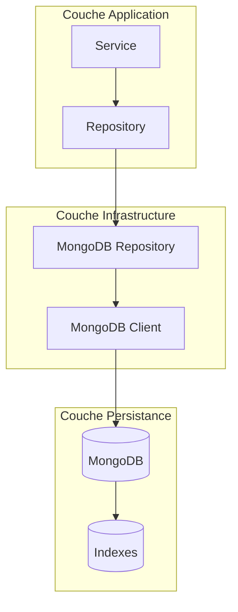

# Chapitre 28 : Stockage MongoDB - Approche Classique

## 🎯 Objectif du Chapitre

Ce chapitre explore l'utilisation de MongoDB pour la persistance avec une approche classique, en mettant l'accent sur les patterns de base et les bonnes pratiques pour les applications NoSQL.

## 📋 Prérequis

- **Chapitre 9** : Repositories et Persistance - Comprendre les patterns de persistance
- **Chapitre 15** : Choix du Type de Stockage - Comprendre les options disponibles
- **Connaissance MongoDB** : Bases de MongoDB et des concepts NoSQL

## 🏗️ Architecture MongoDB Classique

### Vue d'Ensemble

L'approche classique avec MongoDB utilise :
- **Collections** : Équivalent des tables en SQL
- **Documents** : Structure JSON flexible
- **Indexes** : Optimisation des requêtes
- **Repository Pattern** : Abstraction de la persistance

### Diagramme d'Architecture



## 🔧 Implémentation Technique

### 1. Configuration MongoDB

```php
<?php

namespace App\Accounting\Infrastructure\Configuration;

use MongoDB\Client;
use MongoDB\Database;

class MongoDBConfiguration
{
    private Client $client;
    private Database $database;
    
    public function __construct(string $connectionString, string $databaseName)
    {
        $this->client = new Client($connectionString);
        $this->database = $this->client->selectDatabase($databaseName);
    }
    
    public function getClient(): Client
    {
        return $this->client;
    }
    
    public function getDatabase(): Database
    {
        return $this->database;
    }
    
    public function getCollection(string $name): \MongoDB\Collection
    {
        return $this->database->selectCollection($name);
    }
}
```

### 2. Repository MongoDB de Base

```php
<?php

namespace App\Accounting\Infrastructure\Repository;

use App\Accounting\Domain\Aggregate\Payment;
use App\Accounting\Domain\ValueObject\PaymentId;
use App\Accounting\Domain\Repository\PaymentRepositoryInterface;
use App\Accounting\Infrastructure\Configuration\MongoDBConfiguration;
use App\Accounting\Infrastructure\Mapper\PaymentMapper;

class MongoDBPaymentRepository implements PaymentRepositoryInterface
{
    private \MongoDB\Collection $collection;
    
    public function __construct(
        private MongoDBConfiguration $mongoConfig,
        private PaymentMapper $mapper
    ) {
        $this->collection = $mongoConfig->getCollection('payments');
    }
    
    public function save(Payment $payment): void
    {
        $document = $this->mapper->toDocument($payment);
        
        $this->collection->replaceOne(
            ['_id' => $payment->getId()->getValue()],
            $document,
            ['upsert' => true]
        );
    }
    
    public function find(PaymentId $id): ?Payment
    {
        $document = $this->collection->findOne(['_id' => $id->getValue()]);
        
        if (!$document) {
            return null;
        }
        
        return $this->mapper->toDomain($document);
    }
    
    public function findAll(): array
    {
        $documents = $this->collection->find();
        
        return array_map(
            fn($doc) => $this->mapper->toDomain($doc),
            $documents->toArray()
        );
    }
    
    public function findByStatus(string $status): array
    {
        $documents = $this->collection->find(['status' => $status]);
        
        return array_map(
            fn($doc) => $this->mapper->toDomain($doc),
            $documents->toArray()
        );
    }
}
```

### 3. Mapper pour la Conversion

```php
<?php

namespace App\Accounting\Infrastructure\Mapper;

use App\Accounting\Domain\Aggregate\Payment;
use App\Accounting\Domain\ValueObject\PaymentId;
use App\Accounting\Domain\ValueObject\Amount;
use App\Accounting\Domain\ValueObject\Currency;

class PaymentMapper
{
    public function toDocument(Payment $payment): array
    {
        return [
            '_id' => $payment->getId()->getValue(),
            'amount' => $payment->getAmount()->getValue(),
            'currency' => $payment->getCurrency()->getCode(),
            'status' => $payment->getStatus()->getValue(),
            'created_at' => $payment->getCreatedAt()->format('Y-m-d H:i:s'),
            'updated_at' => $payment->getUpdatedAt()->format('Y-m-d H:i:s'),
            'metadata' => $payment->getMetadata()->toArray()
        ];
    }
    
    public function toDomain(array $document): Payment
    {
        return Payment::fromArray([
            'id' => $document['_id'],
            'amount' => $document['amount'],
            'currency' => $document['currency'],
            'status' => $document['status'],
            'created_at' => $document['created_at'],
            'updated_at' => $document['updated_at'],
            'metadata' => $document['metadata'] ?? []
        ]);
    }
}
```

## 🎨 Patterns d'Implémentation

### 1. Repository avec Requêtes Complexes

```php
<?php

namespace App\Accounting\Infrastructure\Repository;

use App\Accounting\Domain\ValueObject\PaymentId;
use App\Accounting\Domain\ValueObject\Amount;
use App\Accounting\Domain\ValueObject\Currency;
use MongoDB\BSON\ObjectId;

class AdvancedMongoDBPaymentRepository
{
    private \MongoDB\Collection $collection;
    
    public function __construct(
        private MongoDBConfiguration $mongoConfig,
        private PaymentMapper $mapper
    ) {
        $this->collection = $mongoConfig->getCollection('payments');
    }
    
    public function findByAmountRange(Amount $minAmount, Amount $maxAmount): array
    {
        $documents = $this->collection->find([
            'amount' => [
                '$gte' => $minAmount->getValue(),
                '$lte' => $maxAmount->getValue()
            ]
        ]);
        
        return array_map(
            fn($doc) => $this->mapper->toDomain($doc),
            $documents->toArray()
        );
    }
    
    public function findByCurrency(Currency $currency): array
    {
        $documents = $this->collection->find([
            'currency' => $currency->getCode()
        ]);
        
        return array_map(
            fn($doc) => $this->mapper->toDomain($doc),
            $documents->toArray()
        );
    }
    
    public function findRecent(int $days = 7): array
    {
        $startDate = new \DateTimeImmutable("-{$days} days");
        
        $documents = $this->collection->find([
            'created_at' => [
                '$gte' => $startDate->format('Y-m-d H:i:s')
            ]
        ]);
        
        return array_map(
            fn($doc) => $this->mapper->toDomain($doc),
            $documents->toArray()
        );
    }
    
    public function aggregateByStatus(): array
    {
        $pipeline = [
            [
                '$group' => [
                    '_id' => '$status',
                    'count' => ['$sum' => 1],
                    'total_amount' => ['$sum' => '$amount']
                ]
            ],
            [
                '$sort' => ['count' => -1]
            ]
        ];
        
        $result = $this->collection->aggregate($pipeline);
        
        return $result->toArray();
    }
}
```

### 2. Gestion des Indexes

```php
<?php

namespace App\Accounting\Infrastructure\Index;

use App\Accounting\Infrastructure\Configuration\MongoDBConfiguration;

class PaymentIndexManager
{
    private \MongoDB\Collection $collection;
    
    public function __construct(MongoDBConfiguration $mongoConfig)
    {
        $this->collection = $mongoConfig->getCollection('payments');
    }
    
    public function createIndexes(): void
    {
        // Index simple sur le statut
        $this->collection->createIndex(['status' => 1]);
        
        // Index composé sur la devise et le montant
        $this->collection->createIndex([
            'currency' => 1,
            'amount' => 1
        ]);
        
        // Index sur la date de création
        $this->collection->createIndex(['created_at' => 1]);
        
        // Index de texte pour la recherche
        $this->collection->createIndex([
            'metadata.description' => 'text',
            'metadata.notes' => 'text'
        ]);
        
        // Index TTL pour l'expiration automatique
        $this->collection->createIndex(
            ['expires_at' => 1],
            ['expireAfterSeconds' => 0]
        );
    }
    
    public function getIndexes(): array
    {
        return $this->collection->listIndexes()->toArray();
    }
}
```

### 3. Gestion des Transactions

```php
<?php

namespace App\Accounting\Infrastructure\Transaction;

use App\Accounting\Domain\Aggregate\Payment;
use App\Accounting\Domain\Aggregate\Subscription;
use App\Accounting\Infrastructure\Configuration\MongoDBConfiguration;

class MongoDBTransactionManager
{
    private \MongoDB\Database $database;
    
    public function __construct(MongoDBConfiguration $mongoConfig)
    {
        $this->database = $mongoConfig->getDatabase();
    }
    
    public function executeInTransaction(callable $callback): mixed
    {
        $session = $this->database->getClient()->startSession();
        
        try {
            $session->startTransaction();
            
            $result = $callback($session);
            
            $session->commitTransaction();
            
            return $result;
        } catch (\Exception $e) {
            $session->abortTransaction();
            throw $e;
        } finally {
            $session->endSession();
        }
    }
    
    public function processPaymentWithSubscription(
        Payment $payment,
        Subscription $subscription
    ): void {
        $this->executeInTransaction(function ($session) use ($payment, $subscription) {
            // Sauvegarder le paiement
            $paymentCollection = $this->database->selectCollection('payments');
            $paymentCollection->replaceOne(
                ['_id' => $payment->getId()->getValue()],
                $this->paymentMapper->toDocument($payment),
                ['upsert' => true, 'session' => $session]
            );
            
            // Mettre à jour l'abonnement
            $subscriptionCollection = $this->database->selectCollection('subscriptions');
            $subscriptionCollection->replaceOne(
                ['_id' => $subscription->getId()->getValue()],
                $this->subscriptionMapper->toDocument($subscription),
                ['upsert' => true, 'session' => $session]
            );
        });
    }
}
```

## 🔄 Gestion des Erreurs et Résilience

### 1. Gestion des Erreurs MongoDB

```php
<?php

namespace App\Accounting\Infrastructure\Error;

use MongoDB\Exception\ExceptionInterface;
use MongoDB\Exception\WriteException;
use MongoDB\Exception\ConnectionException;
use Psr\Log\LoggerInterface;

class MongoDBErrorHandler
{
    public function __construct(
        private LoggerInterface $logger
    ) {}
    
    public function handleException(ExceptionInterface $e): void
    {
        if ($e instanceof WriteException) {
            $this->handleWriteException($e);
        } elseif ($e instanceof ConnectionException) {
            $this->handleConnectionException($e);
        } else {
            $this->handleGenericException($e);
        }
    }
    
    private function handleWriteException(WriteException $e): void
    {
        $this->logger->error('MongoDB Write Error', [
            'error' => $e->getMessage(),
            'code' => $e->getCode(),
            'write_errors' => $e->getWriteResult()->getWriteErrors()
        ]);
        
        // Logique de retry ou de fallback
        throw new \RuntimeException('Failed to write to MongoDB', 0, $e);
    }
    
    private function handleConnectionException(ConnectionException $e): void
    {
        $this->logger->error('MongoDB Connection Error', [
            'error' => $e->getMessage(),
            'code' => $e->getCode()
        ]);
        
        // Logique de reconnexion
        throw new \RuntimeException('MongoDB connection failed', 0, $e);
    }
}
```

### 2. Retry Pattern

```php
<?php

namespace App\Accounting\Infrastructure\Retry;

use MongoDB\Exception\ExceptionInterface;
use MongoDB\Exception\WriteException;

class MongoDBRetryHandler
{
    private int $maxRetries;
    private int $baseDelay;
    
    public function __construct(int $maxRetries = 3, int $baseDelay = 1000)
    {
        $this->maxRetries = $maxRetries;
        $this->baseDelay = $baseDelay;
    }
    
    public function executeWithRetry(callable $operation): mixed
    {
        $attempt = 0;
        $lastException = null;
        
        while ($attempt < $this->maxRetries) {
            try {
                return $operation();
            } catch (WriteException $e) {
                $lastException = $e;
                
                if ($this->shouldRetry($e)) {
                    $attempt++;
                    $delay = $this->calculateDelay($attempt);
                    usleep($delay * 1000);
                } else {
                    throw $e;
                }
            } catch (ExceptionInterface $e) {
                throw $e;
            }
        }
        
        throw $lastException;
    }
    
    private function shouldRetry(WriteException $e): bool
    {
        $writeErrors = $e->getWriteResult()->getWriteErrors();
        
        foreach ($writeErrors as $error) {
            // Retry sur les erreurs temporaires
            if (in_array($error['code'], [11000, 11001, 112])) {
                return true;
            }
        }
        
        return false;
    }
    
    private function calculateDelay(int $attempt): int
    {
        return $this->baseDelay * pow(2, $attempt - 1);
    }
}
```

## 📊 Monitoring et Observabilité

### 1. Métriques MongoDB

```php
<?php

namespace App\Accounting\Infrastructure\Monitoring;

use App\Accounting\Infrastructure\Configuration\MongoDBConfiguration;
use App\Accounting\Infrastructure\Metrics\PrometheusMetrics;

class MongoDBMetricsCollector
{
    public function __construct(
        private MongoDBConfiguration $mongoConfig,
        private PrometheusMetrics $metrics
    ) {}
    
    public function collectMetrics(): void
    {
        $stats = $this->mongoConfig->getDatabase()->command(['dbStats' => 1])->toArray()[0];
        
        // Métriques de base
        $this->metrics->setGauge('mongodb_database_size_bytes', $stats['dataSize']);
        $this->metrics->setGauge('mongodb_index_size_bytes', $stats['indexSize']);
        $this->metrics->setGauge('mongodb_collections_total', $stats['collections']);
        $this->metrics->setGauge('mongodb_indexes_total', $stats['indexes']);
        
        // Métriques de performance
        $this->metrics->setGauge('mongodb_operations_total', $stats['opcounters']['insert'] + $stats['opcounters']['query']);
        $this->metrics->setGauge('mongodb_connections_current', $stats['connections']['current']);
    }
    
    public function recordOperation(string $operation, float $duration, bool $success): void
    {
        $this->metrics->incrementCounter('mongodb_operations_total', [
            'operation' => $operation,
            'status' => $success ? 'success' : 'error'
        ]);
        
        $this->metrics->recordHistogram('mongodb_operation_duration', $duration, [
            'operation' => $operation
        ]);
    }
}
```

### 2. Health Check

```php
<?php

namespace App\Accounting\Infrastructure\Health;

use App\Accounting\Infrastructure\Configuration\MongoDBConfiguration;

class MongoDBHealthCheck
{
    public function __construct(
        private MongoDBConfiguration $mongoConfig
    ) {}
    
    public function check(): array
    {
        try {
            // Test de connexion
            $this->mongoConfig->getDatabase()->command(['ping' => 1]);
            
            // Test de lecture
            $this->mongoConfig->getCollection('payments')->findOne();
            
            return [
                'status' => 'healthy',
                'database' => 'connected',
                'read' => 'working',
                'write' => 'working'
            ];
        } catch (\Exception $e) {
            return [
                'status' => 'unhealthy',
                'error' => $e->getMessage(),
                'database' => 'disconnected'
            ];
        }
    }
}
```

## 🎯 Avantages de l'Approche

### 1. Flexibilité du Schéma
- **Documents flexibles** : Structure JSON adaptable
- **Évolution facile** : Pas de migrations de schéma
- **Données hétérogènes** : Support des données variées

### 2. Performance
- **Indexes optimisés** : Requêtes rapides
- **Sharding** : Distribution horizontale
- **Cache intégré** : Performance mémoire

### 3. Développement
- **API simple** : Interface intuitive
- **Requêtes puissantes** : Aggregation pipeline
- **Intégration facile** : Drivers multiples

## ⚠️ Inconvénients et Considérations

### 1. Consistance
- **ACID limité** : Pas de transactions complexes
- **Consistance éventuelle** : Dans les clusters
- **Pas de contraintes** : Validation applicative

### 2. Requêtes
- **Pas de JOINs** : Relations manuelles
- **Requêtes complexes** : Aggregation pipeline
- **Performance** : Indexes critiques

### 3. Maintenance
- **Monitoring** : Outils spécialisés
- **Backup** : Stratégies spécifiques
- **Scaling** : Configuration complexe

## 🔧 Configuration et Déploiement

### 1. Configuration des Services

```yaml
# config/packages/mongodb.yaml
mongodb:
  connections:
    default:
      uri: '%env(MONGODB_URI)%'
      database: '%env(MONGODB_DATABASE)%'
      options:
        connectTimeoutMS: 30000
        socketTimeoutMS: 30000
        serverSelectionTimeoutMS: 30000
        maxPoolSize: 10
        minPoolSize: 1
```

### 2. Déploiement avec Docker

```yaml
# docker-compose.yml
version: '3.8'
services:
  mongodb:
    image: mongo:6.0
    container_name: hive-mongodb
    restart: unless-stopped
    ports:
      - "27017:27017"
    environment:
      MONGO_INITDB_ROOT_USERNAME: admin
      MONGO_INITDB_ROOT_PASSWORD: password
      MONGO_INITDB_DATABASE: hive_accounting
    volumes:
      - mongodb_data:/data/db
      - ./mongodb/init:/docker-entrypoint-initdb.d
    networks:
      - hive-network

volumes:
  mongodb_data:

networks:
  hive-network:
    driver: bridge
```

## 📚 Exemples Concrets du Projet Hive

### 1. Repository de Paiements

```php
<?php

namespace App\Accounting\Infrastructure\Repository;

use App\Accounting\Domain\Aggregate\Payment;
use App\Accounting\Domain\ValueObject\PaymentId;
use App\Accounting\Infrastructure\Configuration\MongoDBConfiguration;

class HivePaymentRepository
{
    private \MongoDB\Collection $collection;
    
    public function __construct(MongoDBConfiguration $mongoConfig)
    {
        $this->collection = $mongoConfig->getCollection('payments');
    }
    
    public function save(Payment $payment): void
    {
        $document = [
            '_id' => $payment->getId()->getValue(),
            'amount' => $payment->getAmount()->getValue(),
            'currency' => $payment->getCurrency()->getCode(),
            'status' => $payment->getStatus()->getValue(),
            'workspace_id' => $payment->getWorkspaceId()->getValue(),
            'organization_id' => $payment->getOrganizationId()->getValue(),
            'created_at' => $payment->getCreatedAt()->format('Y-m-d H:i:s'),
            'updated_at' => $payment->getUpdatedAt()->format('Y-m-d H:i:s'),
            'metadata' => $payment->getMetadata()->toArray()
        ];
        
        $this->collection->replaceOne(
            ['_id' => $payment->getId()->getValue()],
            $document,
            ['upsert' => true]
        );
    }
    
    public function findByWorkspace(string $workspaceId): array
    {
        $documents = $this->collection->find([
            'workspace_id' => $workspaceId
        ]);
        
        return array_map(
            fn($doc) => $this->mapToPayment($doc),
            $documents->toArray()
        );
    }
}
```

### 2. Aggregation pour les Rapports

```php
<?php

namespace App\Accounting\Infrastructure\Report;

use App\Accounting\Infrastructure\Configuration\MongoDBConfiguration;

class PaymentReportGenerator
{
    private \MongoDB\Collection $collection;
    
    public function __construct(MongoDBConfiguration $mongoConfig)
    {
        $this->collection = $mongoConfig->getCollection('payments');
    }
    
    public function generateMonthlyReport(string $workspaceId, int $year, int $month): array
    {
        $startDate = new \DateTimeImmutable("{$year}-{$month}-01");
        $endDate = $startDate->modify('+1 month');
        
        $pipeline = [
            [
                '$match' => [
                    'workspace_id' => $workspaceId,
                    'created_at' => [
                        '$gte' => $startDate->format('Y-m-d H:i:s'),
                        '$lt' => $endDate->format('Y-m-d H:i:s')
                    ]
                ]
            ],
            [
                '$group' => [
                    '_id' => [
                        'status' => '$status',
                        'currency' => '$currency'
                    ],
                    'count' => ['$sum' => 1],
                    'total_amount' => ['$sum' => '$amount'],
                    'avg_amount' => ['$avg' => '$amount']
                ]
            ],
            [
                '$sort' => ['total_amount' => -1]
            ]
        ];
        
        return $this->collection->aggregate($pipeline)->toArray();
    }
}
```

## 🎯 Critères d'Adoption

### ✅ Adoptez cette approche si :

- **Données non relationnelles** avec structure flexible
- **Performance de lecture** importante
- **Évolutivité horizontale** requise
- **Équipe expérimentée** avec NoSQL
- **Requêtes complexes** avec aggregation
- **Flexibilité du schéma** nécessaire

### ❌ Évitez cette approche si :

- **Données relationnelles** strictes
- **Transactions ACID** critiques
- **Équipe junior** sans expérience NoSQL
- **Requêtes simples** avec JOINs
- **Contraintes de schéma** importantes

## 📈 Métriques de Succès

### 1. Performance
- **Temps de réponse** des requêtes < 50ms
- **Throughput** des opérations > 10000/min
- **Disponibilité** > 99.9%

### 2. Qualité
- **Couverture de tests** > 90%
- **Taux d'erreur** < 0.1%
- **Temps de récupération** < 2 minutes

### 3. Business
- **Satisfaction utilisateur** > 4.5/5
- **Temps de développement** des nouvelles fonctionnalités
- **Coût de maintenance** acceptable

---

## 🎯 Votre Prochaine Étape

Maintenant que vous comprenez l'approche classique avec MongoDB, quel est votre contexte ?


  

  

  

  

  

