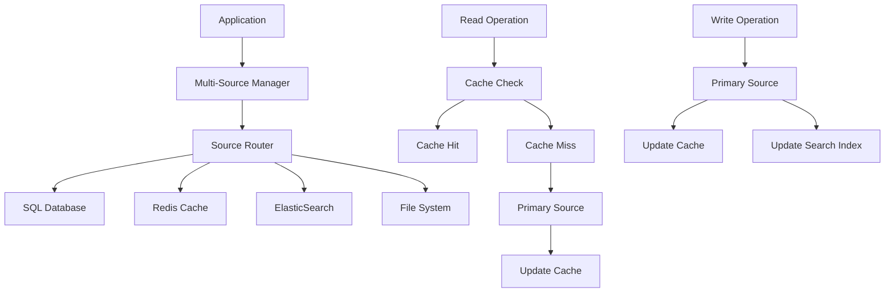

# 🔗 Stockage Multi-sources - Approche Classique

## 🎯 **Contexte et Objectifs**

### **Pourquoi Multi-sources pour le Stockage ?**

Le stockage multi-sources offre une approche hybride qui combine différents types de stockage pour optimiser les performances et répondre aux besoins spécifiques de chaque partie du système. Cette approche est particulièrement adaptée aux systèmes complexes qui nécessitent différents niveaux de performance et de persistance.

#### **Avantages du Stockage Multi-sources**
- **Flexibilité** : Choix du meilleur stockage pour chaque cas d'usage
- **Performance** : Optimisation des performances par type d'opération
- **Résilience** : Redondance et failover entre sources
- **Scalabilité** : Possibilité de scaler indépendamment chaque source
- **Coût** : Optimisation des coûts selon les besoins

### **Contexte Gyroscops**

Dans notre écosystème **User → Organization → Workflow → Cloud Resources → Billing**, Multi-sources est particulièrement pertinent pour :
- **Données utilisateur** : Cache Redis + Base de données SQL
- **Données de facturation** : Base de données SQL + ElasticSearch pour analytics
- **Données de workflow** : Temporal + Cache In-Memory
- **Données de configuration** : Base de données + Fichiers de configuration

## 🏗️ **Architecture Multi-sources Classique**

### **Structure des Sources**

#### **Source de Données Principale**
- **Base de données SQL** : Données transactionnelles critiques
- **Cache Redis** : Données fréquemment accédées
- **ElasticSearch** : Données de recherche et analytics
- **Fichiers** : Configuration et logs

#### **Flux de Données**



## 💻 **Implémentation Pratique**

### **1. Multi-Source Manager**

#### **Gestionnaire Multi-Sources**

```php
<?php

namespace App\Infrastructure\MultiSource;

use App\Domain\Payment\Payment;
use App\Domain\Payment\PaymentRepositoryInterface;
use App\Infrastructure\Repository\SqlPaymentRepository;
use App\Infrastructure\Repository\RedisPaymentRepository;
use App\Infrastructure\Repository\ElasticSearchPaymentRepository;
use Psr\Log\LoggerInterface;

class MultiSourcePaymentRepository implements PaymentRepositoryInterface
{
    private SqlPaymentRepository $sqlRepository;
    private RedisPaymentRepository $redisRepository;
    private ElasticSearchPaymentRepository $elasticSearchRepository;
    private LoggerInterface $logger;
    private array $sourceConfig;

    public function __construct(
        SqlPaymentRepository $sqlRepository,
        RedisPaymentRepository $redisRepository,
        ElasticSearchPaymentRepository $elasticSearchRepository,
        LoggerInterface $logger,
        array $sourceConfig = []
    ) {
        $this->sqlRepository = $sqlRepository;
        $this->redisRepository = $redisRepository;
        $this->elasticSearchRepository = $elasticSearchRepository;
        $this->logger = $logger;
        $this->sourceConfig = array_merge([
            'read_strategy' => 'cache_first',
            'write_strategy' => 'write_through',
            'cache_ttl' => 300,
            'fallback_enabled' => true
        ], $sourceConfig);
    }

    public function save(Payment $payment): void
    {
        try {
            $this->logger->info('Saving payment via multi-source', [
                'paymentId' => $payment->getId(),
                'strategy' => $this->sourceConfig['write_strategy']
            ]);

            switch ($this->sourceConfig['write_strategy']) {
                case 'write_through':
                    $this->writeThrough($payment);
                    break;
                case 'write_behind':
                    $this->writeBehind($payment);
                    break;
                case 'write_around':
                    $this->writeAround($payment);
                    break;
                default:
                    $this->writeThrough($payment);
            }

            $this->logger->info('Payment saved successfully via multi-source', [
                'paymentId' => $payment->getId()
            ]);

        } catch (\Exception $e) {
            $this->logger->error('Failed to save payment via multi-source', [
                'paymentId' => $payment->getId(),
                'error' => $e->getMessage()
            ]);

            throw $e;
        }
    }

    public function findById(string $id): ?Payment
    {
        try {
            $this->logger->info('Finding payment via multi-source', [
                'paymentId' => $id,
                'strategy' => $this->sourceConfig['read_strategy']
            ]);

            switch ($this->sourceConfig['read_strategy']) {
                case 'cache_first':
                    return $this->cacheFirst($id);
                case 'database_first':
                    return $this->databaseFirst($id);
                case 'parallel':
                    return $this->parallelRead($id);
                default:
                    return $this->cacheFirst($id);
            }

        } catch (\Exception $e) {
            $this->logger->error('Failed to find payment via multi-source', [
                'paymentId' => $id,
                'error' => $e->getMessage()
            ]);

            return null;
        }
    }

    public function findByOrganization(string $organizationId): array
    {
        try {
            $this->logger->info('Finding payments by organization via multi-source', [
                'organizationId' => $organizationId
            ]);

            // Pour les requêtes complexes, utiliser ElasticSearch
            $payments = $this->elasticSearchRepository->findByOrganization($organizationId);

            $this->logger->info('Payments found by organization via multi-source', [
                'organizationId' => $organizationId,
                'count' => count($payments)
            ]);

            return $payments;

        } catch (\Exception $e) {
            $this->logger->error('Failed to find payments by organization via multi-source', [
                'organizationId' => $organizationId,
                'error' => $e->getMessage()
            ]);

            // Fallback vers la base de données SQL
            if ($this->sourceConfig['fallback_enabled']) {
                return $this->sqlRepository->findByOrganization($organizationId);
            }

            return [];
        }
    }

    public function delete(string $id): void
    {
        try {
            $this->logger->info('Deleting payment via multi-source', [
                'paymentId' => $id
            ]);

            // Supprimer de toutes les sources
            $this->sqlRepository->delete($id);
            $this->redisRepository->delete($id);
            $this->elasticSearchRepository->delete($id);

            $this->logger->info('Payment deleted successfully via multi-source', [
                'paymentId' => $id
            ]);

        } catch (\Exception $e) {
            $this->logger->error('Failed to delete payment via multi-source', [
                'paymentId' => $id,
                'error' => $e->getMessage()
            ]);

            throw $e;
        }
    }

    public function count(): int
    {
        try {
            // Utiliser la source la plus fiable pour le comptage
            return $this->sqlRepository->count();
        } catch (\Exception $e) {
            $this->logger->error('Failed to count payments via multi-source', [
                'error' => $e->getMessage()
            ]);

            return 0;
        }
    }

    private function writeThrough(Payment $payment): void
    {
        // Écrire dans la base de données SQL d'abord
        $this->sqlRepository->save($payment);
        
        // Puis mettre à jour le cache
        $this->redisRepository->save($payment);
        
        // Et l'index de recherche
        $this->elasticSearchRepository->save($payment);
    }

    private function writeBehind(Payment $payment): void
    {
        // Écrire dans le cache d'abord
        $this->redisRepository->save($payment);
        
        // Programmer l'écriture en base de données
        $this->scheduleDatabaseWrite($payment);
    }

    private function writeAround(Payment $payment): void
    {
        // Écrire directement dans la base de données
        $this->sqlRepository->save($payment);
        
        // Invalider le cache
        $this->redisRepository->delete($payment->getId());
    }

    private function cacheFirst(string $id): ?Payment
    {
        // Vérifier le cache d'abord
        $payment = $this->redisRepository->findById($id);
        
        if ($payment) {
            return $payment;
        }
        
        // Si pas en cache, chercher en base de données
        $payment = $this->sqlRepository->findById($id);
        
        if ($payment) {
            // Mettre en cache
            $this->redisRepository->save($payment);
        }
        
        return $payment;
    }

    private function databaseFirst(string $id): ?Payment
    {
        // Chercher en base de données d'abord
        $payment = $this->sqlRepository->findById($id);
        
        if ($payment) {
            // Mettre en cache
            $this->redisRepository->save($payment);
        }
        
        return $payment;
    }

    private function parallelRead(string $id): ?Payment
    {
        // Lancer les lectures en parallèle
        $cachePromise = $this->redisRepository->findByIdAsync($id);
        $databasePromise = $this->sqlRepository->findByIdAsync($id);
        
        // Attendre les résultats
        $cacheResult = $cachePromise->wait();
        $databaseResult = $databasePromise->wait();
        
        // Retourner le résultat le plus récent
        if ($cacheResult && $databaseResult) {
            return $cacheResult->getUpdatedAt() > $databaseResult->getUpdatedAt() 
                ? $cacheResult 
                : $databaseResult;
        }
        
        return $cacheResult ?: $databaseResult;
    }

    private function scheduleDatabaseWrite(Payment $payment): void
    {
        // Implémentation de l'écriture différée
        // Ex: via une queue de messages
        $this->messageQueue->push(new DatabaseWriteJob($payment));
    }
}
```

### **2. Source Router**

#### **Routeur de Sources**

```php
<?php

namespace App\Infrastructure\MultiSource;

use App\Domain\Payment\Payment;
use Psr\Log\LoggerInterface;

class SourceRouter
{
    private array $routingRules;
    private LoggerInterface $logger;

    public function __construct(array $routingRules = [], LoggerInterface $logger)
    {
        $this->routingRules = array_merge([
            'read' => [
                'simple_queries' => 'cache',
                'complex_queries' => 'elasticsearch',
                'critical_data' => 'database'
            ],
            'write' => [
                'transactions' => 'database',
                'cache_updates' => 'cache',
                'search_index' => 'elasticsearch'
            ]
        ], $routingRules);
        $this->logger = $logger;
    }

    public function routeRead(string $operation, array $criteria = []): string
    {
        $this->logger->debug('Routing read operation', [
            'operation' => $operation,
            'criteria' => $criteria
        ]);

        // Logique de routage basée sur l'opération
        if ($this->isSimpleQuery($operation, $criteria)) {
            return 'cache';
        }

        if ($this->isComplexQuery($operation, $criteria)) {
            return 'elasticsearch';
        }

        if ($this->isCriticalData($operation, $criteria)) {
            return 'database';
        }

        // Par défaut, utiliser le cache
        return 'cache';
    }

    public function routeWrite(string $operation, Payment $payment): array
    {
        $this->logger->debug('Routing write operation', [
            'operation' => $operation,
            'paymentId' => $payment->getId()
        ]);

        $sources = [];

        // Toujours écrire en base de données pour les transactions
        if ($this->isTransaction($operation)) {
            $sources[] = 'database';
        }

        // Mettre à jour le cache pour les données fréquemment accédées
        if ($this->shouldUpdateCache($payment)) {
            $sources[] = 'cache';
        }

        // Mettre à jour l'index de recherche pour les données recherchables
        if ($this->shouldUpdateSearchIndex($payment)) {
            $sources[] = 'elasticsearch';
        }

        return $sources;
    }

    private function isSimpleQuery(string $operation, array $criteria): bool
    {
        return in_array($operation, ['findById', 'findByStatus']) && 
               count($criteria) <= 2;
    }

    private function isComplexQuery(string $operation, array $criteria): bool
    {
        return in_array($operation, ['search', 'findByOrganization', 'findByDateRange']) ||
               count($criteria) > 2;
    }

    private function isCriticalData(string $operation, array $criteria): bool
    {
        return in_array($operation, ['findById']) && 
               isset($criteria['critical']) && 
               $criteria['critical'] === true;
    }

    private function isTransaction(string $operation): bool
    {
        return in_array($operation, ['save', 'update', 'delete']);
    }

    private function shouldUpdateCache(Payment $payment): bool
    {
        // Mettre à jour le cache pour les paiements récents ou fréquemment accédés
        return $payment->getCreatedAt() > new \DateTime('-1 hour') ||
               $payment->getStatus() === 'processing';
    }

    private function shouldUpdateSearchIndex(Payment $payment): bool
    {
        // Mettre à jour l'index de recherche pour les paiements avec des données recherchables
        return !empty($payment->getDescription()) ||
               $payment->getAmount() > 1000;
    }
}
```

### **3. Cache Manager**

#### **Gestionnaire de Cache Multi-Sources**

```php
<?php

namespace App\Infrastructure\MultiSource;

use App\Domain\Payment\Payment;
use Psr\Cache\CacheItemPoolInterface;
use Psr\Log\LoggerInterface;

class MultiSourceCacheManager
{
    private CacheItemPoolInterface $cache;
    private LoggerInterface $logger;
    private array $cacheConfig;

    public function __construct(
        CacheItemPoolInterface $cache,
        LoggerInterface $logger,
        array $cacheConfig = []
    ) {
        $this->cache = $cache;
        $this->logger = $logger;
        $this->cacheConfig = array_merge([
            'default_ttl' => 300,
            'payment_ttl' => 600,
            'search_ttl' => 1800,
            'enable_compression' => true
        ], $cacheConfig);
    }

    public function get(string $key): mixed
    {
        try {
            $cacheItem = $this->cache->getItem($key);
            
            if ($cacheItem->isHit()) {
                $this->logger->debug('Cache hit', ['key' => $key]);
                return $this->unserialize($cacheItem->get());
            }
            
            $this->logger->debug('Cache miss', ['key' => $key]);
            return null;
            
        } catch (\Exception $e) {
            $this->logger->error('Cache get failed', [
                'key' => $key,
                'error' => $e->getMessage()
            ]);
            
            return null;
        }
    }

    public function set(string $key, mixed $value, int $ttl = null): bool
    {
        try {
            $cacheItem = $this->cache->getItem($key);
            $cacheItem->set($this->serialize($value));
            $cacheItem->expiresAfter($ttl ?? $this->cacheConfig['default_ttl']);
            
            $result = $this->cache->save($cacheItem);
            
            $this->logger->debug('Cache set', [
                'key' => $key,
                'ttl' => $ttl ?? $this->cacheConfig['default_ttl'],
                'success' => $result
            ]);
            
            return $result;
            
        } catch (\Exception $e) {
            $this->logger->error('Cache set failed', [
                'key' => $key,
                'error' => $e->getMessage()
            ]);
            
            return false;
        }
    }

    public function delete(string $key): bool
    {
        try {
            $result = $this->cache->deleteItem($key);
            
            $this->logger->debug('Cache delete', [
                'key' => $key,
                'success' => $result
            ]);
            
            return $result;
            
        } catch (\Exception $e) {
            $this->logger->error('Cache delete failed', [
                'key' => $key,
                'error' => $e->getMessage()
            ]);
            
            return false;
        }
    }

    public function getPayment(string $paymentId): ?Payment
    {
        $key = $this->generatePaymentKey($paymentId);
        return $this->get($key);
    }

    public function setPayment(Payment $payment, int $ttl = null): bool
    {
        $key = $this->generatePaymentKey($payment->getId());
        $ttl = $ttl ?? $this->cacheConfig['payment_ttl'];
        
        return $this->set($key, $payment, $ttl);
    }

    public function deletePayment(string $paymentId): bool
    {
        $key = $this->generatePaymentKey($paymentId);
        return $this->delete($key);
    }

    public function getSearchResults(string $query, array $filters = []): ?array
    {
        $key = $this->generateSearchKey($query, $filters);
        return $this->get($key);
    }

    public function setSearchResults(string $query, array $filters, array $results, int $ttl = null): bool
    {
        $key = $this->generateSearchKey($query, $filters);
        $ttl = $ttl ?? $this->cacheConfig['search_ttl'];
        
        return $this->set($key, $results, $ttl);
    }

    private function generatePaymentKey(string $paymentId): string
    {
        return "payment:{$paymentId}";
    }

    private function generateSearchKey(string $query, array $filters): string
    {
        $filterString = md5(serialize($filters));
        return "search:" . md5($query) . ":{$filterString}";
    }

    private function serialize(mixed $value): string
    {
        if ($this->cacheConfig['enable_compression']) {
            return gzcompress(serialize($value));
        }
        
        return serialize($value);
    }

    private function unserialize(string $value): mixed
    {
        if ($this->cacheConfig['enable_compression']) {
            return unserialize(gzuncompress($value));
        }
        
        return unserialize($value);
    }
}
```

## 🧪 **Tests et Validation**

### **Tests d'Intégration Multi-Sources**

```php
<?php

namespace App\Tests\Integration\MultiSource;

use App\Domain\Payment\Payment;
use App\Infrastructure\MultiSource\MultiSourcePaymentRepository;
use App\Infrastructure\Repository\SqlPaymentRepository;
use App\Infrastructure\Repository\RedisPaymentRepository;
use App\Infrastructure\Repository\ElasticSearchPaymentRepository;

class MultiSourcePaymentRepositoryTest extends TestCase
{
    private MultiSourcePaymentRepository $repository;
    private SqlPaymentRepository $sqlRepository;
    private RedisPaymentRepository $redisRepository;
    private ElasticSearchPaymentRepository $elasticSearchRepository;

    protected function setUp(): void
    {
        $this->sqlRepository = $this->createMock(SqlPaymentRepository::class);
        $this->redisRepository = $this->createMock(RedisPaymentRepository::class);
        $this->elasticSearchRepository = $this->createMock(ElasticSearchPaymentRepository::class);
        
        $this->repository = new MultiSourcePaymentRepository(
            $this->sqlRepository,
            $this->redisRepository,
            $this->elasticSearchRepository,
            $this->createMock(LoggerInterface::class),
            ['read_strategy' => 'cache_first', 'write_strategy' => 'write_through']
        );
    }

    public function testSaveWithWriteThrough(): void
    {
        $payment = new Payment(
            'payment-123',
            'org-456',
            'user-789',
            100.00,
            'EUR',
            'processing',
            'Test payment',
            new \DateTime()
        );
        
        $this->sqlRepository->expects($this->once())->method('save')->with($payment);
        $this->redisRepository->expects($this->once())->method('save')->with($payment);
        $this->elasticSearchRepository->expects($this->once())->method('save')->with($payment);
        
        $this->repository->save($payment);
    }

    public function testFindByIdWithCacheFirst(): void
    {
        $payment = new Payment(
            'payment-123',
            'org-456',
            'user-789',
            100.00,
            'EUR',
            'processing',
            'Test payment',
            new \DateTime()
        );
        
        $this->redisRepository->expects($this->once())
            ->method('findById')
            ->with('payment-123')
            ->willReturn($payment);
        
        $result = $this->repository->findById('payment-123');
        
        $this->assertEquals($payment, $result);
    }

    public function testFindByIdWithCacheMiss(): void
    {
        $payment = new Payment(
            'payment-123',
            'org-456',
            'user-789',
            100.00,
            'EUR',
            'processing',
            'Test payment',
            new \DateTime()
        );
        
        $this->redisRepository->expects($this->once())
            ->method('findById')
            ->with('payment-123')
            ->willReturn(null);
        
        $this->sqlRepository->expects($this->once())
            ->method('findById')
            ->with('payment-123')
            ->willReturn($payment);
        
        $this->redisRepository->expects($this->once())
            ->method('save')
            ->with($payment);
        
        $result = $this->repository->findById('payment-123');
        
        $this->assertEquals($payment, $result);
    }
}
```

## 📊 **Performance et Optimisation**

### **Stratégies d'Optimisation Multi-Sources**

#### **1. Cache Warming**
```php
public function warmCache(): void
{
    $this->logger->info('Warming cache for frequently accessed data');
    
    // Charger les paiements récents
    $recentPayments = $this->sqlRepository->findRecent(100);
    foreach ($recentPayments as $payment) {
        $this->redisRepository->save($payment);
    }
    
    // Charger les statistiques
    $stats = $this->sqlRepository->getStatistics();
    $this->redisRepository->set('payment:stats', $stats, 3600);
}
```

#### **2. Load Balancing**
```php
public function getOptimalSource(string $operation): string
{
    $sourceLoads = $this->getSourceLoads();
    $optimalSource = array_keys($sourceLoads, min($sourceLoads))[0];
    
    $this->logger->debug('Selected optimal source', [
        'operation' => $operation,
        'source' => $optimalSource,
        'loads' => $sourceLoads
    ]);
    
    return $optimalSource;
}
```

#### **3. Monitoring des Sources**
```php
public function getSourceMetrics(): array
{
    return [
        'sql' => $this->getSqlMetrics(),
        'redis' => $this->getRedisMetrics(),
        'elasticsearch' => $this->getElasticSearchMetrics(),
        'overall_health' => $this->getOverallHealth()
    ];
}
```

## 🎯 **Critères d'Adoption**

### **Quand Utiliser Multi-sources Classique**

#### **✅ Avantages**
- **Flexibilité** : Choix du meilleur stockage pour chaque cas d'usage
- **Performance** : Optimisation des performances par type d'opération
- **Résilience** : Redondance et failover entre sources
- **Scalabilité** : Possibilité de scaler indépendamment chaque source
- **Coût** : Optimisation des coûts selon les besoins

#### **❌ Inconvénients**
- **Complexité** : Gestion de plusieurs sources de données
- **Cohérence** : Risque d'incohérence entre sources
- **Maintenance** : Plus de sources à maintenir
- **Expertise** : Équipe expérimentée requise

#### **🎯 Critères d'Adoption**
- **Système complexe** : Besoins de performance différents par type d'opération
- **Données hétérogènes** : Types de données différents nécessitant différents stockages
- **Performance critique** : Besoins de performance optimale
- **Résilience importante** : Besoin de redondance et failover
- **Équipe expérimentée** : Maîtrise de plusieurs technologies de stockage
- **Budget suffisant** : Investissement en infrastructure multiple
- **Temps de développement** : Suffisant pour implémenter cette complexité

## 🚀 **Votre Prochaine Étape**


  
  
  
  
  
  
  


---

*Multi-sources classique offre une approche flexible pour combiner différents types de stockage, parfaitement adaptée aux besoins complexes de Gyroscops.*

