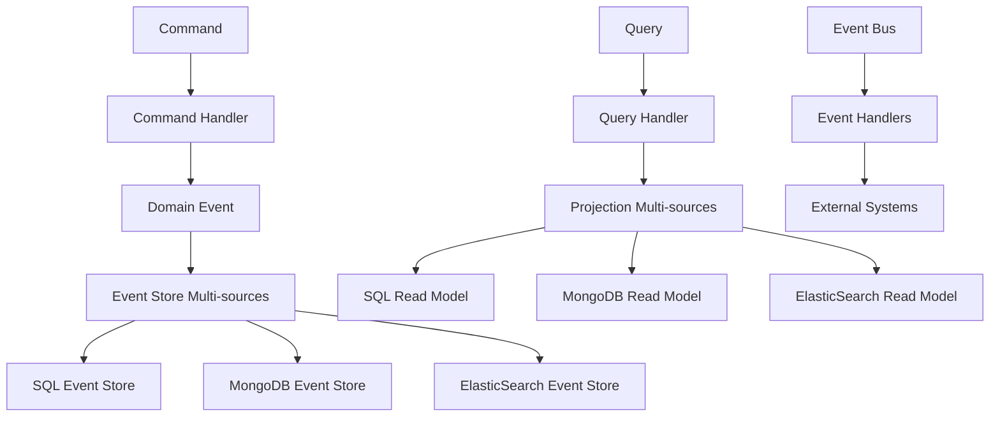

# 📊 Stockage Multi-sources avec Event Sourcing

## 🎯 **Objectif du Chapitre**

Ce chapitre explore l'implémentation du **stockage multi-sources avec Event Sourcing**, une approche avancée qui combine plusieurs types de stockage avec la persistance événementielle pour créer des systèmes robustes et évolutifs.

## 🌟 **Concepts Clés**

### **Event Sourcing Multi-sources**

L'Event Sourcing multi-sources étend le pattern classique en permettant :
- **Persistance distribuée** : Événements stockés dans plusieurs systèmes
- **Résilience** : Tolérance aux pannes de stockage individuel
- **Performance** : Optimisation selon le type de requête
- **Évolutivité** : Ajout/suppression de sources de stockage

### **Architecture Multi-sources Event Sourcing**



## 🏗️ **Implémentation**

### **1. Event Store Multi-sources**

```php
<?php

namespace Gyroscops\Cloud\Infrastructure\EventStore;

use Gyroscops\Cloud\Domain\Event\DomainEvent;
use Gyroscops\Cloud\Domain\Event\EventStoreInterface;
use Gyroscops\Cloud\Domain\Event\EventStream;

class MultiSourceEventStore implements EventStoreInterface
{
    private array $eventStores;
    private EventStoreStrategy $strategy;

    public function __construct(
        array $eventStores,
        EventStoreStrategy $strategy
    ) {
        $this->eventStores = $eventStores;
        $this->strategy = $strategy;
    }

    public function append(EventStream $stream): void
    {
        $this->strategy->write($stream, $this->eventStores);
    }

    public function getEvents(string $aggregateId): EventStream
    {
        return $this->strategy->read($aggregateId, $this->eventStores);
    }
}
```

### **2. Stratégie de Stockage**

```php
<?php

namespace Gyroscops\Cloud\Infrastructure\EventStore;

interface EventStoreStrategy
{
    public function write(EventStream $stream, array $eventStores): void;
    public function read(string $aggregateId, array $eventStores): EventStream;
}

class ReplicationStrategy implements EventStoreStrategy
{
    public function write(EventStream $stream, array $eventStores): void
    {
        foreach ($eventStores as $eventStore) {
            try {
                $eventStore->append($stream);
            } catch (Exception $e) {
                // Log error but continue with other stores
                $this->logger->error('Failed to write to event store', [
                    'store' => get_class($eventStore),
                    'error' => $e->getMessage()
                ]);
            }
        }
    }

    public function read(string $aggregateId, array $eventStores): EventStream
    {
        foreach ($eventStores as $eventStore) {
            try {
                return $eventStore->getEvents($aggregateId);
            } catch (Exception $e) {
                // Try next store
                continue;
            }
        }
        
        throw new EventStreamNotFoundException($aggregateId);
    }
}
```

### **3. Projection Multi-sources**

```php
<?php

namespace Gyroscops\Cloud\Infrastructure\Projection;

use Gyroscops\Cloud\Domain\Event\DomainEvent;
use Gyroscops\Cloud\Domain\Projection\ProjectionInterface;

class MultiSourceProjection implements ProjectionInterface
{
    private array $projections;
    private ProjectionStrategy $strategy;

    public function __construct(
        array $projections,
        ProjectionStrategy $strategy
    ) {
        $this->projections = $projections;
        $this->strategy = $strategy;
    }

    public function handle(DomainEvent $event): void
    {
        $this->strategy->project($event, $this->projections);
    }
}
```

## 🔄 **Patterns d'Implémentation**

### **1. Réplication Complète**

Tous les événements sont stockés dans toutes les sources :

```php
class FullReplicationStrategy implements EventStoreStrategy
{
    public function write(EventStream $stream, array $eventStores): void
    {
        $promises = [];
        
        foreach ($eventStores as $eventStore) {
            $promises[] = $this->asyncWrite($eventStore, $stream);
        }
        
        // Attendre que tous les écritures soient terminées
        $this->waitForAll($promises);
    }
}
```

### **2. Partitionnement par Type d'Événement**

Différents types d'événements dans différentes sources :

```php
class EventTypePartitioningStrategy implements EventStoreStrategy
{
    private array $eventTypeMapping;

    public function write(EventStream $stream, array $eventStores): void
    {
        foreach ($stream->getEvents() as $event) {
            $eventType = $event->getEventType();
            $targetStore = $this->eventTypeMapping[$eventType] ?? 'default';
            
            $eventStores[$targetStore]->append(new EventStream([$event]));
        }
    }
}
```

### **3. Stratégie de Priorité**

Écriture dans la source principale, réplication asynchrone :

```php
class PriorityStrategy implements EventStoreStrategy
{
    private string $primaryStore;
    private array $replicaStores;

    public function write(EventStream $stream, array $eventStores): void
    {
        // Écriture synchrone dans la source principale
        $eventStores[$this->primaryStore]->append($stream);
        
        // Réplication asynchrone
        $this->asyncReplicate($stream, $this->replicaStores);
    }
}
```

## 🎯 **Avantages du Stockage Multi-sources Event Sourcing**

### **Résilience et Disponibilité**

- **Tolérance aux pannes** : Continuité même si une source tombe
- **Récupération automatique** : Synchronisation lors du retour en ligne
- **Backup distribué** : Données protégées sur plusieurs systèmes

### **Performance Optimisée**

- **Lecture optimisée** : Source la plus rapide pour chaque type de requête
- **Écriture parallèle** : Performance améliorée par la parallélisation
- **Cache distribué** : Mise en cache intelligente selon la source

### **Évolutivité**

- **Ajout de sources** : Extension sans impact sur l'existant
- **Migration progressive** : Transition douce entre systèmes
- **Scaling horizontal** : Distribution de la charge

## ⚠️ **Défis et Considérations**

### **Cohérence Éventuelle**

- **Synchronisation** : Gestion des délais de réplication
- **Résolution de conflits** : Stratégies de résolution
- **Monitoring** : Surveillance de la cohérence

### **Complexité Opérationnelle**

- **Gestion des sources** : Monitoring de multiples systèmes
- **Debugging** : Traçabilité dans un environnement distribué
- **Maintenance** : Mise à jour coordonnée des sources

## 🚀 **Cas d'Usage Recommandés**

### **Systèmes Critiques**

- **Systèmes de paiement** : Redondance pour la sécurité financière
- **Systèmes de santé** : Disponibilité maximale pour les données médicales
- **E-commerce** : Performance et résilience pour les transactions

### **Environnements Multi-cloud**

- **Hybrid cloud** : Combinaison cloud privé/public
- **Multi-région** : Distribution géographique des données
- **Compliance** : Respect des réglementations par région

## 📊 **Métriques et Monitoring**

### **Métriques Clés**

- **Latence d'écriture** : Temps moyen d'écriture dans toutes les sources
- **Taux de succès** : Pourcentage d'écritures réussies
- **Délai de réplication** : Temps de synchronisation entre sources
- **Cohérence** : Pourcentage de données cohérentes entre sources

### **Alertes Recommandées**

- **Source indisponible** : Alerte immédiate si une source tombe
- **Délai de réplication** : Alerte si la réplication prend trop de temps
- **Incohérence détectée** : Alerte en cas de divergence des données

## 🎯 **Prochaines Étapes**

Après avoir maîtrisé le stockage multi-sources avec Event Sourcing, vous pouvez :

- **Explorer les stratégies avancées** de réplication et de partitionnement
- **Implémenter des patterns de résolution de conflits** sophistiqués
- **Découvrir les techniques de monitoring** et d'observabilité
- **Apprendre les patterns de migration** entre sources de stockage

---


  {{< chapter-option 
    letter="A" 
    color="green" 
    title="Je veux explorer les stratégies avancées de réplication" 
    subtitle="Vous voulez comprendre les patterns sophistiqués de réplication multi-sources"
    criteria="Architecture distribuée,Patterns avancés,Performance critique,Résilience maximale"
    time="45-60 minutes"
    chapter="56"
    chapter-title="Stratégies Avancées de Réplication Multi-sources"
    chapter-url="/chapitres/stockage/multi-sources/chapitre-56-stockage-multi-sources-strategies-avancees/"
  >}}
  
  {{< chapter-option 
    letter="B" 
    color="blue" 
    title="Je veux comprendre la résolution de conflits" 
    subtitle="Vous voulez maîtriser les techniques de résolution de conflits dans un environnement multi-sources"
    criteria="Cohérence des données,Résolution de conflits,Architecture distribuée,Intégrité des données"
    time="30-45 minutes"
    chapter="57"
    chapter-title="Résolution de Conflits Multi-sources"
    chapter-url="/chapitres/stockage/multi-sources/chapitre-57-stockage-multi-sources-resolution-conflits/"
  >}}
  
  
  
  

