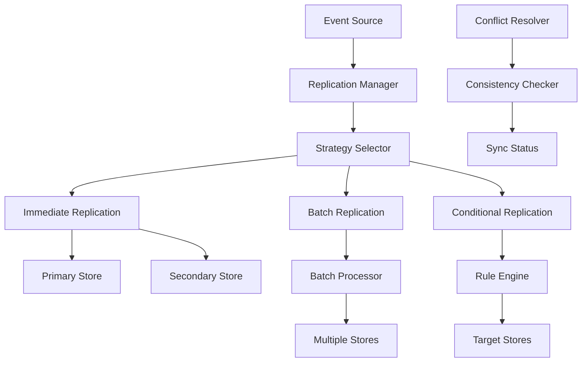

# 🔄 Stratégies Avancées de Réplication Multi-sources

## 🎯 **Objectif du Chapitre**

Ce chapitre explore les **stratégies avancées de réplication** pour les systèmes multi-sources, couvrant les patterns sophistiqués de synchronisation, de cohérence et d'optimisation des performances.

## 🌟 **Concepts Clés**

### **Réplication Avancée**

La réplication avancée va au-delà de la simple duplication de données :
- **Réplication intelligente** : Sélection dynamique des sources
- **Synchronisation bidirectionnelle** : Mise à jour dans les deux sens
- **Réplication conditionnelle** : Basée sur des critères métier
- **Optimisation des performances** : Réplication asynchrone et parallèle

### **Architecture de Réplication Avancée**



## 🏗️ **Patterns de Réplication**

### **1. Réplication en Cascade**

Les données sont répliquées de manière séquentielle :

```php
<?php

namespace Gyroscops\Cloud\Infrastructure\Replication;

class CascadeReplicationStrategy implements ReplicationStrategyInterface
{
    private array $storeChain;
    private int $maxRetries;

    public function replicate(EventStream $stream): void
    {
        $currentStream = $stream;
        
        foreach ($this->storeChain as $store) {
            try {
                $store->append($currentStream);
                $currentStream = $this->transformStream($currentStream, $store);
            } catch (Exception $e) {
                $this->handleReplicationFailure($store, $e);
                break; // Arrêter la cascade en cas d'échec
            }
        }
    }

    private function transformStream(EventStream $stream, EventStoreInterface $store): EventStream
    {
        // Transformation des événements selon le type de store
        $transformedEvents = [];
        
        foreach ($stream->getEvents() as $event) {
            $transformedEvents[] = $this->transformEvent($event, $store);
        }
        
        return new EventStream($transformedEvents);
    }
}
```

### **2. Réplication en Étoile**

Toutes les sources sont mises à jour simultanément :

```php
<?php

namespace Gyroscops\Cloud\Infrastructure\Replication;

class StarReplicationStrategy implements ReplicationStrategyInterface
{
    private array $stores;
    private ReplicationCoordinator $coordinator;

    public function replicate(EventStream $stream): void
    {
        $replicationTasks = [];
        
        foreach ($this->stores as $storeId => $store) {
            $replicationTasks[] = $this->createReplicationTask($store, $stream);
        }
        
        $this->coordinator->executeParallel($replicationTasks);
    }

    private function createReplicationTask(EventStoreInterface $store, EventStream $stream): ReplicationTask
    {
        return new ReplicationTask(function() use ($store, $stream) {
            try {
                $store->append($stream);
                return ReplicationResult::success();
            } catch (Exception $e) {
                return ReplicationResult::failure($e);
            }
        });
    }
}
```

### **3. Réplication Conditionnelle**

La réplication dépend de critères métier :

```php
<?php

namespace Gyroscops\Cloud\Infrastructure\Replication;

class ConditionalReplicationStrategy implements ReplicationStrategyInterface
{
    private array $replicationRules;
    private RuleEngine $ruleEngine;

    public function replicate(EventStream $stream): void
    {
        foreach ($stream->getEvents() as $event) {
            $targetStores = $this->ruleEngine->evaluate($event, $this->replicationRules);
            
            foreach ($targetStores as $store) {
                $this->replicateToStore($store, $event);
            }
        }
    }

    private function replicateToStore(EventStoreInterface $store, DomainEvent $event): void
    {
        try {
            $store->append(new EventStream([$event]));
        } catch (Exception $e) {
            $this->handleReplicationError($store, $event, $e);
        }
    }
}
```

## 🔄 **Stratégies de Cohérence**

### **1. Cohérence Éventuelle avec Compensation**

```php
<?php

namespace Gyroscops\Cloud\Infrastructure\Consistency;

class EventualConsistencyWithCompensation implements ConsistencyStrategyInterface
{
    private ConsistencyChecker $checker;
    private CompensationManager $compensation;

    public function ensureConsistency(array $stores): void
    {
        $inconsistencies = $this->checker->detectInconsistencies($stores);
        
        foreach ($inconsistencies as $inconsistency) {
            $this->compensation->applyCompensation($inconsistency);
        }
    }
}
```

### **2. Cohérence Forte avec Quorum**

```php
<?php

namespace Gyroscops\Cloud\Infrastructure\Consistency;

class StrongConsistencyWithQuorum implements ConsistencyStrategyInterface
{
    private int $quorumSize;
    private array $stores;

    public function write(EventStream $stream): void
    {
        $successCount = 0;
        $errors = [];
        
        foreach ($this->stores as $store) {
            try {
                $store->append($stream);
                $successCount++;
            } catch (Exception $e) {
                $errors[] = $e;
            }
        }
        
        if ($successCount < $this->quorumSize) {
            throw new QuorumNotReachedException($errors);
        }
    }
}
```

## ⚡ **Optimisations de Performance**

### **1. Réplication Asynchrone avec Queue**

```php
<?php

namespace Gyroscops\Cloud\Infrastructure\Replication;

class AsyncReplicationWithQueue implements ReplicationStrategyInterface
{
    private MessageQueue $queue;
    private ReplicationWorker $worker;

    public function replicate(EventStream $stream): void
    {
        // Écriture immédiate dans la source principale
        $this->primaryStore->append($stream);
        
        // Mise en queue pour réplication asynchrone
        $this->queue->publish(new ReplicationMessage($stream));
    }

    public function processReplicationQueue(): void
    {
        while ($message = $this->queue->consume()) {
            $this->worker->process($message);
        }
    }
}
```

### **2. Réplication par Batch**

```php
<?php

namespace Gyroscops\Cloud\Infrastructure\Replication;

class BatchReplicationStrategy implements ReplicationStrategyInterface
{
    private BatchProcessor $batchProcessor;
    private int $batchSize;
    private int $batchTimeout;

    public function replicate(EventStream $stream): void
    {
        $this->batchProcessor->addToBatch($stream);
        
        if ($this->shouldProcessBatch()) {
            $this->processBatch();
        }
    }

    private function shouldProcessBatch(): bool
    {
        return $this->batchProcessor->getBatchSize() >= $this->batchSize ||
               $this->batchProcessor->getBatchAge() >= $this->batchTimeout;
    }
}
```

## 🔍 **Monitoring et Observabilité**

### **1. Métriques de Réplication**

```php
<?php

namespace Gyroscops\Cloud\Infrastructure\Monitoring;

class ReplicationMetrics
{
    private MetricsCollector $collector;

    public function recordReplicationLatency(string $storeId, float $latency): void
    {
        $this->collector->histogram('replication.latency', $latency, [
            'store' => $storeId
        ]);
    }

    public function recordReplicationSuccess(string $storeId): void
    {
        $this->collector->increment('replication.success', [
            'store' => $storeId
        ]);
    }

    public function recordReplicationFailure(string $storeId, string $error): void
    {
        $this->collector->increment('replication.failure', [
            'store' => $storeId,
            'error' => $error
        ]);
    }
}
```

### **2. Health Checks**

```php
<?php

namespace Gyroscops\Cloud\Infrastructure\Health;

class ReplicationHealthCheck implements HealthCheckInterface
{
    private array $stores;
    private ConsistencyChecker $checker;

    public function check(): HealthStatus
    {
        $status = new HealthStatus();
        
        foreach ($this->stores as $storeId => $store) {
            try {
                $this->checkStoreHealth($store);
                $status->addStoreStatus($storeId, 'healthy');
            } catch (Exception $e) {
                $status->addStoreStatus($storeId, 'unhealthy', $e->getMessage());
            }
        }
        
        return $status;
    }
}
```

## 🎯 **Patterns Avancés**

### **1. Réplication Géographique**

```php
<?php

namespace Gyroscops\Cloud\Infrastructure\Replication;

class GeographicReplicationStrategy implements ReplicationStrategyInterface
{
    private array $regions;
    private LatencyOptimizer $optimizer;

    public function replicate(EventStream $stream): void
    {
        $userRegion = $this->getUserRegion();
        $targetRegions = $this->optimizer->selectOptimalRegions($userRegion);
        
        foreach ($targetRegions as $region) {
            $this->replicateToRegion($region, $stream);
        }
    }
}
```

### **2. Réplication Adaptative**

```php
<?php

namespace Gyroscops\Cloud\Infrastructure\Replication;

class AdaptiveReplicationStrategy implements ReplicationStrategyInterface
{
    private PerformanceMonitor $monitor;
    private StrategySelector $selector;

    public function replicate(EventStream $stream): void
    {
        $currentPerformance = $this->monitor->getCurrentPerformance();
        $strategy = $this->selector->selectStrategy($currentPerformance);
        
        $strategy->replicate($stream);
    }
}
```

## 🚀 **Cas d'Usage Avancés**

### **Systèmes Multi-région**

- **Latence optimisée** : Réplication basée sur la proximité géographique
- **Disaster recovery** : Réplication cross-region pour la continuité
- **Compliance** : Respect des réglementations par région

### **Systèmes de Trading**

- **Latence ultra-faible** : Réplication immédiate pour les données critiques
- **Cohérence forte** : Garantie de cohérence pour les transactions financières
- **Audit trail** : Traçabilité complète des modifications

## 📊 **Métriques et KPIs**

### **Métriques de Performance**

- **Latence de réplication** : Temps moyen de réplication
- **Throughput** : Nombre d'événements répliqués par seconde
- **Taux de succès** : Pourcentage de réplications réussies
- **Délai de synchronisation** : Temps de convergence entre stores

### **Métriques de Qualité**

- **Cohérence** : Pourcentage de données cohérentes
- **Intégrité** : Absence de corruption des données
- **Disponibilité** : Temps de fonctionnement des stores
- **Récupération** : Temps de récupération après panne

## 🎯 **Prochaines Étapes**

Après avoir maîtrisé les stratégies avancées de réplication, vous pouvez :

- **Explorer la résolution de conflits** dans les environnements multi-sources
- **Découvrir les techniques de monitoring** et d'observabilité avancées
- **Apprendre les patterns de migration** et de maintenance
- **Implémenter des solutions de disaster recovery** sophistiquées

---


  {{< chapter-option 
    letter="A" 
    color="green" 
    title="Je veux comprendre la résolution de conflits" 
    subtitle="Vous voulez maîtriser les techniques de résolution de conflits dans un environnement multi-sources"
    criteria="Résolution de conflits,Cohérence des données,Architecture distribuée,Intégrité des données"
    time="30-45 minutes"
    chapter="57"
    chapter-title="Résolution de Conflits Multi-sources"
    chapter-url="/chapitres/stockage/multi-sources/chapitre-57-stockage-multi-sources-resolution-conflits/"
  >}}
  
  
  
  
  
  

