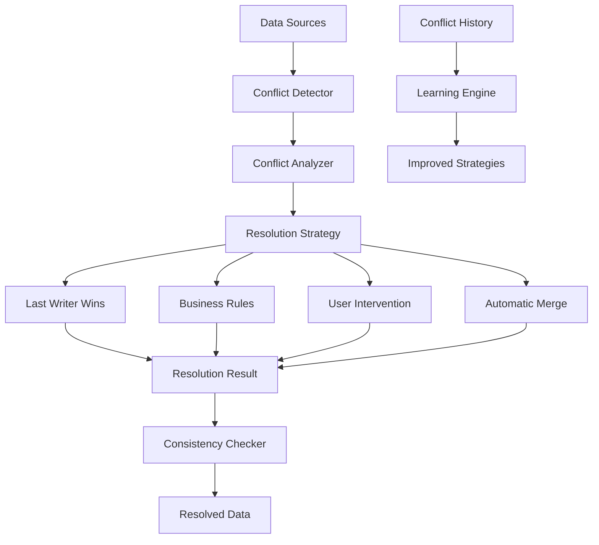

# ⚖️ Résolution de Conflits Multi-sources

## 🎯 **Objectif du Chapitre**

Ce chapitre explore les **techniques avancées de résolution de conflits** dans les environnements multi-sources, couvrant les patterns de détection, de résolution et de prévention des conflits de données.

## 🌟 **Concepts Clés**

### **Conflits Multi-sources**

Les conflits surviennent quand plusieurs sources de données divergent :
- **Conflits de données** : Valeurs différentes pour la même entité
- **Conflits temporels** : Modifications simultanées
- **Conflits de structure** : Schémas incompatibles
- **Conflits de cohérence** : Violations des contraintes métier

### **Architecture de Résolution de Conflits**



## 🔍 **Types de Conflits**

### **1. Conflits de Valeur**

Différences dans les valeurs des attributs :

```php
<?php

namespace Gyroscops\Cloud\Domain\Conflict;

class ValueConflict
{
    private string $entityId;
    private string $attribute;
    private array $conflictingValues;
    private array $sources;

    public function __construct(
        string $entityId,
        string $attribute,
        array $conflictingValues,
        array $sources
    ) {
        $this->entityId = $entityId;
        $this->attribute = $attribute;
        $this->conflictingValues = $conflictingValues;
        $this->sources = $sources;
    }

    public function getSeverity(): ConflictSeverity
    {
        return $this->analyzeSeverity();
    }

    private function analyzeSeverity(): ConflictSeverity
    {
        // Analyse de la gravité du conflit
        $valueTypes = array_map('gettype', $this->conflictingValues);
        
        if (count(array_unique($valueTypes)) > 1) {
            return ConflictSeverity::CRITICAL; // Types incompatibles
        }
        
        if ($this->isNumericConflict()) {
            return ConflictSeverity::MEDIUM; // Conflit numérique
        }
        
        return ConflictSeverity::LOW; // Conflit de texte
    }
}
```

### **2. Conflits Temporels**

Modifications simultanées :

```php
<?php

namespace Gyroscops\Cloud\Domain\Conflict;

class TemporalConflict
{
    private string $entityId;
    private array $modifications;
    private array $timestamps;

    public function __construct(
        string $entityId,
        array $modifications,
        array $timestamps
    ) {
        $this->entityId = $entityId;
        $this->modifications = $modifications;
        $this->timestamps = $timestamps;
    }

    public function getTimeDelta(): int
    {
        $maxTime = max($this->timestamps);
        $minTime = min($this->timestamps);
        
        return $maxTime - $minTime;
    }

    public function isSimultaneous(): bool
    {
        return $this->getTimeDelta() < 1000; // Moins d'1 seconde
    }
}
```

### **3. Conflits de Structure**

Schémas incompatibles :

```php
<?php

namespace Gyroscops\Cloud\Domain\Conflict;

class StructuralConflict
{
    private string $entityType;
    private array $schemaDifferences;
    private array $sources;

    public function __construct(
        string $entityType,
        array $schemaDifferences,
        array $sources
    ) {
        $this->entityType = $entityType;
        $this->schemaDifferences = $schemaDifferences;
        $this->sources = $sources;
    }

    public function getCompatibilityLevel(): CompatibilityLevel
    {
        $compatibilityScore = $this->calculateCompatibilityScore();
        
        if ($compatibilityScore >= 0.9) {
            return CompatibilityLevel::HIGH;
        } elseif ($compatibilityScore >= 0.7) {
            return CompatibilityLevel::MEDIUM;
        } else {
            return CompatibilityLevel::LOW;
        }
    }
}
```

## ⚖️ **Stratégies de Résolution**

### **1. Last Writer Wins (LWW)**

```php
<?php

namespace Gyroscops\Cloud\Infrastructure\ConflictResolution;

class LastWriterWinsStrategy implements ConflictResolutionStrategyInterface
{
    public function resolve(Conflict $conflict): ResolutionResult
    {
        $latestModification = $this->findLatestModification($conflict);
        
        return new ResolutionResult(
            $latestModification->getValue(),
            $latestModification->getSource(),
            ResolutionMethod::LAST_WRITER_WINS
        );
    }

    private function findLatestModification(Conflict $conflict): Modification
    {
        $modifications = $conflict->getModifications();
        
        usort($modifications, function($a, $b) {
            return $b->getTimestamp() <=> $a->getTimestamp();
        });
        
        return $modifications[0];
    }
}
```

### **2. Business Rules Resolution**

```php
<?php

namespace Gyroscops\Cloud\Infrastructure\ConflictResolution;

class BusinessRulesStrategy implements ConflictResolutionStrategyInterface
{
    private BusinessRuleEngine $ruleEngine;
    private array $rules;

    public function resolve(Conflict $conflict): ResolutionResult
    {
        $applicableRules = $this->findApplicableRules($conflict);
        
        foreach ($applicableRules as $rule) {
            $result = $this->ruleEngine->evaluate($rule, $conflict);
            
            if ($result->isResolved()) {
                return $result;
            }
        }
        
        throw new UnresolvableConflictException($conflict);
    }

    private function findApplicableRules(Conflict $conflict): array
    {
        return array_filter($this->rules, function($rule) use ($conflict) {
            return $rule->isApplicableTo($conflict);
        });
    }
}
```

### **3. User Intervention Strategy**

```php
<?php

namespace Gyroscops\Cloud\Infrastructure\ConflictResolution;

class UserInterventionStrategy implements ConflictResolutionStrategyInterface
{
    private ConflictNotificationService $notificationService;
    private UserDecisionRepository $decisionRepository;

    public function resolve(Conflict $conflict): ResolutionResult
    {
        // Notifier l'utilisateur du conflit
        $notification = $this->createConflictNotification($conflict);
        $this->notificationService->send($notification);
        
        // Attendre la décision de l'utilisateur
        $userDecision = $this->waitForUserDecision($conflict);
        
        return $this->applyUserDecision($conflict, $userDecision);
    }

    private function createConflictNotification(Conflict $conflict): ConflictNotification
    {
        return new ConflictNotification(
            $conflict->getId(),
            $conflict->getDescription(),
            $conflict->getOptions(),
            $conflict->getDeadline()
        );
    }
}
```

### **4. Automatic Merge Strategy**

```php
<?php

namespace Gyroscops\Cloud\Infrastructure\ConflictResolution;

class AutomaticMergeStrategy implements ConflictResolutionStrategyInterface
{
    private MergeAlgorithm $mergeAlgorithm;
    private ConflictAnalyzer $analyzer;

    public function resolve(Conflict $conflict): ResolutionResult
    {
        $mergeStrategy = $this->selectMergeStrategy($conflict);
        $mergedValue = $this->mergeAlgorithm->merge($conflict, $mergeStrategy);
        
        return new ResolutionResult(
            $mergedValue,
            'automatic_merge',
            ResolutionMethod::AUTOMATIC_MERGE
        );
    }

    private function selectMergeStrategy(Conflict $conflict): MergeStrategy
    {
        $conflictType = $this->analyzer->analyzeConflictType($conflict);
        
        switch ($conflictType) {
            case ConflictType::TEXT:
                return new TextMergeStrategy();
            case ConflictType::NUMERIC:
                return new NumericMergeStrategy();
            case ConflictType::ARRAY:
                return new ArrayMergeStrategy();
            default:
                return new DefaultMergeStrategy();
        }
    }
}
```

## 🔄 **Patterns de Résolution Avancés**

### **1. Conflict-Free Replicated Data Types (CRDTs)**

```php
<?php

namespace Gyroscops\Cloud\Infrastructure\CRDT;

class CRDTConflictResolver implements ConflictResolutionStrategyInterface
{
    private CRDTRegistry $crdtRegistry;

    public function resolve(Conflict $conflict): ResolutionResult
    {
        $crdtType = $this->crdtRegistry->getCRDTType($conflict->getEntityType());
        $crdt = $this->createCRDT($crdtType, $conflict);
        
        $mergedValue = $crdt->merge($conflict->getValues());
        
        return new ResolutionResult(
            $mergedValue,
            'crdt_merge',
            ResolutionMethod::CRDT_MERGE
        );
    }

    private function createCRDT(string $crdtType, Conflict $conflict): CRDTInterface
    {
        switch ($crdtType) {
            case 'counter':
                return new CounterCRDT($conflict->getValues());
            case 'set':
                return new SetCRDT($conflict->getValues());
            case 'map':
                return new MapCRDT($conflict->getValues());
            default:
                throw new UnsupportedCRDTException($crdtType);
        }
    }
}
```

### **2. Operational Transformation**

```php
<?php

namespace Gyroscops\Cloud\Infrastructure\OperationalTransformation;

class OperationalTransformationResolver implements ConflictResolutionStrategyInterface
{
    private OperationTransformer $transformer;
    private OperationHistory $history;

    public function resolve(Conflict $conflict): ResolutionResult
    {
        $operations = $conflict->getOperations();
        $transformedOperations = $this->transformer->transform($operations);
        
        $result = $this->applyTransformedOperations($transformedOperations);
        
        return new ResolutionResult(
            $result,
            'operational_transformation',
            ResolutionMethod::OPERATIONAL_TRANSFORMATION
        );
    }

    private function applyTransformedOperations(array $operations): mixed
    {
        $state = $this->getInitialState();
        
        foreach ($operations as $operation) {
            $state = $operation->apply($state);
        }
        
        return $state;
    }
}
```

## 🛡️ **Prévention des Conflits**

### **1. Optimistic Locking**

```php
<?php

namespace Gyroscops\Cloud\Infrastructure\Locking;

class OptimisticLockingManager
{
    private VersionRepository $versionRepository;

    public function acquireLock(string $entityId, int $expectedVersion): Lock
    {
        $currentVersion = $this->versionRepository->getVersion($entityId);
        
        if ($currentVersion !== $expectedVersion) {
            throw new OptimisticLockException($entityId, $expectedVersion, $currentVersion);
        }
        
        return new Lock($entityId, $expectedVersion);
    }

    public function releaseLock(Lock $lock): void
    {
        $this->versionRepository->incrementVersion($lock->getEntityId());
    }
}
```

### **2. Pessimistic Locking**

```php
<?php

namespace Gyroscops\Cloud\Infrastructure\Locking;

class PessimisticLockingManager
{
    private LockRepository $lockRepository;
    private int $lockTimeout;

    public function acquireLock(string $entityId, string $clientId): Lock
    {
        $existingLock = $this->lockRepository->findByEntityId($entityId);
        
        if ($existingLock && !$this->isLockExpired($existingLock)) {
            throw new EntityLockedException($entityId, $existingLock->getClientId());
        }
        
        $lock = new Lock($entityId, $clientId, time() + $this->lockTimeout);
        $this->lockRepository->save($lock);
        
        return $lock;
    }

    private function isLockExpired(Lock $lock): bool
    {
        return $lock->getExpiresAt() < time();
    }
}
```

## 📊 **Monitoring des Conflits**

### **1. Conflict Metrics**

```php
<?php

namespace Gyroscops\Cloud\Infrastructure\Monitoring;

class ConflictMetrics
{
    private MetricsCollector $collector;

    public function recordConflict(Conflict $conflict): void
    {
        $this->collector->increment('conflicts.total', [
            'type' => $conflict->getType(),
            'severity' => $conflict->getSeverity(),
            'entity_type' => $conflict->getEntityType()
        ]);
    }

    public function recordResolution(ResolutionResult $result): void
    {
        $this->collector->increment('conflicts.resolved', [
            'method' => $result->getMethod(),
            'success' => $result->isSuccessful()
        ]);
    }

    public function recordResolutionTime(string $conflictId, float $time): void
    {
        $this->collector->histogram('conflicts.resolution_time', $time, [
            'conflict_id' => $conflictId
        ]);
    }
}
```

### **2. Conflict Dashboard**

```php
<?php

namespace Gyroscops\Cloud\Infrastructure\Dashboard;

class ConflictDashboard
{
    private ConflictRepository $conflictRepository;
    private ConflictMetrics $metrics;

    public function getConflictSummary(): ConflictSummary
    {
        return new ConflictSummary(
            $this->conflictRepository->getActiveConflicts(),
            $this->conflictRepository->getResolvedConflicts(),
            $this->metrics->getConflictRate(),
            $this->metrics->getResolutionTime()
        );
    }

    public function getConflictTrends(): ConflictTrends
    {
        return new ConflictTrends(
            $this->conflictRepository->getConflictsByTimeRange('24h'),
            $this->conflictRepository->getConflictsByType(),
            $this->conflictRepository->getConflictsBySeverity()
        );
    }
}
```

## 🎯 **Cas d'Usage Spécifiques**

### **Systèmes de Collaboration**

- **Édition simultanée** : Résolution des conflits d'édition
- **Commentaires** : Fusion des commentaires multiples
- **Permissions** : Gestion des conflits d'autorisation

### **Systèmes Financiers**

- **Transactions concurrentes** : Résolution des conflits de transaction
- **Audit trail** : Traçabilité des résolutions
- **Compliance** : Respect des réglementations

### **Systèmes IoT**

- **Données capteurs** : Fusion des données de capteurs multiples
- **États distribués** : Synchronisation des états
- **Tolérance aux pannes** : Récupération après panne

## 📈 **Métriques et KPIs**

### **Métriques de Conflits**

- **Taux de conflits** : Nombre de conflits par unité de temps
- **Temps de résolution** : Temps moyen de résolution
- **Taux de résolution automatique** : Pourcentage de conflits résolus automatiquement
- **Satisfaction utilisateur** : Qualité des résolutions

### **Métriques de Performance**

- **Latence de détection** : Temps de détection des conflits
- **Throughput de résolution** : Nombre de conflits résolus par seconde
- **Précision** : Pourcentage de résolutions correctes
- **Disponibilité** : Temps de fonctionnement sans conflits non résolus

## 🎯 **Prochaines Étapes**

Après avoir maîtrisé la résolution de conflits multi-sources, vous pouvez :

- **Explorer les techniques de monitoring** et d'observabilité avancées
- **Découvrir les patterns de migration** et de maintenance
- **Apprendre les techniques de disaster recovery** sophistiquées
- **Implémenter des solutions de haute disponibilité** distribuées

---


  
  
  
  
  
  
  

