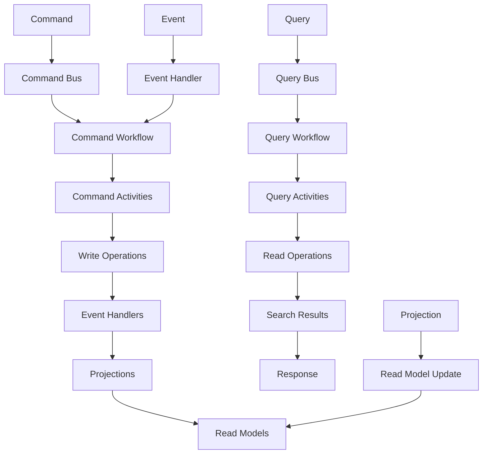

# 🚀 Stockage Temporal - CQRS

## 🎯 **Contexte et Objectifs**

### **L'Architecture Maximale : CQRS avec Temporal**

Nous arrivons maintenant à l'approche la plus sophistiquée pour Temporal : **CQRS complet**. Cette combinaison offre une architecture hautement scalable et flexible, parfaite pour les systèmes nécessitant orchestration maximale et séparation claire des responsabilités.

#### **Pourquoi CQRS avec Temporal ?**
- **Séparation totale** : Commandes et requêtes complètement découplées
- **Scalabilité maximale** : Possibilité de scaler indépendamment chaque côté
- **Performance optimale** : Chaque côté optimisé pour son usage
- **Flexibilité** : Projections multiples pour différents besoins
- **Résilience** : Workflows robustes avec reprise automatique

### **Contexte Gyroscops**

Dans notre écosystème **User → Organization → Workflow → Cloud Resources → Billing**, CQRS avec Temporal est la solution ultime pour :
- **Workflows de commande** : Orchestration des processus de modification avec projections
- **Workflows de requête** : Optimisation des lectures avec analytics avancées
- **Processus de facturation** : Séparation complète des écritures et lectures de facturation
- **Intégrations complexes** : Orchestration des intégrations avec projections multiples

## 🏗️ **Architecture CQRS avec Temporal**

### **Séparation Complète des Responsabilités**

#### **Command Side (Write)**
- **Command Workflows** : Orchestration des processus de modification
- **Command Activities** : Exécution des activités de modification
- **Event Handlers** : Gestion des événements de domaine
- **Command Bus** : Orchestration des commandes
- **Projections** : Mise à jour des vues matérialisées

#### **Query Side (Read)**
- **Query Workflows** : Orchestration des processus de lecture
- **Query Activities** : Exécution des activités de lecture
- **Search Services** : Services de recherche spécialisés
- **Query Bus** : Orchestration des requêtes
- **Caches** : Optimisation des performances

### **Flux de Données Complet**



## 💻 **Implémentation Complète**

### **1. Command Side Implementation**

#### **Command Bus avec Middleware**

```php
<?php

namespace App\Application\CommandBus\Temporal;

use App\Domain\Command\CommandInterface;
use App\Domain\Command\CommandHandlerInterface;
use Temporal\Client\WorkflowClientInterface;
use Psr\Log\LoggerInterface;

class TemporalCommandBus
{
    private array $handlers = [];
    private array $middleware = [];
    private WorkflowClientInterface $workflowClient;
    private LoggerInterface $logger;

    public function __construct(
        WorkflowClientInterface $workflowClient,
        LoggerInterface $logger
    ) {
        $this->workflowClient = $workflowClient;
        $this->logger = $logger;
    }

    public function registerHandler(string $commandClass, CommandHandlerInterface $handler): void
    {
        $this->handlers[$commandClass] = $handler;
    }

    public function addMiddleware(callable $middleware): void
    {
        $this->middleware[] = $middleware;
    }

    public function handle(CommandInterface $command): void
    {
        $commandClass = get_class($command);
        
        if (!isset($this->handlers[$commandClass])) {
            throw new \InvalidArgumentException("No handler registered for command: $commandClass");
        }

        $handler = $this->handlers[$commandClass];
        
        // Exécuter les middleware
        $this->executeMiddleware($command, function() use ($handler, $command) {
            $this->logger->info('Executing command via Temporal', [
                'command' => get_class($command),
                'data' => $command->toArray()
            ]);
            
            $handler->handle($command);
        });
    }

    private function executeMiddleware(CommandInterface $command, callable $next): void
    {
        $middleware = array_reverse($this->middleware);
        
        foreach ($middleware as $mw) {
            $next = function() use ($mw, $command, $next) {
                return $mw($command, $next);
            };
        }
        
        $next();
    }
}
```

#### **Command Workflow Avancé**

```php
<?php

namespace App\Workflow\Command\Payment;

use Temporal\Workflow\WorkflowInterface;
use Temporal\Workflow\WorkflowMethod;
use Temporal\Workflow\ActivityInterface;
use Temporal\Workflow\ActivityMethod;
use Temporal\Workflow\Workflow;

#[WorkflowInterface]
interface PaymentCommandWorkflowInterface
{
    #[WorkflowMethod]
    public function processPaymentCommand(PaymentCommandRequest $request): PaymentCommandResult;
    
    #[WorkflowMethod]
    public function updatePaymentCommand(PaymentUpdateCommandRequest $request): PaymentCommandResult;
    
    #[WorkflowMethod]
    public function deletePaymentCommand(PaymentDeleteCommandRequest $request): PaymentCommandResult;
}

#[ActivityInterface]
interface PaymentCommandActivityInterface
{
    #[ActivityMethod]
    public function validatePaymentCommand(PaymentCommandRequest $request): ValidationResult;
    
    #[ActivityMethod]
    public function executePaymentCommand(PaymentCommandRequest $request): CommandExecutionResult;
    
    #[ActivityMethod]
    public function updateProjections(PaymentEvent $event): void;
}

class PaymentCommandWorkflow implements PaymentCommandWorkflowInterface
{
    private PaymentCommandActivityInterface $commandActivity;

    public function __construct()
    {
        $this->commandActivity = Workflow::newActivityStub(PaymentCommandActivityInterface::class);
    }

    public function processPaymentCommand(PaymentCommandRequest $request): PaymentCommandResult
    {
        try {
            // Validation de la commande
            $validation = yield $this->commandActivity->validatePaymentCommand($request);
            
            if (!$validation->isValid()) {
                return new PaymentCommandResult(false, $validation->getError());
            }
            
            // Exécution de la commande
            $execution = yield $this->commandActivity->executePaymentCommand($request);
            
            if (!$execution->isSuccess()) {
                return new PaymentCommandResult(false, $execution->getError());
            }
            
            // Mise à jour des projections
            $event = new PaymentProcessedEvent(
                $request->getPaymentId(),
                $request->getAmount(),
                $request->getCurrency(),
                $request->getOrganizationId()
            );
            
            yield $this->commandActivity->updateProjections($event);
            
            return new PaymentCommandResult(true, 'Payment command processed successfully');
            
        } catch (\Exception $e) {
            return new PaymentCommandResult(false, $e->getMessage());
        }
    }

    public function updatePaymentCommand(PaymentUpdateCommandRequest $request): PaymentCommandResult
    {
        try {
            // Validation de la commande de mise à jour
            $validation = yield $this->commandActivity->validatePaymentCommand($request);
            
            if (!$validation->isValid()) {
                return new PaymentCommandResult(false, $validation->getError());
            }
            
            // Exécution de la mise à jour
            $execution = yield $this->commandActivity->executePaymentCommand($request);
            
            if (!$execution->isSuccess()) {
                return new PaymentCommandResult(false, $execution->getError());
            }
            
            // Mise à jour des projections
            $event = new PaymentUpdatedEvent(
                $request->getPaymentId(),
                $request->getUpdates(),
                $request->getOrganizationId()
            );
            
            yield $this->commandActivity->updateProjections($event);
            
            return new PaymentCommandResult(true, 'Payment update command processed successfully');
            
        } catch (\Exception $e) {
            return new PaymentCommandResult(false, $e->getMessage());
        }
    }

    public function deletePaymentCommand(PaymentDeleteCommandRequest $request): PaymentCommandResult
    {
        try {
            // Validation de la commande de suppression
            $validation = yield $this->commandActivity->validatePaymentCommand($request);
            
            if (!$validation->isValid()) {
                return new PaymentCommandResult(false, $validation->getError());
            }
            
            // Exécution de la suppression
            $execution = yield $this->commandActivity->executePaymentCommand($request);
            
            if (!$execution->isSuccess()) {
                return new PaymentCommandResult(false, $execution->getError());
            }
            
            // Mise à jour des projections
            $event = new PaymentDeletedEvent(
                $request->getPaymentId(),
                $request->getOrganizationId()
            );
            
            yield $this->commandActivity->updateProjections($event);
            
            return new PaymentCommandResult(true, 'Payment delete command processed successfully');
            
        } catch (\Exception $e) {
            return new PaymentCommandResult(false, $e->getMessage());
        }
    }
}
```

### **2. Query Side Implementation**

#### **Query Bus avec Cache**

```php
<?php

namespace App\Application\QueryBus\Temporal;

use App\Domain\Query\QueryInterface;
use App\Domain\Query\QueryHandlerInterface;
use Temporal\Client\WorkflowClientInterface;
use Psr\Cache\CacheItemPoolInterface;
use Psr\Log\LoggerInterface;

class TemporalQueryBus
{
    private array $handlers = [];
    private WorkflowClientInterface $workflowClient;
    private CacheItemPoolInterface $cache;
    private LoggerInterface $logger;

    public function __construct(
        WorkflowClientInterface $workflowClient,
        CacheItemPoolInterface $cache,
        LoggerInterface $logger
    ) {
        $this->workflowClient = $workflowClient;
        $this->cache = $cache;
        $this->logger = $logger;
    }

    public function registerHandler(string $queryClass, QueryHandlerInterface $handler): void
    {
        $this->handlers[$queryClass] = $handler;
    }

    public function handle(QueryInterface $query): mixed
    {
        $queryClass = get_class($query);
        
        if (!isset($this->handlers[$queryClass])) {
            throw new \InvalidArgumentException("No handler registered for query: $queryClass");
        }

        // Vérifier le cache
        $cacheKey = $this->generateCacheKey($query);
        $cachedItem = $this->cache->getItem($cacheKey);
        
        if ($cachedItem->isHit()) {
            $this->logger->debug('Query result served from cache', [
                'query' => $queryClass,
                'cacheKey' => $cacheKey
            ]);
            
            return $cachedItem->get();
        }

        // Exécuter la requête via Temporal
        $handler = $this->handlers[$queryClass];
        $result = $handler->handle($query);
        
        // Mettre en cache
        $cachedItem->set($result);
        $cachedItem->expiresAfter(300); // 5 minutes
        $this->cache->save($cachedItem);
        
        $this->logger->info('Query executed and cached via Temporal', [
            'query' => $queryClass,
            'cacheKey' => $cacheKey
        ]);
        
        return $result;
    }

    private function generateCacheKey(QueryInterface $query): string
    {
        return 'temporal_query_' . md5(serialize($query));
    }
}
```

#### **Query Workflow Avancé**

```php
<?php

namespace App\Workflow\Query\Payment;

use Temporal\Workflow\WorkflowInterface;
use Temporal\Workflow\WorkflowMethod;
use Temporal\Workflow\ActivityInterface;
use Temporal\Workflow\ActivityMethod;
use Temporal\Workflow\Workflow;

#[WorkflowInterface]
interface PaymentQueryWorkflowInterface
{
    #[WorkflowMethod]
    public function searchPayments(PaymentSearchQuery $query): PaymentSearchResult;
    
    #[WorkflowMethod]
    public function getPaymentById(PaymentByIdQuery $query): ?Payment;
    
    #[WorkflowMethod]
    public function getPaymentStatistics(PaymentStatisticsQuery $query): array;
    
    #[WorkflowMethod]
    public function getPaymentAnalytics(PaymentAnalyticsQuery $query): array;
}

#[ActivityInterface]
interface PaymentQueryActivityInterface
{
    #[ActivityMethod]
    public function searchPaymentsInReadModel(PaymentSearchQuery $query): array;
    
    #[ActivityMethod]
    public function getPaymentFromReadModel(string $paymentId): ?Payment;
    
    #[ActivityMethod]
    public function calculatePaymentStatistics(PaymentStatisticsQuery $query): array;
    
    #[ActivityMethod]
    public function generatePaymentAnalytics(PaymentAnalyticsQuery $query): array;
}

class PaymentQueryWorkflow implements PaymentQueryWorkflowInterface
{
    private PaymentQueryActivityInterface $queryActivity;

    public function __construct()
    {
        $this->queryActivity = Workflow::newActivityStub(PaymentQueryActivityInterface::class);
    }

    public function searchPayments(PaymentSearchQuery $query): PaymentSearchResult
    {
        try {
            // Recherche dans le Read Model
            $payments = yield $this->queryActivity->searchPaymentsInReadModel($query);
            
            // Filtrage et tri
            $filteredPayments = $this->filterPayments($payments, $query);
            $sortedPayments = $this->sortPayments($filteredPayments, $query);
            
            // Pagination
            $paginatedPayments = $this->paginatePayments($sortedPayments, $query);
            
            return new PaymentSearchResult(
                $paginatedPayments,
                count($filteredPayments),
                $query->getPage(),
                $query->getSize()
            );
            
        } catch (\Exception $e) {
            return new PaymentSearchResult([], 0, $query->getPage(), $query->getSize());
        }
    }

    public function getPaymentById(PaymentByIdQuery $query): ?Payment
    {
        try {
            return yield $this->queryActivity->getPaymentFromReadModel($query->getPaymentId());
        } catch (\Exception $e) {
            return null;
        }
    }

    public function getPaymentStatistics(PaymentStatisticsQuery $query): array
    {
        try {
            return yield $this->queryActivity->calculatePaymentStatistics($query);
        } catch (\Exception $e) {
            return [];
        }
    }

    public function getPaymentAnalytics(PaymentAnalyticsQuery $query): array
    {
        try {
            return yield $this->queryActivity->generatePaymentAnalytics($query);
        } catch (\Exception $e) {
            return [];
        }
    }

    private function filterPayments(array $payments, PaymentSearchQuery $query): array
    {
        return array_filter($payments, function($payment) use ($query) {
            if ($query->getOrganizationId() && $payment->getOrganizationId() !== $query->getOrganizationId()) {
                return false;
            }
            
            if ($query->getStatus() && $payment->getStatus() !== $query->getStatus()) {
                return false;
            }
            
            if ($query->getMinAmount() && $payment->getAmount() < $query->getMinAmount()) {
                return false;
            }
            
            if ($query->getMaxAmount() && $payment->getAmount() > $query->getMaxAmount()) {
                return false;
            }
            
            return true;
        });
    }

    private function sortPayments(array $payments, PaymentSearchQuery $query): array
    {
        $sortField = $query->getSortField() ?? 'createdAt';
        $sortDirection = $query->getSortDirection() ?? 'desc';
        
        usort($payments, function($a, $b) use ($sortField, $sortDirection) {
            $valueA = $this->getFieldValue($a, $sortField);
            $valueB = $this->getFieldValue($b, $sortField);
            
            if ($sortDirection === 'asc') {
                return $valueA <=> $valueB;
            } else {
                return $valueB <=> $valueA;
            }
        });
        
        return $payments;
    }

    private function paginatePayments(array $payments, PaymentSearchQuery $query): array
    {
        $page = $query->getPage() ?? 1;
        $size = $query->getSize() ?? 10;
        $offset = ($page - 1) * $size;
        
        return array_slice($payments, $offset, $size);
    }

    private function getFieldValue(Payment $payment, string $field): mixed
    {
        switch ($field) {
            case 'amount':
                return $payment->getAmount();
            case 'createdAt':
                return $payment->getCreatedAt();
            case 'status':
                return $payment->getStatus();
            default:
                return $payment->getCreatedAt();
        }
    }
}
```

### **3. Service de Projection**

#### **Service de Projection pour les Read Models**

```php
<?php

namespace App\Application\Service\Temporal;

use App\Domain\Event\DomainEvent;
use App\Infrastructure\Temporal\TemporalClientFactory;
use Psr\Log\LoggerInterface;

class PaymentProjectionService
{
    private TemporalClientFactory $temporalFactory;
    private LoggerInterface $logger;

    public function __construct(
        TemporalClientFactory $temporalFactory,
        LoggerInterface $logger
    ) {
        $this->temporalFactory = $temporalFactory;
        $this->logger = $logger;
    }

    public function handleEvent(DomainEvent $event): void
    {
        try {
            $workflowOptions = $this->temporalFactory->createWorkflowOptions()
                ->withWorkflowId('projection-' . $event->getEventType() . '-' . uniqid());
            
            $workflow = $this->temporalFactory->createClient()
                ->newWorkflowStub(PaymentProjectionWorkflowInterface::class, $workflowOptions);
            
            $workflow->updateProjection($event);
            
            $this->logger->info('Projection updated via Temporal', [
                'eventType' => $event->getEventType(),
                'eventId' => $event->getId()
            ]);
            
        } catch (\Exception $e) {
            $this->logger->error('Failed to update projection via Temporal', [
                'eventType' => $event->getEventType(),
                'error' => $e->getMessage()
            ]);
            
            throw $e;
        }
    }

    public function rebuildProjection(string $projectionType): void
    {
        try {
            $workflowOptions = $this->temporalFactory->createWorkflowOptions()
                ->withWorkflowId('rebuild-projection-' . $projectionType . '-' . uniqid());
            
            $workflow = $this->temporalFactory->createClient()
                ->newWorkflowStub(PaymentProjectionWorkflowInterface::class, $workflowOptions);
            
            $workflow->rebuildProjection($projectionType);
            
            $this->logger->info('Projection rebuilt via Temporal', [
                'projectionType' => $projectionType
            ]);
            
        } catch (\Exception $e) {
            $this->logger->error('Failed to rebuild projection via Temporal', [
                'projectionType' => $projectionType,
                'error' => $e->getMessage()
            ]);
            
            throw $e;
        }
    }
}
```

## 🧪 **Tests et Validation**

### **Tests d'Intégration CQRS**

```php
<?php

namespace App\Tests\Integration\Temporal;

use App\Workflow\Command\Payment\PaymentCommandRequest;
use App\Workflow\Query\Payment\PaymentSearchQuery;
use App\Application\CommandBus\Temporal\TemporalCommandBus;
use App\Application\QueryBus\Temporal\TemporalQueryBus;
use App\Infrastructure\Temporal\TemporalClientFactory;

class TemporalPaymentCqrsTest extends TestCase
{
    private TemporalCommandBus $commandBus;
    private TemporalQueryBus $queryBus;
    private TemporalClientFactory $temporalFactory;

    protected function setUp(): void
    {
        $this->temporalFactory = new TemporalClientFactory('localhost', 7233, 'test');
        $this->commandBus = new TemporalCommandBus(
            $this->temporalFactory->createClient(),
            $this->createMock(LoggerInterface::class)
        );
        $this->queryBus = new TemporalQueryBus(
            $this->temporalFactory->createClient(),
            $this->createMock(CacheItemPoolInterface::class),
            $this->createMock(LoggerInterface::class)
        );
    }

    public function testCqrsSeparation(): void
    {
        // Exécuter une commande
        $command = new PaymentCommandRequest(
            'CREATE',
            'payment-123',
            'org-456',
            'user-789',
            100.00,
            'EUR',
            'Test payment'
        );
        
        $this->commandBus->handle($command);
        
        // Vérifier avec une requête
        $query = new PaymentSearchQuery('org-456', 0, 10);
        $result = $this->queryBus->handle($query);
        
        $this->assertGreaterThan(0, $result->getTotal());
    }

    public function testQueryCaching(): void
    {
        $query = new PaymentSearchQuery('org-456', 0, 10);
        
        // Première recherche
        $result1 = $this->queryBus->handle($query);
        
        // Deuxième recherche (devrait utiliser le cache)
        $result2 = $this->queryBus->handle($query);
        
        $this->assertEquals($result1->getTotal(), $result2->getTotal());
    }
}
```

## 📊 **Performance et Optimisation**

### **Stratégies d'Optimisation CQRS**

#### **1. Cache Multi-Niveaux**
```php
public function searchPaymentsWithCache(PaymentSearchQuery $query): PaymentSearchResult
{
    // Cache L1: Mémoire
    if (isset($this->memoryCache[$query->getCacheKey()])) {
        return $this->memoryCache[$query->getCacheKey()];
    }
    
    // Cache L2: Redis
    if ($cached = $this->redis->get("payment_search:{$query->getCacheKey()}")) {
        $result = PaymentSearchResult::fromArray(json_decode($cached, true));
        $this->memoryCache[$query->getCacheKey()] = $result;
        return $result;
    }
    
    // Temporal
    $result = $this->searchPayments($query);
    
    // Mettre en cache
    $this->memoryCache[$query->getCacheKey()] = $result;
    $this->redis->setex("payment_search:{$query->getCacheKey()}", 300, json_encode($result->toArray()));
    
    return $result;
}
```

#### **2. Projections Asynchrones**
```php
public function handleEventAsync(DomainEvent $event): void
{
    // Mettre en queue pour traitement asynchrone
    $this->messageBus->dispatch(new ProcessProjectionCommand($event));
}
```

#### **3. Monitoring des Workflows**
```php
public function getWorkflowMetrics(): array
{
    return [
        'commandWorkflows' => $this->getCommandWorkflowMetrics(),
        'queryWorkflows' => $this->getQueryWorkflowMetrics(),
        'projections' => $this->getProjectionMetrics(),
        'cacheHitRate' => $this->getCacheHitRate(),
        'averageExecutionTime' => $this->getAverageExecutionTime()
    ];
}
```

## 🎯 **Critères d'Adoption**

### **Quand Utiliser CQRS avec Temporal**

#### **✅ Avantages**
- **Scalabilité maximale** : Possibilité de scaler indépendamment
- **Performance optimale** : Chaque côté optimisé pour son usage
- **Flexibilité maximale** : Projections multiples pour différents besoins
- **Résilience** : Workflows robustes avec reprise automatique
- **Maintenabilité** : Code plus clair et organisé

#### **❌ Inconvénients**
- **Complexité maximale** : Architecture très complexe
- **Infrastructure** : Nécessite un serveur Temporal
- **Latence** : Overhead pour les opérations simples
- **Expertise** : Équipe très expérimentée requise
- **Coût** : Infrastructure très coûteuse

#### **🎯 Critères d'Adoption**
- **Système très complexe** : Besoins de scalabilité maximale
- **Processus métier complexes** : Workflows qui nécessitent de l'orchestration
- **Performance critique** : Besoins de performance maximale
- **Projections multiples** : Besoin de vues différentes des données
- **Équipe très expérimentée** : Maîtrise de Temporal et CQRS
- **Budget important** : Investissement en complexité justifié
- **Infrastructure disponible** : Serveur Temporal opérationnel

## 🚀 **Votre Prochaine Étape**


  
  
  
  
  
  
  


---

*CQRS avec Temporal représente l'état de l'art en matière d'architecture scalable pour l'orchestration, parfaitement adapté aux besoins les plus exigeants de Gyroscops.*
