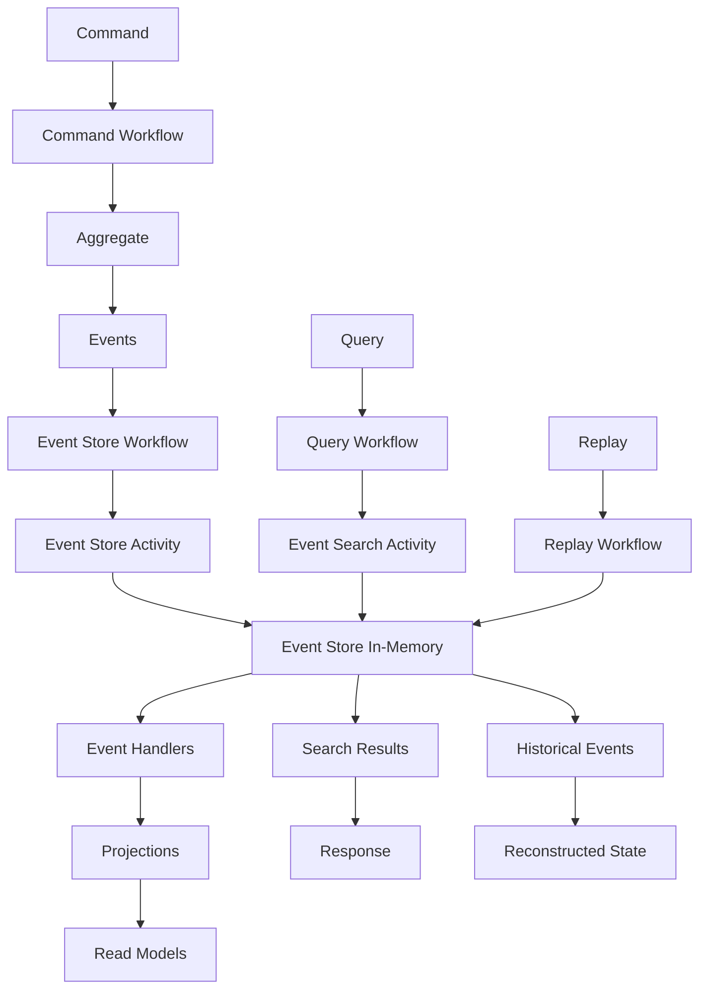

# 📚 Stockage Temporal - Event Sourcing

## 🎯 **Contexte et Objectifs**

### **Pourquoi Event Sourcing avec Temporal ?**

L'Event Sourcing avec Temporal offre une approche unique qui combine l'audit trail complet de l'Event Sourcing avec l'orchestration et la résilience des workflows. Cette combinaison est particulièrement puissante pour les processus métier complexes qui nécessitent une traçabilité complète.

#### **Avantages de cette Combinaison**
- **Audit trail complet** : Historique immuable de tous les événements
- **Orchestration robuste** : Gestion complexe des processus métier
- **Résilience** : Reprise automatique après panne
- **Observabilité** : Visibilité complète sur l'exécution
- **Flexibilité** : Projections multiples pour différents besoins

### **Contexte Gyroscops**

Dans notre écosystème **User → Organization → Workflow → Cloud Resources → Billing**, Event Sourcing avec Temporal est particulièrement pertinent pour :
- **Workflows de provisioning** : Orchestration des ressources cloud avec audit trail
- **Processus de facturation** : Gestion des cycles de facturation avec historique complet
- **Intégrations complexes** : Orchestration des intégrations API avec traçabilité
- **Processus métier longs** : Workflows qui s'étalent sur plusieurs jours avec audit

## 🏗️ **Architecture Event Sourcing avec Temporal**

### **Structure des Workflows**

#### **Event Store Temporal**
```php
<?php

namespace App\Infrastructure\EventStore\Temporal;

use App\Domain\Event\DomainEvent;
use App\Domain\Event\EventStoreInterface;
use Temporal\Client\WorkflowClientInterface;
use Temporal\Workflow\WorkflowInterface;
use Temporal\Workflow\WorkflowMethod;
use Temporal\Workflow\ActivityInterface;
use Temporal\Workflow\ActivityMethod;
use Temporal\Workflow\Workflow;
use Psr\Log\LoggerInterface;

#[WorkflowInterface]
interface EventStoreWorkflowInterface
{
    #[WorkflowMethod]
    public function appendEvents(string $aggregateId, array $events, int $expectedVersion): void;
    
    #[WorkflowMethod]
    public function getEvents(string $aggregateId, int $fromVersion = 0): array;
    
    #[WorkflowMethod]
    public function getEventsByType(string $eventType, \DateTime $from = null, \DateTime $to = null): array;
}

#[ActivityInterface]
interface EventStoreActivityInterface
{
    #[ActivityMethod]
    public function persistEvents(string $aggregateId, array $events, int $expectedVersion): void;
    
    #[ActivityMethod]
    public function loadEvents(string $aggregateId, int $fromVersion = 0): array;
    
    #[ActivityMethod]
    public function searchEventsByType(string $eventType, \DateTime $from = null, \DateTime $to = null): array;
}

class EventStoreWorkflow implements EventStoreWorkflowInterface
{
    private EventStoreActivityInterface $eventStoreActivity;

    public function __construct()
    {
        $this->eventStoreActivity = Workflow::newActivityStub(EventStoreActivityInterface::class);
    }

    public function appendEvents(string $aggregateId, array $events, int $expectedVersion): void
    {
        try {
            // Persister les événements
            yield $this->eventStoreActivity->persistEvents($aggregateId, $events, $expectedVersion);
            
            // Publier les événements pour les projections
            foreach ($events as $event) {
                yield $this->eventStoreActivity->publishEvent($event);
            }
            
        } catch (\Exception $e) {
            // En cas d'erreur, le workflow peut être rejoué
            throw $e;
        }
    }

    public function getEvents(string $aggregateId, int $fromVersion = 0): array
    {
        return yield $this->eventStoreActivity->loadEvents($aggregateId, $fromVersion);
    }

    public function getEventsByType(string $eventType, \DateTime $from = null, \DateTime $to = null): array
    {
        return yield $this->eventStoreActivity->searchEventsByType($eventType, $from, $to);
    }
}
```

#### **Event Store Activities**
```php
<?php

namespace App\Infrastructure\EventStore\Temporal;

use Temporal\Activity\ActivityInterface;
use Temporal\Activity\ActivityMethod;
use App\Domain\Event\DomainEvent;
use App\Infrastructure\EventStore\InMemoryEventStore;
use Psr\Log\LoggerInterface;

class EventStoreActivity implements EventStoreActivityInterface
{
    private InMemoryEventStore $eventStore;
    private LoggerInterface $logger;

    public function __construct(
        InMemoryEventStore $eventStore,
        LoggerInterface $logger
    ) {
        $this->eventStore = $eventStore;
        $this->logger = $logger;
    }

    #[ActivityMethod]
    public function persistEvents(string $aggregateId, array $events, int $expectedVersion): void
    {
        try {
            $this->logger->info('Persisting events via Temporal', [
                'aggregateId' => $aggregateId,
                'events' => count($events),
                'expectedVersion' => $expectedVersion
            ]);
            
            $this->eventStore->appendEvents($aggregateId, $events, $expectedVersion);
            
            $this->logger->info('Events persisted successfully', [
                'aggregateId' => $aggregateId,
                'events' => count($events)
            ]);
            
        } catch (\Exception $e) {
            $this->logger->error('Failed to persist events', [
                'aggregateId' => $aggregateId,
                'events' => count($events),
                'error' => $e->getMessage()
            ]);
            
            throw $e;
        }
    }

    #[ActivityMethod]
    public function loadEvents(string $aggregateId, int $fromVersion = 0): array
    {
        try {
            $this->logger->info('Loading events via Temporal', [
                'aggregateId' => $aggregateId,
                'fromVersion' => $fromVersion
            ]);
            
            $events = $this->eventStore->getEvents($aggregateId, $fromVersion);
            
            $this->logger->info('Events loaded successfully', [
                'aggregateId' => $aggregateId,
                'events' => count($events)
            ]);
            
            return $events;
            
        } catch (\Exception $e) {
            $this->logger->error('Failed to load events', [
                'aggregateId' => $aggregateId,
                'error' => $e->getMessage()
            ]);
            
            throw $e;
        }
    }

    #[ActivityMethod]
    public function searchEventsByType(string $eventType, \DateTime $from = null, \DateTime $to = null): array
    {
        try {
            $this->logger->info('Searching events by type via Temporal', [
                'eventType' => $eventType,
                'from' => $from?->format('c'),
                'to' => $to?->format('c')
            ]);
            
            $events = $this->eventStore->getEventsByType($eventType, $from, $to);
            
            $this->logger->info('Events found by type', [
                'eventType' => $eventType,
                'events' => count($events)
            ]);
            
            return $events;
            
        } catch (\Exception $e) {
            $this->logger->error('Failed to search events by type', [
                'eventType' => $eventType,
                'error' => $e->getMessage()
            ]);
            
            throw $e;
        }
    }

    #[ActivityMethod]
    public function publishEvent(DomainEvent $event): void
    {
        try {
            $this->logger->info('Publishing event via Temporal', [
                'eventType' => $event->getEventType(),
                'eventId' => $event->getId()
            ]);
            
            // Publier l'événement (ex: via Event Bus)
            $this->eventBus->publish($event);
            
        } catch (\Exception $e) {
            $this->logger->error('Failed to publish event', [
                'eventType' => $event->getEventType(),
                'error' => $e->getMessage()
            ]);
            
            throw $e;
        }
    }
}
```

### **Flux de Données**



## 💻 **Implémentation Pratique**

### **1. Command Handler avec Event Sourcing**

#### **Command Handler pour les Paiements**

```php
<?php

namespace App\Workflow\Command\Payment;

use Temporal\Workflow\WorkflowInterface;
use Temporal\Workflow\WorkflowMethod;
use Temporal\Workflow\ActivityInterface;
use Temporal\Workflow\ActivityMethod;
use Temporal\Workflow\Workflow;
use App\Domain\Payment\PaymentAggregate;
use App\Infrastructure\EventStore\Temporal\EventStoreWorkflowInterface;

#[WorkflowInterface]
interface PaymentEventSourcingWorkflowInterface
{
    #[WorkflowMethod]
    public function processPaymentWithEventSourcing(PaymentCommandRequest $request): PaymentCommandResult;
}

#[ActivityInterface]
interface PaymentEventSourcingActivityInterface
{
    #[ActivityMethod]
    public function loadPaymentAggregate(string $paymentId): ?PaymentAggregate;
    
    #[ActivityMethod]
    public function savePaymentAggregate(PaymentAggregate $payment): void;
    
    #[ActivityMethod]
    public function publishPaymentEvents(array $events): void;
}

class PaymentEventSourcingWorkflow implements PaymentEventSourcingWorkflowInterface
{
    private PaymentEventSourcingActivityInterface $paymentActivity;
    private EventStoreWorkflowInterface $eventStoreWorkflow;

    public function __construct()
    {
        $this->paymentActivity = Workflow::newActivityStub(PaymentEventSourcingActivityInterface::class);
        $this->eventStoreWorkflow = Workflow::newWorkflowStub(EventStoreWorkflowInterface::class);
    }

    public function processPaymentWithEventSourcing(PaymentCommandRequest $request): PaymentCommandResult
    {
        try {
            // Charger l'agrégat depuis les événements
            $events = yield $this->eventStoreWorkflow->getEvents($request->getPaymentId());
            $payment = PaymentAggregate::fromEvents($events);
            
            if (!$payment) {
                // Créer un nouvel agrégat
                $payment = new PaymentAggregate($request->getPaymentId());
            }
            
            // Exécuter la commande
            $payment->processPayment($request->getAmount(), $request->getCurrency());
            
            // Sauvegarder les événements
            $uncommittedEvents = $payment->getUncommittedEvents();
            yield $this->eventStoreWorkflow->appendEvents(
                $request->getPaymentId(),
                $uncommittedEvents,
                $payment->getVersion()
            );
            
            // Publier les événements
            yield $this->paymentActivity->publishPaymentEvents($uncommittedEvents);
            
            // Nettoyer les événements non commités
            $payment->markEventsAsCommitted();
            
            return new PaymentCommandResult(true, 'Payment processed with event sourcing');
            
        } catch (\Exception $e) {
            return new PaymentCommandResult(false, $e->getMessage());
        }
    }
}
```

#### **Payment Event Sourcing Activities**

```php
<?php

namespace App\Workflow\Command\Payment;

use Temporal\Activity\ActivityInterface;
use Temporal\Activity\ActivityMethod;
use App\Domain\Payment\PaymentAggregate;
use App\Domain\Event\DomainEvent;
use App\Infrastructure\EventStore\Temporal\EventStoreWorkflowInterface;
use Psr\Log\LoggerInterface;

class PaymentEventSourcingActivity implements PaymentEventSourcingActivityInterface
{
    private EventStoreWorkflowInterface $eventStoreWorkflow;
    private LoggerInterface $logger;

    public function __construct(
        EventStoreWorkflowInterface $eventStoreWorkflow,
        LoggerInterface $logger
    ) {
        $this->eventStoreWorkflow = $eventStoreWorkflow;
        $this->logger = $logger;
    }

    #[ActivityMethod]
    public function loadPaymentAggregate(string $paymentId): ?PaymentAggregate
    {
        try {
            $this->logger->info('Loading payment aggregate via Temporal', [
                'paymentId' => $paymentId
            ]);
            
            $events = yield $this->eventStoreWorkflow->getEvents($paymentId);
            
            if (empty($events)) {
                return null;
            }
            
            $payment = PaymentAggregate::fromEvents($events);
            
            $this->logger->info('Payment aggregate loaded successfully', [
                'paymentId' => $paymentId,
                'events' => count($events)
            ]);
            
            return $payment;
            
        } catch (\Exception $e) {
            $this->logger->error('Failed to load payment aggregate', [
                'paymentId' => $paymentId,
                'error' => $e->getMessage()
            ]);
            
            throw $e;
        }
    }

    #[ActivityMethod]
    public function savePaymentAggregate(PaymentAggregate $payment): void
    {
        try {
            $this->logger->info('Saving payment aggregate via Temporal', [
                'paymentId' => $payment->getId(),
                'version' => $payment->getVersion()
            ]);
            
            $uncommittedEvents = $payment->getUncommittedEvents();
            
            if (!empty($uncommittedEvents)) {
                yield $this->eventStoreWorkflow->appendEvents(
                    $payment->getId(),
                    $uncommittedEvents,
                    $payment->getVersion()
                );
            }
            
            $this->logger->info('Payment aggregate saved successfully', [
                'paymentId' => $payment->getId(),
                'events' => count($uncommittedEvents)
            ]);
            
        } catch (\Exception $e) {
            $this->logger->error('Failed to save payment aggregate', [
                'paymentId' => $payment->getId(),
                'error' => $e->getMessage()
            ]);
            
            throw $e;
        }
    }

    #[ActivityMethod]
    public function publishPaymentEvents(array $events): void
    {
        try {
            $this->logger->info('Publishing payment events via Temporal', [
                'events' => count($events)
            ]);
            
            foreach ($events as $event) {
                yield $this->eventStoreWorkflow->publishEvent($event);
            }
            
            $this->logger->info('Payment events published successfully', [
                'events' => count($events)
            ]);
            
        } catch (\Exception $e) {
            $this->logger->error('Failed to publish payment events', [
                'events' => count($events),
                'error' => $e->getMessage()
            ]);
            
            throw $e;
        }
    }
}
```

### **2. Query Handler avec Recherche d'Événements**

#### **Query Handler pour l'Historique**

```php
<?php

namespace App\Workflow\Query\Payment;

use Temporal\Workflow\WorkflowInterface;
use Temporal\Workflow\WorkflowMethod;
use Temporal\Workflow\ActivityInterface;
use Temporal\Workflow\ActivityMethod;
use Temporal\Workflow\Workflow;
use App\Infrastructure\EventStore\Temporal\EventStoreWorkflowInterface;

#[WorkflowInterface]
interface PaymentHistoryQueryWorkflowInterface
{
    #[WorkflowMethod]
    public function getPaymentHistory(PaymentHistoryQuery $query): array;
    
    #[WorkflowMethod]
    public function searchPaymentEvents(PaymentEventSearchQuery $query): array;
    
    #[WorkflowMethod]
    public function getPaymentTimeline(PaymentTimelineQuery $query): array;
}

#[ActivityInterface]
interface PaymentHistoryQueryActivityInterface
{
    #[ActivityMethod]
    public function getEventsByAggregate(string $aggregateId): array;
    
    #[ActivityMethod]
    public function searchEventsByCriteria(array $criteria): array;
    
    #[ActivityMethod]
    public function getEventsByCorrelationId(string $correlationId): array;
}

class PaymentHistoryQueryWorkflow implements PaymentHistoryQueryWorkflowInterface
{
    private PaymentHistoryQueryActivityInterface $queryActivity;
    private EventStoreWorkflowInterface $eventStoreWorkflow;

    public function __construct()
    {
        $this->queryActivity = Workflow::newActivityStub(PaymentHistoryQueryActivityInterface::class);
        $this->eventStoreWorkflow = Workflow::newWorkflowStub(EventStoreWorkflowInterface::class);
    }

    public function getPaymentHistory(PaymentHistoryQuery $query): array
    {
        try {
            $events = yield $this->queryActivity->getEventsByAggregate($query->getPaymentId());
            
            $history = [];
            foreach ($events as $event) {
                $history[] = [
                    'eventId' => $event->getId(),
                    'eventType' => $event->getEventType(),
                    'timestamp' => $event->getTimestamp(),
                    'data' => $event->toArray(),
                    'metadata' => $event->getMetadata()
                ];
            }
            
            return $history;
            
        } catch (\Exception $e) {
            return [];
        }
    }

    public function searchPaymentEvents(PaymentEventSearchQuery $query): array
    {
        try {
            $criteria = [
                'aggregateType' => 'Payment'
            ];
            
            if ($query->getEventType()) {
                $criteria['eventType'] = $query->getEventType();
            }
            
            if ($query->getFrom() || $query->getTo()) {
                $criteria['timestamp'] = [];
                if ($query->getFrom()) {
                    $criteria['timestamp']['gte'] = $query->getFrom();
                }
                if ($query->getTo()) {
                    $criteria['timestamp']['lte'] = $query->getTo();
                }
            }
            
            $events = yield $this->queryActivity->searchEventsByCriteria($criteria);
            
            $results = [];
            foreach ($events as $event) {
                $results[] = [
                    'eventId' => $event->getId(),
                    'aggregateId' => $event->getAggregateId(),
                    'eventType' => $event->getEventType(),
                    'timestamp' => $event->getTimestamp(),
                    'data' => $event->toArray(),
                    'metadata' => $event->getMetadata()
                ];
            }
            
            return $results;
            
        } catch (\Exception $e) {
            return [];
        }
    }

    public function getPaymentTimeline(PaymentTimelineQuery $query): array
    {
        try {
            $events = yield $this->queryActivity->getEventsByCorrelationId($query->getCorrelationId());
            
            $timeline = [];
            foreach ($events as $event) {
                $timeline[] = [
                    'eventId' => $event->getId(),
                    'aggregateId' => $event->getAggregateId(),
                    'eventType' => $event->getEventType(),
                    'timestamp' => $event->getTimestamp(),
                    'data' => $event->toArray(),
                    'metadata' => $event->getMetadata()
                ];
            }
            
            return $timeline;
            
        } catch (\Exception $e) {
            return [];
        }
    }
}
```

### **3. Service d'Analytics Temporelles**

#### **Service d'Analytics des Événements**

```php
<?php

namespace App\Application\Service\Temporal;

use App\Infrastructure\EventStore\Temporal\EventStoreWorkflowInterface;
use Temporal\Client\WorkflowClientInterface;
use Psr\Log\LoggerInterface;

class EventAnalyticsService
{
    private WorkflowClientInterface $workflowClient;
    private LoggerInterface $logger;

    public function __construct(
        WorkflowClientInterface $workflowClient,
        LoggerInterface $logger
    ) {
        $this->workflowClient = $workflowClient;
        $this->logger = $logger;
    }

    public function getEventStatistics(string $eventType, \DateTime $from, \DateTime $to): array
    {
        try {
            $workflowOptions = $this->createAnalyticsWorkflowOptions();
            
            $workflow = $this->workflowClient->newWorkflowStub(
                EventAnalyticsWorkflowInterface::class,
                $workflowOptions
            );
            
            $statistics = $workflow->getEventStatistics($eventType, $from, $to);
            
            $this->logger->info('Event statistics retrieved via Temporal', [
                'eventType' => $eventType,
                'from' => $from->format('c'),
                'to' => $to->format('c')
            ]);
            
            return $statistics;
            
        } catch (\Exception $e) {
            $this->logger->error('Failed to get event statistics via Temporal', [
                'eventType' => $eventType,
                'error' => $e->getMessage()
            ]);
            
            throw $e;
        }
    }

    public function getEventTrends(string $eventType, \DateTime $from, \DateTime $to, string $interval = 'day'): array
    {
        try {
            $workflowOptions = $this->createAnalyticsWorkflowOptions();
            
            $workflow = $this->workflowClient->newWorkflowStub(
                EventAnalyticsWorkflowInterface::class,
                $workflowOptions
            );
            
            $trends = $workflow->getEventTrends($eventType, $from, $to, $interval);
            
            $this->logger->info('Event trends retrieved via Temporal', [
                'eventType' => $eventType,
                'interval' => $interval
            ]);
            
            return $trends;
            
        } catch (\Exception $e) {
            $this->logger->error('Failed to get event trends via Temporal', [
                'eventType' => $eventType,
                'error' => $e->getMessage()
            ]);
            
            throw $e;
        }
    }

    private function createAnalyticsWorkflowOptions(): WorkflowOptions
    {
        return WorkflowOptions::new()
            ->withWorkflowId('event-analytics-' . uniqid())
            ->withWorkflowExecutionTimeout(300)
            ->withWorkflowRunTimeout(300)
            ->withWorkflowTaskTimeout(60);
    }
}
```

## 🧪 **Tests et Validation**

### **Tests d'Intégration Event Sourcing**

```php
<?php

namespace App\Tests\Integration\Temporal;

use App\Workflow\Command\Payment\PaymentCommandRequest;
use App\Workflow\Query\Payment\PaymentHistoryQuery;
use App\Infrastructure\EventStore\Temporal\EventStoreWorkflowInterface;
use App\Infrastructure\Temporal\TemporalClientFactory;

class TemporalEventSourcingTest extends TestCase
{
    private EventStoreWorkflowInterface $eventStoreWorkflow;
    private TemporalClientFactory $temporalFactory;

    protected function setUp(): void
    {
        $this->temporalFactory = new TemporalClientFactory('localhost', 7233, 'test');
        $this->eventStoreWorkflow = $this->temporalFactory->createClient()
            ->newWorkflowStub(EventStoreWorkflowInterface::class);
    }

    public function testEventSourcingFlow(): void
    {
        // Exécuter une commande avec Event Sourcing
        $command = new PaymentCommandRequest(
            'CREATE',
            'payment-123',
            'org-456',
            'user-789',
            100.00,
            'EUR',
            'Test payment'
        );
        
        $workflow = $this->temporalFactory->createClient()
            ->newWorkflowStub(PaymentEventSourcingWorkflowInterface::class);
        
        $result = $workflow->processPaymentWithEventSourcing($command);
        
        $this->assertTrue($result->isSuccess());
        
        // Vérifier l'historique des événements
        $query = new PaymentHistoryQuery('payment-123');
        $history = $this->eventStoreWorkflow->getEvents('payment-123');
        
        $this->assertNotEmpty($history);
        $this->assertCount(1, $history);
        $this->assertEquals('PaymentProcessed', $history[0]->getEventType());
    }

    public function testEventSearch(): void
    {
        // Créer plusieurs événements
        $commands = [
            new PaymentCommandRequest('CREATE', 'payment-1', 'org-456', 'user-1', 100.00, 'EUR', 'Payment 1'),
            new PaymentCommandRequest('CREATE', 'payment-2', 'org-456', 'user-2', 200.00, 'USD', 'Payment 2'),
            new PaymentCommandRequest('CREATE', 'payment-3', 'org-789', 'user-3', 300.00, 'EUR', 'Payment 3')
        ];
        
        foreach ($commands as $command) {
            $workflow = $this->temporalFactory->createClient()
                ->newWorkflowStub(PaymentEventSourcingWorkflowInterface::class);
            $workflow->processPaymentWithEventSourcing($command);
        }
        
        // Rechercher les événements
        $events = $this->eventStoreWorkflow->getEventsByType(
            'PaymentProcessed',
            new \DateTime('2024-01-01'),
            new \DateTime('2024-12-31')
        );
        
        $this->assertCount(3, $events);
        $this->assertEquals('PaymentProcessed', $events[0]->getEventType());
    }
}
```

## 📊 **Performance et Optimisation**

### **Stratégies d'Optimisation Event Sourcing**

#### **1. Cache des Événements**
```php
public function getEventsWithCache(string $aggregateId, int $fromVersion = 0): array
{
    $cacheKey = "events_{$aggregateId}_{$fromVersion}";
    
    if ($cached = $this->cache->get($cacheKey)) {
        return $cached;
    }
    
    $events = $this->getEvents($aggregateId, $fromVersion);
    $this->cache->set($cacheKey, $events, 300);
    
    return $events;
}
```

#### **2. Projections Asynchrones**
```php
public function handleEventAsync(DomainEvent $event): void
{
    // Mettre en queue pour traitement asynchrone
    $this->messageBus->dispatch(new ProcessProjectionCommand($event));
}
```

#### **3. Monitoring des Workflows**
```php
public function getWorkflowMetrics(): array
{
    return [
        'eventStoreWorkflows' => $this->getEventStoreWorkflowMetrics(),
        'commandWorkflows' => $this->getCommandWorkflowMetrics(),
        'queryWorkflows' => $this->getQueryWorkflowMetrics(),
        'averageExecutionTime' => $this->getAverageExecutionTime()
    ];
}
```

## 🎯 **Critères d'Adoption**

### **Quand Utiliser Event Sourcing avec Temporal**

#### **✅ Avantages**
- **Audit trail complet** : Historique immuable de tous les événements
- **Orchestration robuste** : Gestion complexe des processus métier
- **Résilience** : Reprise automatique après panne
- **Observabilité** : Visibilité complète sur l'exécution
- **Flexibilité** : Projections multiples pour différents besoins

#### **❌ Inconvénients**
- **Complexité élevée** : Architecture très complexe
- **Infrastructure** : Nécessite un serveur Temporal
- **Latence** : Overhead pour les opérations simples
- **Expertise** : Équipe très expérimentée requise
- **Coût** : Infrastructure très coûteuse

#### **🎯 Critères d'Adoption**
- **Audit trail critique** : Besoin de traçabilité complète
- **Processus métier complexes** : Workflows qui nécessitent de l'orchestration
- **Résilience critique** : Besoin de reprise automatique après panne
- **Processus longs** : Workflows qui s'étalent sur plusieurs jours
- **Équipe très expérimentée** : Maîtrise de Temporal et Event Sourcing
- **Budget important** : Investissement en complexité justifié
- **Infrastructure disponible** : Serveur Temporal opérationnel

## 🚀 **Votre Prochaine Étape**


  
  
  
  
  
  
  


---

*Event Sourcing avec Temporal offre une approche unique pour l'audit trail et l'orchestration, parfaitement adaptée aux besoins de traçabilité de Gyroscops.*

