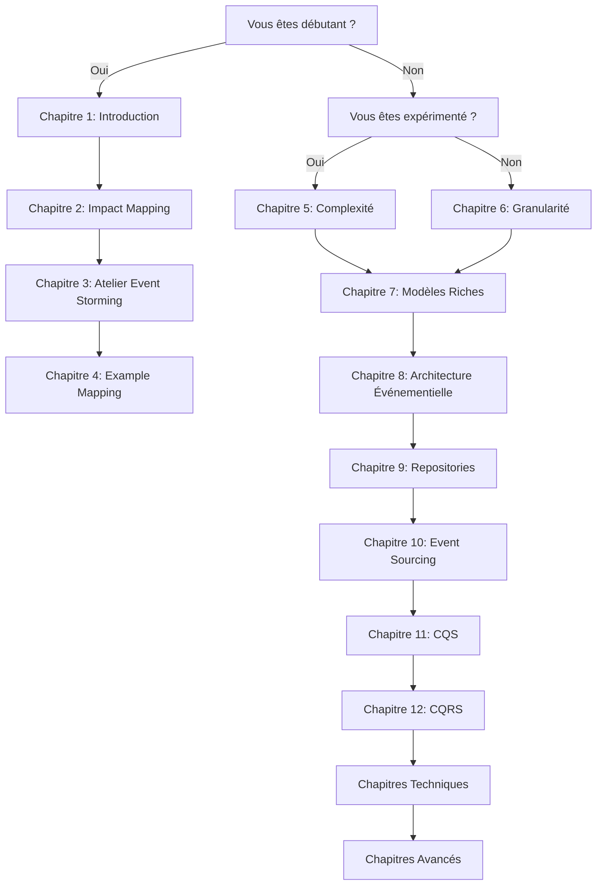
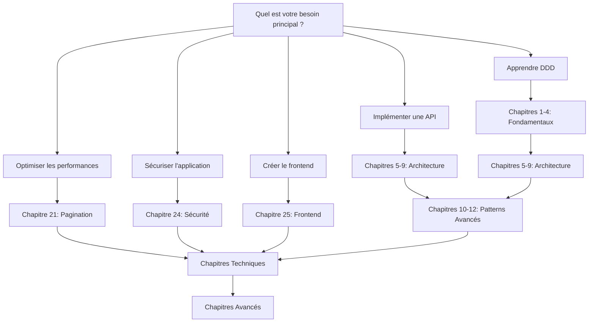
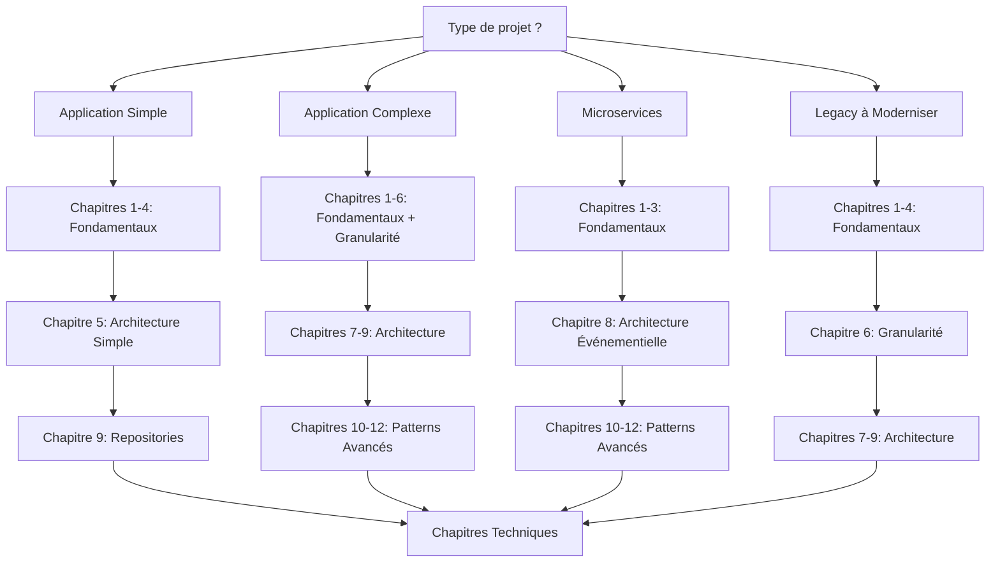

# Guide de Navigation "Livre dont vous êtes le héros"

## 🎮 Comment Naviguer dans ce Guide

Ce guide est conçu comme un **"livre dont vous êtes le héros"** où chaque chapitre vous propose des choix basés sur votre contexte, votre expérience et vos besoins. Vous n'êtes pas obligé de tout lire dans l'ordre !

### 🚀 Démarrage Rapide

**Si vous êtes pressé et voulez aller droit au but :**
1. Commencez par le [Chapitre 1 : Introduction Event Storming DDD](/chapitres/fondamentaux/chapitre-01-introduction-event-storming-ddd/)
2. Répondez aux questions de navigation à la fin de chaque chapitre
3. Suivez le parcours qui correspond à votre situation

**Si vous voulez tout comprendre dans l'ordre :**
1. Suivez les chapitres fondamentaux (1-9)
2. Puis les chapitres optionnels (10-12)
3. Enfin les chapitres techniques (20-23) et avancés (24-25)

## 🗺️ Cartes de Navigation

### Carte 1 : Parcours par Expérience

### Carte 2 : Parcours par Besoin

### Carte 3 : Parcours par Projet

## 🎯 Questions de Navigation

### Question 1 : Votre Niveau d'Expérience

**Quelle est votre expérience avec DDD et API Platform ?**

- **Débutant** : Je découvre DDD et API Platform
  - → Commencez par le [Chapitre 1](/chapitres/fondamentaux/chapitre-01-introduction-event-storming-ddd/)

- **Intermédiaire** : J'ai quelques notions mais je veux approfondir
  - → Commencez par le [Chapitre 2](/chapitres/fondamentaux/chapitre-02-impact-mapping/)

- **Expérimenté** : Je connais les concepts mais je veux optimiser
  - → Commencez par le [Chapitre 5](/chapitres/fondamentaux/chapitre-05-complexite-accidentelle-essentielle/)

- **Expert** : Je veux les patterns avancés
  - → Commencez par le [Chapitre 10](/chapitres/optionnels/chapitre-10-event-sourcing/)

### Question 2 : Votre Contexte Projet

**Dans quel contexte travaillez-vous ?**

- **Startup** : Équipe petite, développement rapide
  - → Parcours Simple : Chapitres 1-4, puis 5, puis 9

- **PME** : Équipe moyenne, besoins modérés
  - → Parcours Intermédiaire : Chapitres 1-6, puis 7-9, puis 10-12

- **Grande Entreprise** : Équipe importante, besoins complexes
  - → Parcours Avancé : Tous les chapitres dans l'ordre

- **Consultant** : Besoin de comprendre tous les aspects
  - → Parcours Complet : Tous les chapitres

### Question 3 : Votre Priorité

**Quelle est votre priorité principale ?**

- **Apprendre** : Comprendre les concepts
  - → Chapitres Fondamentaux (1-9)

- **Implémenter** : Mettre en pratique
  - → Chapitres Techniques (20-23)

- **Optimiser** : Améliorer l'existant
  - → Chapitres Avancés (24-25)

- **Architecturer** : Concevoir l'architecture
  - → Chapitres Optionnels (10-12)

### Question 4 : Votre Contrainte Temporelle

**Combien de temps avez-vous ?**

- **< 2 heures** : Parcours Express
  - → Chapitres 1, 2, 5, 9

- **2-4 heures** : Parcours Standard
  - → Chapitres 1-4, 5, 7, 9

- **4-8 heures** : Parcours Complet
  - → Chapitres 1-9, puis 20-23

- **> 8 heures** : Parcours Expert
  - → Tous les chapitres

## 🛤️ Parcours Recommandés

### Parcours Express (2 heures)
**Pour les développeurs pressés qui veulent l'essentiel**

1. [Chapitre 1](/chapitres/fondamentaux/chapitre-01-introduction-event-storming-ddd/) - Introduction (15 min)
2. [Chapitre 2](/chapitres/fondamentaux/chapitre-02-impact-mapping/) - Impact Mapping (15 min)
3. [Chapitre 5](/chapitres/fondamentaux/chapitre-05-complexite-accidentelle-essentielle/) - Complexité (20 min)
4. [Chapitre 7](/chapitres/fondamentaux/chapitre-07-modeles-riches-vs-anemiques/) - Modèles Riches (20 min)
5. [Chapitre 9](/chapitres/fondamentaux/chapitre-09-repositories-persistance/) - Repositories (20 min)
6. [Chapitre 20](/chapitres/techniques/chapitre-20-gestion-donnees-validation/) - Validation (20 min)
7. [Chapitre 24](/chapitres/avances/chapitre-24-securite-autorisation/) - Sécurité (20 min)

### Parcours Standard (4 heures)
**Pour les développeurs qui veulent une base solide**

1. **Fondamentaux** (2h) : Chapitres 1-4, 5, 7-9
2. **Techniques** (1h) : Chapitres 20-23
3. **Avancés** (1h) : Chapitres 24-25

### Parcours Complet (8 heures)
**Pour les architectes et développeurs expérimentés**

1. **Fondamentaux** (3h) : Chapitres 1-9
2. **Optionnels** (2h) : Chapitres 10-12
3. **Techniques** (2h) : Chapitres 20-23
4. **Avancés** (1h) : Chapitres 24-25

### Parcours Expert (12+ heures)
**Pour les experts qui veulent maîtriser tous les aspects**

1. **Fondamentaux** (4h) : Chapitres 1-9
2. **Optionnels** (3h) : Chapitres 10-12
3. **Stockage** (3h) : Chapitres 15-41
4. **Techniques** (2h) : Chapitres 20-23
5. **Avancés** (2h) : Chapitres 24-25

## 🎨 Personas et Parcours

### 👨‍💻 Développeur Junior
**"Je découvre DDD et API Platform"**

**Parcours recommandé :**
1. Chapitres 1-4 (Fondamentaux)
2. Chapitre 5 (Complexité)
3. Chapitre 7 (Modèles Riches)
4. Chapitre 9 (Repositories)
5. Chapitre 20 (Validation)

**Temps estimé :** 3-4 heures

### 👩‍💼 Product Owner
**"Je veux comprendre l'impact business"**

**Parcours recommandé :**
1. Chapitre 1 (Introduction)
2. Chapitre 2 (Impact Mapping)
3. Chapitre 3 (Atelier Event Storming)
4. Chapitre 4 (Example Mapping)
5. Chapitre 6 (Granularité)

**Temps estimé :** 2-3 heures

### 🏗️ Architecte
**"Je dois concevoir l'architecture"**

**Parcours recommandé :**
1. Chapitres 1-6 (Fondamentaux + Granularité)
2. Chapitres 7-9 (Architecture)
3. Chapitres 10-12 (Patterns Avancés)
4. Chapitres 20-23 (Techniques)
5. Chapitres 24-25 (Avancés)

**Temps estimé :** 6-8 heures

### 🔧 DevOps
**"Je dois déployer et maintenir"**

**Parcours recommandé :**
1. Chapitres 1-2 (Introduction)
2. Chapitre 5 (Complexité)
3. Chapitres 7-9 (Architecture)
4. Chapitre 21 (Pagination et Performance)
5. Chapitre 22 (Gestion d'Erreurs)
6. Chapitre 23 (Tests et Qualité)

**Temps estimé :** 4-5 heures

### 🎨 Développeur Frontend
**"Je dois intégrer le frontend"**

**Parcours recommandé :**
1. Chapitres 1-2 (Introduction)
2. Chapitre 5 (Complexité)
3. Chapitre 9 (Repositories)
4. Chapitre 20 (Validation)
5. Chapitre 24 (Sécurité)
6. Chapitre 25 (Frontend)

**Temps estimé :** 3-4 heures

## 🚦 Feux de Circulation

### 🟢 Vert : Continuez
- Vous comprenez le concept
- Vous avez les prérequis
- Vous voulez approfondir

### 🟡 Orange : Attention
- Le concept est complexe
- Vous avez besoin de prérequis
- Prenez votre temps

### 🔴 Rouge : Arrêtez-vous
- Le concept est trop avancé
- Vous avez besoin de bases
- Revenez en arrière

## 🔄 Navigation de Retour

**Si vous vous sentez perdu :**
1. Revenez au [Chapitre 1](/chapitres/fondamentaux/chapitre-01-introduction-event-storming-ddd/)
2. Utilisez ce guide de navigation
3. Choisissez un parcours plus simple

**Si vous voulez explorer :**
1. Suivez les liens "Alternative" dans chaque chapitre
2. Utilisez la table des matières
3. Explorez les chapitres optionnels

**Si vous voulez approfondir :**
1. Suivez les références aux ADR
2. Consultez les exemples de code
3. Explorez les diagrammes

## 📚 Ressources Complémentaires

### Documentation Officielle
- [API Platform](https://api-platform.com/)
- [Symfony](https://symfony.com/)
- [Domain-Driven Design](https://martinfowler.com/bliki/DomainDrivenDesign.html)

### Livres Recommandés
- "Domain-Driven Design" - Eric Evans
- "Implementing Domain-Driven Design" - Vaughn Vernon
- "Event Storming" - Alberto Brandolini

### Outils
- [Event Storming](https://www.eventstorming.com/)
- [Miro](https://miro.com/) - Pour les ateliers
- [Draw.io](https://draw.io/) - Pour les diagrammes

## 🎯 Objectifs de Navigation

1. **Efficacité** : Trouvez rapidement ce dont vous avez besoin
2. **Progression** : Suivez un parcours logique
3. **Flexibilité** : Adaptez le parcours à votre contexte
4. **Compréhension** : Assurez-vous de comprendre avant de continuer
5. **Pratique** : Mettez en pratique ce que vous apprenez

---

**💡 Conseil** : N'hésitez pas à revenir en arrière ou à explorer d'autres options. L'objectif est que vous compreniez et que vous puissiez appliquer les concepts dans votre contexte.

**🔄 Alternative** : Si vous préférez une approche linéaire, commencez par le [Chapitre 1](/chapitres/fondamentaux/chapitre-01-introduction-event-storming-ddd/) et suivez les chapitres dans l'ordre.
