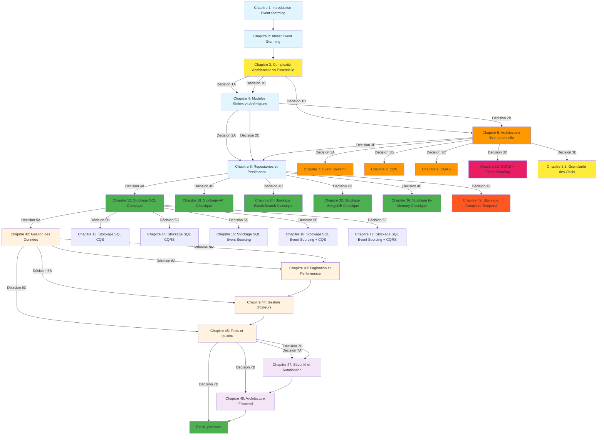

# 🎮 Navigation Interactive - Livre dont vous êtes le héros

Cette page vous permet de naviguer de manière interactive dans la documentation en fonction de votre contexte et de vos besoins.

## 🎯 Votre Contexte

### 🟢 Parcours Débutant
**Pour les équipes junior avec des applications simples**

**Chapitres** : 1-4 → 6 → 12 → 42-45

**Durée estimée** : 2-3 semaines

**Critères** :
- Équipe de 1-3 développeurs
- Application monolithique
- Peu d'intégrations externes
- Développement rapide requis

[**Commencer le Parcours Débutant**](/chapitres/fondamentaux/chapitre-01-introduction-event-storming-ddd/)

---

### 🟡 Parcours Standard
**Pour la plupart des applications métier**

**Chapitres** : 1-4 → 6 → 12/13/16 → 42-45

**Durée estimée** : 1-2 mois

**Critères** :
- Équipe de 3-8 développeurs
- Quelques intégrations externes
- Besoin de performance modérée
- Évolutivité importante

[**Commencer le Parcours Standard**](/chapitres/fondamentaux/chapitre-01-introduction-event-storming-ddd/)

---

### 🔴 Parcours Événementiel
**Pour les systèmes avec intégrations multiples**

**Chapitres** : 1-5 → 6 → 12/13/16 → 42-45

**Durée estimée** : 2-3 mois

**Critères** :
- Équipe de 3-8 développeurs
- Intégrations multiples
- Besoin de découplage
- Architecture distribuée

[**Commencer le Parcours Événementiel**](/chapitres/fondamentaux/chapitre-01-introduction-event-storming-ddd/)

---

### ⚡ Parcours CQRS
**Pour les applications avec CQRS**

**Chapitres** : 1-5 → 8 → 6 → 11/14/17 → 42-45

**Durée estimée** : 2-4 mois

**Critères** :
- Équipe de 4-8 développeurs
- Lectures/écritures très différentes
- Performance critique
- Équipe expérimentée

[**Commencer le Parcours CQRS**](/chapitres/fondamentaux/chapitre-01-introduction-event-storming-ddd/)

---

### 🚀 Parcours Event Sourcing
**Pour les applications avec Event Sourcing + CQRS**

**Chapitres** : 1-5 → 7 → 8 → 9 → 6 → 12/15/18 → 42-45

**Durée estimée** : 4-6 mois

**Critères** :
- Équipe de 8+ développeurs
- Audit trail critique
- Performance critique
- Équipe très expérimentée
- Budget et temps importants

[**Commencer le Parcours Event Sourcing**](/chapitres/fondamentaux/chapitre-01-introduction-event-storming-ddd/)

---

### 🌐 Parcours Distribué
**Pour les systèmes distribués complexes**

**Chapitres** : 1-5 → 7 → 8 → 9 → 6 → 12/15/18 → 19 → 42-45

**Durée estimée** : 6+ mois

**Critères** :
- Équipe de 10+ développeurs
- Systèmes distribués
- Transactions complexes
- Équipe très expérimentée
- Budget important

[**Commencer le Parcours Distribué**](/chapitres/fondamentaux/chapitre-01-introduction-event-storming-ddd/)

## 🗺️ Schéma de Navigation

## 🎯 Points de Décision Principaux

### Décision 1 : Après le Chapitre 3 (Complexité)
*"Maintenant que vous comprenez la différence entre complexité accidentelle et essentielle, quel est votre contexte ?"*

- **Option A** : Équipe junior, application simple → Chapitre 4
- **Option B** : Équipe expérimentée, intégrations multiples → Chapitre 5
- **Option C** : Voir des exemples concrets → Chapitre 4

### Décision 2 : Après le Chapitre 4 (Modèles)
*"Vous maîtrisez maintenant les modèles riches. Quel est votre niveau de complexité ?"*

- **Option A** : Application simple, équipe junior → Chapitre 6 (Parcours Classique)
- **Option B** : Système avec intégrations, besoin de découplage → Chapitre 5
- **Option C** : Voir les options de stockage → Chapitre 6

### Décision 3 : Après le Chapitre 5 (Architecture Événementielle)
*"Vous avez choisi l'architecture événementielle. Quel est votre niveau de complexité et vos besoins ?"*

- **Option A** : Audit trail critique, modèles simples → Chapitre 7 (Event Sourcing)
- **Option B** : Lectures/écritures différentes, un seul modèle → Chapitre 8 (CQS)
- **Option C** : Lectures/écritures très différentes, modèles distincts → Chapitre 9 (CQRS)
- **Option D** : Système très complexe, audit trail + modèles distincts → Chapitre 10 (CQRS + Event Sourcing)

### Décision 4 : Après le Chapitre 6 (Repositories)
*"Vous comprenez les patterns de repository. Quel type de stockage utilisez-vous principalement ?"*

- **Option A** : Base de données SQL → Chapitre 12 (Stockage SQL Classique)
- **Option B** : APIs externes → Chapitre 18 (Stockage API Classique)
- **Option C** : ElasticSearch → Chapitre 24 (Stockage ElasticSearch Classique)
- **Option D** : MongoDB → Chapitre 30 (Stockage MongoDB Classique)
- **Option E** : Stockage In-Memory → Chapitre 36 (Stockage In-Memory Classique)
- **Option F** : Systèmes multiples → Chapitre 42 (Stockage Complexe Temporal)

## 💡 Conseils de Navigation

1. **Commencez toujours** par le Chapitre 1 pour comprendre le contexte
2. **Suivez les choix** à la fin de chaque chapitre
3. **Vous pouvez toujours** revenir en arrière ou explorer d'autres options
4. **Les exemples** sont basés sur le projet Hive et ses ADR
5. **Prenez votre temps** pour comprendre chaque concept avant de passer au suivant

## 🔄 Alternative : Parcours Linéaire

Si vous préférez suivre un parcours linéaire sans choix interactifs, vous pouvez consulter les chapitres dans l'ordre :

1. [Chapitre 1 : Introduction à l'Event Storming et DDD](/chapitres/fondamentaux/chapitre-01-introduction-event-storming-ddd/)
2. [Chapitre 2 : L'Atelier Event Storming - Guide Pratique](/chapitres/fondamentaux/chapitre-02-atelier-event-storming/)
3. [Chapitre 3 : Complexité Accidentelle vs Essentielle](/chapitres/fondamentaux/chapitre-03-complexite-accidentelle-essentielle/)
4. [Chapitre 4 : Modèles Riches vs Modèles Anémiques](/chapitres/fondamentaux/chapitre-04-modeles-riches-vs-anemiques/)
5. [Chapitre 5 : Architecture Événementielle](/chapitres/fondamentaux/chapitre-05-architecture-evenementielle/)
6. [Chapitre 6 : Repositories et Persistance](/chapitres/fondamentaux/chapitre-06-repositories-persistance/)

Et ainsi de suite...
