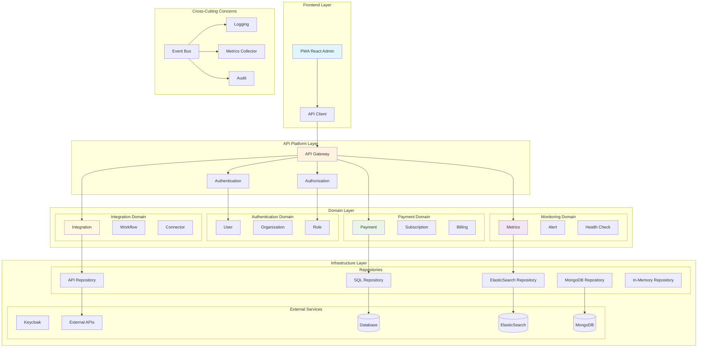
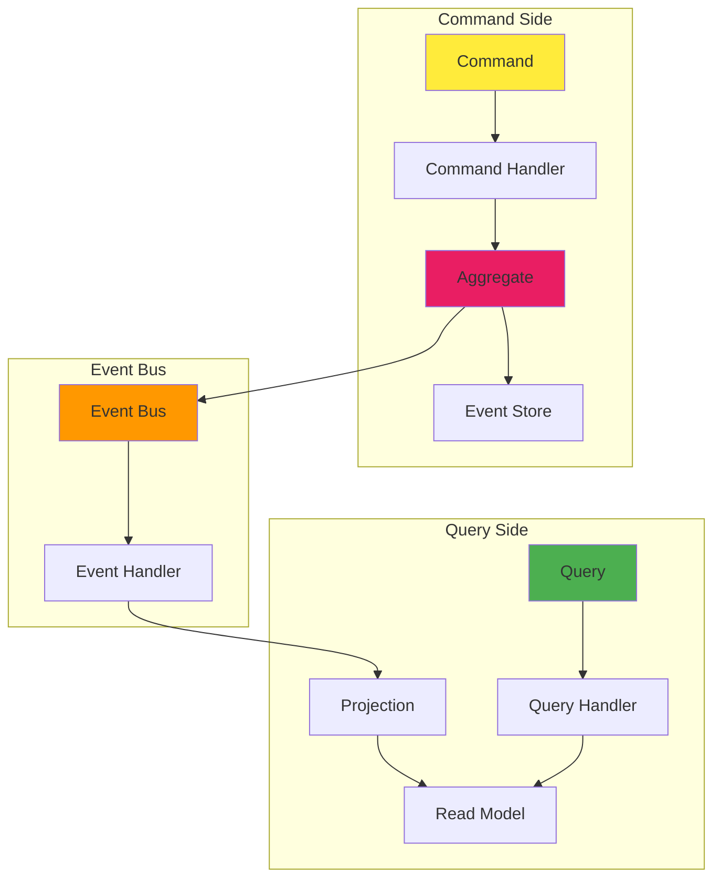
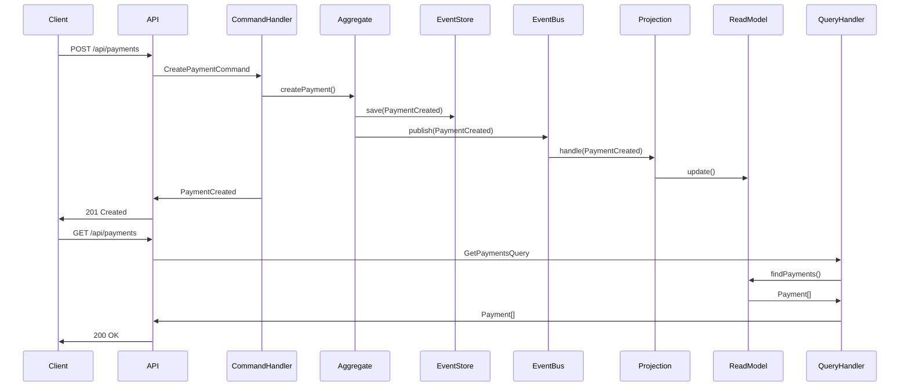
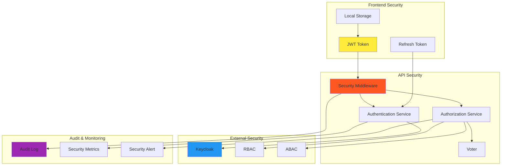
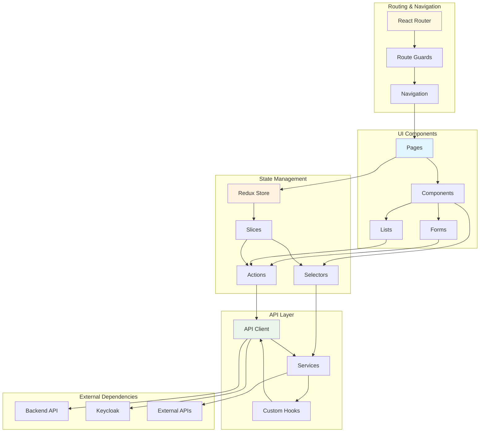

# Architecture Générale du Projet Hive

## Vue d'ensemble de l'Architecture

## Architecture CQRS avec Event Sourcing

## Architecture des Repositories

```mermaid
graph TB
    subgraph "Repository Interfaces"
        CMD_REPO[Command Repository]
        QUERY_REPO[Query Repository]
    end
    
    subgraph "Repository Implementations"
        SQL_CMD[SQL Command Repository]
        SQL_QUERY[SQL Query Repository]
        API_CMD[API Command Repository]
        API_QUERY[API Query Repository]
        ES_CMD[ElasticSearch Command Repository]
        ES_QUERY[ElasticSearch Query Repository]
        MONGO_CMD[MongoDB Command Repository]
        MONGO_QUERY[MongoDB Query Repository]
        MEMORY_CMD[In-Memory Command Repository]
        MEMORY_QUERY[In-Memory Query Repository]
    end
    
    subgraph "Data Sources"
        DATABASE[(SQL Database)]
        EXTERNAL_API[External APIs]
        ELASTICSEARCH[(ElasticSearch)]
        MONGODB[(MongoDB)]
        MEMORY[(In-Memory)]
    end
    
    CMD_REPO --> SQL_CMD
    CMD_REPO --> API_CMD
    CMD_REPO --> ES_CMD
    CMD_REPO --> MONGO_CMD
    CMD_REPO --> MEMORY_CMD
    
    QUERY_REPO --> SQL_QUERY
    QUERY_REPO --> API_QUERY
    QUERY_REPO --> ES_QUERY
    QUERY_REPO --> MONGO_QUERY
    QUERY_REPO --> MEMORY_QUERY
    
    SQL_CMD --> DATABASE
    SQL_QUERY --> DATABASE
    API_CMD --> EXTERNAL_API
    API_QUERY --> EXTERNAL_API
    ES_CMD --> ELASTICSEARCH
    ES_QUERY --> ELASTICSEARCH
    MONGO_CMD --> MONGODB
    MONGO_QUERY --> MONGODB
    MEMORY_CMD --> MEMORY
    MEMORY_QUERY --> MEMORY
    
    style CMD_REPO fill:#ff5722
    style QUERY_REPO fill:#4caf50
    style DATABASE fill:#2196f3
    style EXTERNAL_API fill:#ff9800
    style ELASTICSEARCH fill:#9c27b0
    style MONGODB fill:#4caf50
    style MEMORY fill:#607d8b
```

## Flux de Données avec Event Sourcing

## Architecture de Sécurité

## Architecture Frontend

