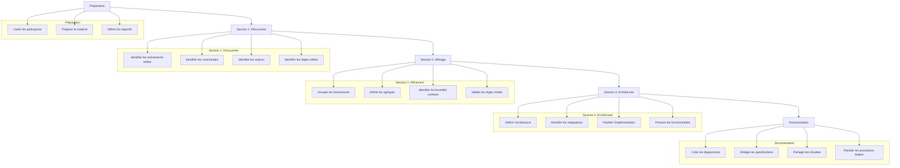
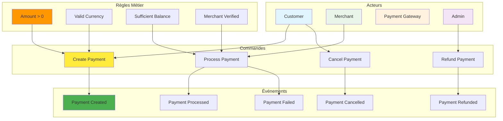
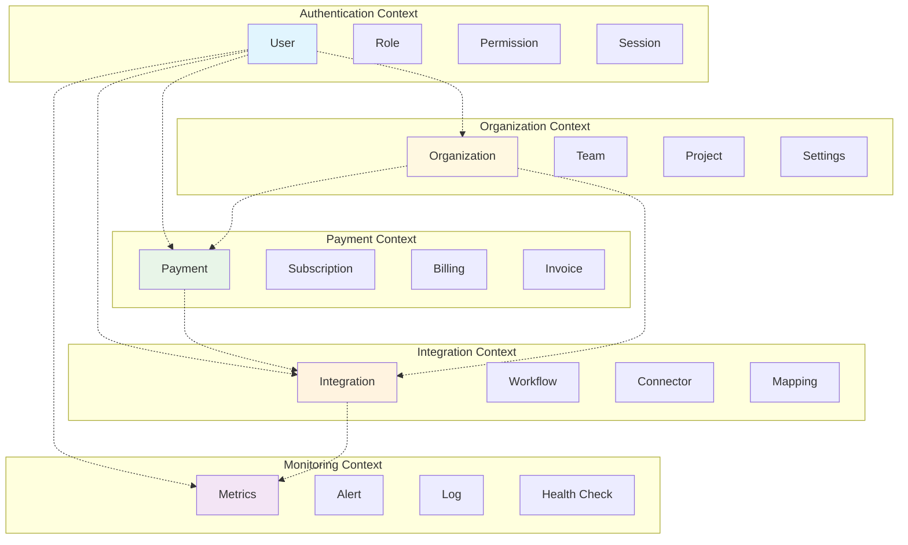
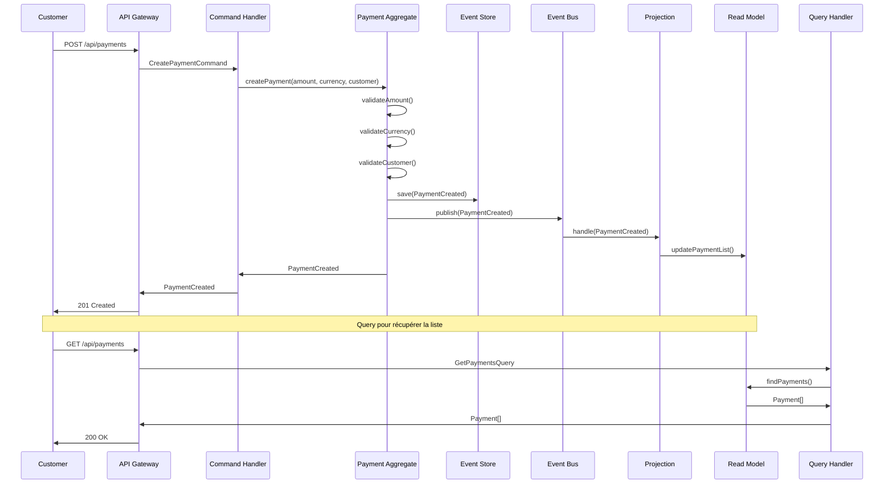
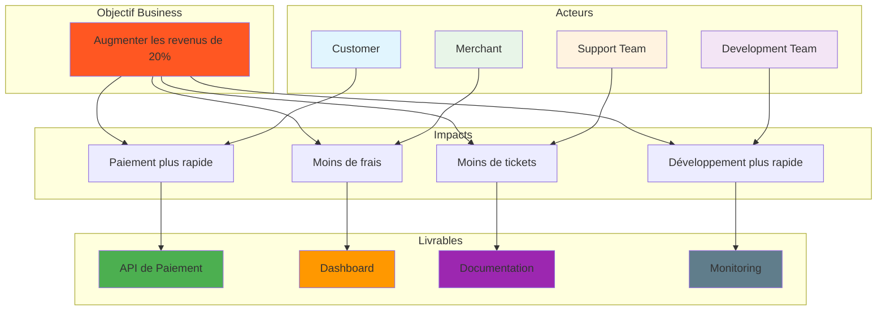
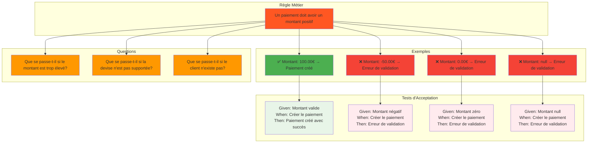

# Processus Event Storming

## Atelier Event Storming - Étapes

## Exemple d'Event Storming - Système de Paiement

## Bounded Contexts - Système Gyroscops Cloud

## Flux d'Événements - Création de Paiement

## Impact Mapping - Système de Paiement

## Example Mapping - Création de Paiement

