# 🎨 Schéma de Lecture Interactif "Livre dont vous êtes le héros"

## 🎯 Vue d'Ensemble

Ce schéma Mermaid interactif représente le parcours de lecture "livre dont vous êtes le héros" de la documentation. Chaque nœud représente un chapitre, et chaque flèche représente un choix de lecture basé sur le contexte de l'utilisateur.

## 🗺️ Schéma Principal

```mermaid
graph TD
    A[Chapitre 1: Introduction Event Storming] --> B[Chapitre 2: Atelier Event Storming]
    B --> C[Chapitre 3: Complexité Accidentelle vs Essentielle]
    
    C -->|Décision 1A| D[Chapitre 4: Modèles Riches vs Anémiques]
    C -->|Décision 1B| E[Chapitre 5: Architecture Événementielle]
    C -->|Décision 1C| D
    
    D -->|Décision 2A| F[Chapitre 6: Repositories et Persistance]
    D -->|Décision 2B| E
    D -->|Décision 2C| F
    
    E -->|Décision 3A| G[Chapitre 7: Event Sourcing]
    E -->|Décision 3B| H[Chapitre 8: CQS]
    E -->|Décision 3C| I[Chapitre 9: CQRS]
    E -->|Décision 3D| J[Chapitre 10: CQRS + Event Sourcing]
    E -->|Décision 3E| K[Chapitre 3.1: Granularité des Choix]
    E -->|Décision 3F| F
    
    %% Chemins de sortie des chapitres 7 et 8
    G -->|Décision 7A| L[Chapitre 11: Projections Event Sourcing]
    G -->|Décision 7B| F
    G -->|Décision 7C| M[Chapitre 42: Stockage Complexe Temporal]
    
    H -->|Décision 8A| F
    H -->|Décision 8B| I
    H -->|Décision 8C| N[Chapitre 7: Event Sourcing]
    
    I -->|Décision 9A| F
    I -->|Décision 9B| J
    
    J -->|Décision 10A| F
    J -->|Décision 10B| M
    
    L -->|Décision 11A| O[Chapitre 43: Gestion des Données]
    L -->|Décision 11B| M
    
    K -->|Décision 12A| C
    K -->|Décision 12B| D
    K -->|Décision 12C| D
    K -->|Décision 12D| F
    
    F -->|Décision 4A| P[Chapitre 12: Stockage SQL Classique]
    F -->|Décision 4B| Q[Chapitre 18: Stockage API Classique]
    F -->|Décision 4C| R[Chapitre 24: Stockage ElasticSearch Classique]
    F -->|Décision 4D| S[Chapitre 30: Stockage MongoDB Classique]
    F -->|Décision 4E| T[Chapitre 36: Stockage In-Memory Classique]
    F -->|Décision 4F| M
    
    %% Chemins de sortie des stockages classiques
    P -->|Décision 5A| O
    P -->|Décision 5B| U[Chapitre 13: Stockage SQL CQS]
    P -->|Décision 5C| V[Chapitre 14: Stockage SQL CQRS]
    P -->|Décision 5D| W[Chapitre 15: Stockage SQL Event Sourcing]
    P -->|Décision 5E| X[Chapitre 16: Stockage SQL Event Sourcing + CQS]
    P -->|Décision 5F| Y[Chapitre 17: Stockage SQL Event Sourcing + CQRS]
    
    Q -->|Décision 5A| O
    Q -->|Décision 5B| Z[Chapitre 19: Stockage API CQS]
    Q -->|Décision 5C| AA[Chapitre 20: Stockage API CQRS]
    Q -->|Décision 5D| BB[Chapitre 21: Stockage API Event Sourcing]
    Q -->|Décision 5E| CC[Chapitre 22: Stockage API Event Sourcing + CQS]
    Q -->|Décision 5F| DD[Chapitre 23: Stockage API Event Sourcing + CQRS]
    
    R -->|Décision 5A| O
    R -->|Décision 5B| EE[Chapitre 25: Stockage ElasticSearch CQS]
    R -->|Décision 5C| FF[Chapitre 26: Stockage ElasticSearch CQRS]
    R -->|Décision 5D| GG[Chapitre 27: Stockage ElasticSearch Event Sourcing]
    R -->|Décision 5E| HH[Chapitre 28: Stockage ElasticSearch Event Sourcing + CQS]
    R -->|Décision 5F| II[Chapitre 29: Stockage ElasticSearch Event Sourcing + CQRS]
    
    S -->|Décision 5A| O
    S -->|Décision 5B| JJ[Chapitre 31: Stockage MongoDB CQS]
    S -->|Décision 5C| KK[Chapitre 32: Stockage MongoDB CQRS]
    S -->|Décision 5D| LL[Chapitre 33: Stockage MongoDB Event Sourcing]
    S -->|Décision 5E| MM[Chapitre 34: Stockage MongoDB Event Sourcing + CQS]
    S -->|Décision 5F| NN[Chapitre 35: Stockage MongoDB Event Sourcing + CQRS]
    
    T -->|Décision 5A| O
    T -->|Décision 5B| OO[Chapitre 37: Stockage In-Memory CQS]
    T -->|Décision 5C| PP[Chapitre 38: Stockage In-Memory CQRS]
    T -->|Décision 5D| QQ[Chapitre 39: Stockage In-Memory Event Sourcing]
    T -->|Décision 5E| RR[Chapitre 40: Stockage In-Memory Event Sourcing + CQS]
    T -->|Décision 5F| SS[Chapitre 41: Stockage In-Memory Event Sourcing + CQRS]
    
    %% Chemins de sortie des stockages avancés
    U -->|Décision 6A| O
    U -->|Décision 6B| V
    U -->|Décision 6C| X
    
    V -->|Décision 6A| O
    V -->|Décision 6B| Y
    
    W -->|Décision 6A| O
    W -->|Décision 6B| X
    W -->|Décision 6C| Y
    
    X -->|Décision 6A| O
    X -->|Décision 6B| Y
    
    Y -->|Décision 6A| O
    Y -->|Décision 6B| M
    
    %% Chemins similaires pour les autres types de stockage
    Z -->|Décision 6A| O
    Z -->|Décision 6B| AA
    Z -->|Décision 6C| CC
    
    AA -->|Décision 6A| O
    AA -->|Décision 6B| DD
    
    BB -->|Décision 6A| O
    BB -->|Décision 6B| CC
    BB -->|Décision 6C| DD
    
    CC -->|Décision 6A| O
    CC -->|Décision 6B| DD
    
    DD -->|Décision 6A| O
    DD -->|Décision 6B| M
    
    %% Chemins pour ElasticSearch
    EE -->|Décision 6A| O
    EE -->|Décision 6B| FF
    EE -->|Décision 6C| HH
    
    FF -->|Décision 6A| O
    FF -->|Décision 6B| II
    
    GG -->|Décision 6A| O
    GG -->|Décision 6B| HH
    GG -->|Décision 6C| II
    
    HH -->|Décision 6A| O
    HH -->|Décision 6B| II
    
    II -->|Décision 6A| O
    II -->|Décision 6B| M
    
    %% Chemins pour MongoDB
    JJ -->|Décision 6A| O
    JJ -->|Décision 6B| KK
    JJ -->|Décision 6C| MM
    
    KK -->|Décision 6A| O
    KK -->|Décision 6B| NN
    
    LL -->|Décision 6A| O
    LL -->|Décision 6B| MM
    LL -->|Décision 6C| NN
    
    MM -->|Décision 6A| O
    MM -->|Décision 6B| NN
    
    NN -->|Décision 6A| O
    NN -->|Décision 6B| M
    
    %% Chemins pour In-Memory
    OO -->|Décision 6A| O
    OO -->|Décision 6B| PP
    OO -->|Décision 6C| RR
    
    PP -->|Décision 6A| O
    PP -->|Décision 6B| SS
    
    QQ -->|Décision 6A| O
    QQ -->|Décision 6B| RR
    QQ -->|Décision 6C| SS
    
    RR -->|Décision 6A| O
    RR -->|Décision 6B| SS
    
    SS -->|Décision 6A| O
    SS -->|Décision 6B| M
    
    M --> O
    
    O -->|Décision 9A| TT[Chapitre 44: Pagination et Performance]
    O -->|Décision 9B| UU[Chapitre 45: Gestion d'Erreurs]
    O -->|Décision 9C| VV[Chapitre 46: Tests et Qualité]
    O -->|Décision 9D| TT
    
    TT --> UU
    UU --> VV
    
    VV -->|Décision 10A| WW[Chapitre 47: Sécurité]
    VV -->|Décision 10B| XX[Chapitre 48: Architecture Frontend]
    VV -->|Décision 10C| WW
    VV -->|Décision 10D| YY[Fin du parcours]
    
    WW --> XX
    XX --> YY
    
    %% Styles
    style A fill:#e1f5fe
    style B fill:#e1f5fe
    style C fill:#ffeb3b
    style D fill:#e1f5fe
    style E fill:#ff9800
    style F fill:#e1f5fe
    style G fill:#ff9800
    style H fill:#ff9800
    style I fill:#ff9800
    style J fill:#e91e63
    style K fill:#ffeb3b
    style L fill:#9c27b0
    style M fill:#ff5722
    style O fill:#fff3e0
    style P fill:#4caf50
    style Q fill:#4caf50
    style R fill:#4caf50
    style S fill:#4caf50
    style T fill:#4caf50
    style TT fill:#fff3e0
    style UU fill:#fff3e0
    style VV fill:#fff3e0
    style WW fill:#f3e5f5
    style XX fill:#f3e5f5
    style YY fill:#4caf50
```

## 🎯 Légende des Couleurs

### 🟦 Bleu Clair - Chapitres Fondamentaux
- **Chapitre 1** : Introduction Event Storming
- **Chapitre 2** : Atelier Event Storming
- **Chapitre 4** : Modèles Riches vs Anémiques
- **Chapitre 6** : Repositories et Persistance

### 🟨 Jaune - Chapitres de Décision
- **Chapitre 3** : Complexité Accidentelle vs Essentielle (Pivot)
- **Chapitre 3.1** : Granularité des Choix Architecturaux

### 🟠 Orange - Chapitres Optionnels
- **Chapitre 5** : Architecture Événementielle
- **Chapitre 7** : Event Sourcing
- **Chapitre 8** : CQS
- **Chapitre 9** : CQRS

### 🔴 Rouge - Chapitres Avancés
- **Chapitre 10** : CQRS + Event Sourcing Combinés
- **Chapitre 42** : Stockage Complexe Temporal

### 🟣 Violet - Chapitres Spécialisés
- **Chapitre 11** : Projections Event Sourcing

### 🟢 Vert - Chapitres de Stockage
- **Chapitres 12-41** : Tous les chapitres de stockage

### 🟡 Beige - Chapitres Techniques
- **Chapitres 43-46** : Gestion des données, Performance, Erreurs, Tests

### 🟣 Rose - Chapitres Avancés
- **Chapitres 47-48** : Sécurité, Architecture Frontend

## 🎮 Points de Décision Principaux

### Décision 1 : Après le Chapitre 3 (Complexité)
*"Maintenant que vous comprenez la différence entre complexité accidentelle et essentielle, quel est votre contexte ?"*

- **Option A** : Équipe junior, application simple → Chapitre 4
- **Option B** : Équipe expérimentée, intégrations multiples → Chapitre 5
- **Option C** : Voir des exemples concrets → Chapitre 4

### Décision 2 : Après le Chapitre 4 (Modèles)
*"Vous maîtrisez maintenant les modèles riches. Quel est votre niveau de complexité ?"*

- **Option A** : Application simple, équipe junior → Chapitre 6 (Parcours Classique)
- **Option B** : Système avec intégrations, besoin de découplage → Chapitre 5
- **Option C** : Voir les options de stockage → Chapitre 6

### Décision 3 : Après le Chapitre 5 (Architecture Événementielle)
*"Vous avez choisi l'architecture événementielle. Quel est votre niveau de complexité et vos besoins ?"*

- **Option A** : Audit trail critique, modèles simples → Chapitre 7 (Event Sourcing)
- **Option B** : Lectures/écritures différentes, un seul modèle → Chapitre 8 (CQS)
- **Option C** : Lectures/écritures très différentes, modèles distincts → Chapitre 9 (CQRS)
- **Option D** : Système très complexe, audit trail + modèles distincts → Chapitre 10 (CQRS + Event Sourcing)

### Décision 4 : Après le Chapitre 6 (Repositories)
*"Vous comprenez les patterns de repository. Quel type de stockage utilisez-vous principalement ?"*

- **Option A** : Base de données SQL → Chapitre 12 (Stockage SQL Classique)
- **Option B** : APIs externes → Chapitre 18 (Stockage API Classique)
- **Option C** : ElasticSearch → Chapitre 24 (Stockage ElasticSearch Classique)
- **Option D** : MongoDB → Chapitre 30 (Stockage MongoDB Classique)
- **Option E** : Stockage In-Memory → Chapitre 36 (Stockage In-Memory Classique)
- **Option F** : Systèmes multiples → Chapitre 42 (Stockage Complexe Temporal)

## 🚀 Parcours Prédéfinis

### 🟢 Parcours Débutant
**Chapitres** : 1-4 → 6 → 12 → 43-46  
**Durée** : 2-3 semaines  
**Équipe** : 1-3 développeurs

### 🟡 Parcours Standard
**Chapitres** : 1-4 → 6 → 12/13/16 → 43-46  
**Durée** : 1-2 mois  
**Équipe** : 3-8 développeurs

### 🔴 Parcours Événementiel
**Chapitres** : 1-5 → 6 → 12/13/16 → 43-46  
**Durée** : 2-3 mois  
**Équipe** : 3-8 développeurs

### ⚡ Parcours CQRS
**Chapitres** : 1-5 → 8 → 6 → 11/14/17 → 43-46  
**Durée** : 2-4 mois  
**Équipe** : 4-8 développeurs

### 🚀 Parcours Event Sourcing
**Chapitres** : 1-5 → 7 → 8 → 9 → 6 → 12/15/18 → 43-46  
**Durée** : 4-6 mois  
**Équipe** : 8+ développeurs

### 🌐 Parcours Distribué
**Chapitres** : 1-5 → 7 → 8 → 9 → 6 → 12/15/18 → 19 → 43-46  
**Durée** : 6+ mois  
**Équipe** : 10+ développeurs

## 💡 Conseils d'Utilisation

1. **Commencez toujours** par le Chapitre 1 pour comprendre le contexte
2. **Suivez les choix** à la fin de chaque chapitre
3. **Vous pouvez toujours** revenir en arrière ou explorer d'autres options
4. **Les exemples** sont basés sur le projet Hive et ses ADR
5. **Prenez votre temps** pour comprendre chaque concept avant de passer au suivant

## 🔄 Alternative : Parcours Linéaire

Si vous préférez suivre un parcours linéaire sans choix interactifs, vous pouvez consulter les chapitres dans l'ordre :

1. [Chapitre 1 : Introduction à l'Event Storming et DDD](/chapitres/fondamentaux/chapitre-01-introduction-event-storming-ddd/)
2. [Chapitre 2 : L'Atelier Event Storming - Guide Pratique](/chapitres/fondamentaux/chapitre-02-atelier-event-storming/)
3. [Chapitre 3 : Complexité Accidentelle vs Essentielle](/chapitres/fondamentaux/chapitre-03-complexite-accidentelle-essentielle/)
4. [Chapitre 4 : Modèles Riches vs Modèles Anémiques](/chapitres/fondamentaux/chapitre-04-modeles-riches-vs-anemiques/)
5. [Chapitre 5 : Architecture Événementielle](/chapitres/fondamentaux/chapitre-05-architecture-evenementielle/)
6. [Chapitre 6 : Repositories et Persistance](/chapitres/fondamentaux/chapitre-06-repositories-persistance/)

Et ainsi de suite...

---

*Ce schéma est basé sur les Architecture Decision Records (ADR) du projet Hive et suit les principes établis dans "API Platform Con 2025 - Et si on utilisait l'Event Storming ?"*
